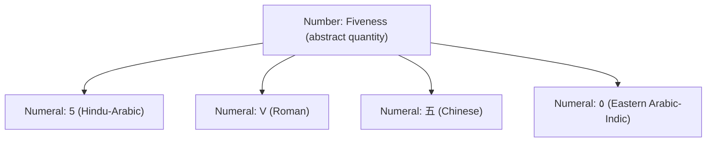
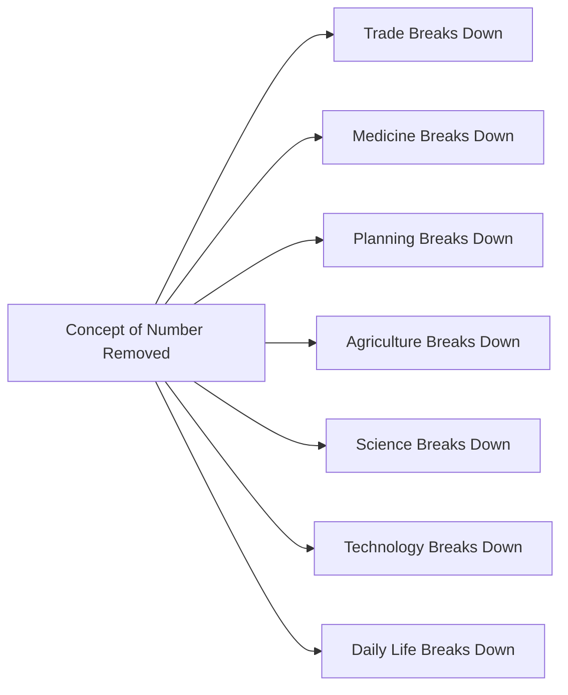

# Number vs Numeral

## Table of Contents

1. [Number vs Numeral](#number-vs-numeral-1)
   - [Common Misconceptions](#common-misconceptions)
   - [Quick Recap](#quick-recap)
2. [Why Do Numbers Exist](#why-do-numbers-exist)
   - [The Vanishing Numbers Thought Experiment](#the-vanishing-numbers-thought-experiment)
   - [Common Misconceptions](#common-misconceptions-1)
   - [Quick Recap](#quick-recap-1)
3. [Follow Me](#follow-me)
***Include notes***

⋆˚꩜｡

## Number vs Numeral

A number is an abstract idea of quantity. A numeral is the written symbol used to represent that idea. Separating these two concepts is essential in early mathematics, since it clarifies why different symbol systems can represent identical mathematical content.

♡ Definition

- **Number**: The abstract idea of quantity, independent of any symbol.
- **Numeral**: The written symbol or group of symbols used to represent a number.
- **Symbol**: Any mark or sign that stands for something else.
- **Concept**: The mental understanding behind a symbol.

| Term | Meaning | Example |
|---|---|---|
| Number | Abstract idea of quantity | The idea of "fiveness" |
| Numeral | Written symbol representing a number | 5, V, ٥, 五 |
| Symbol | Any mark standing for something else | +, =, %, 5 |
| Concept | Mental understanding behind a symbol | Understanding "five things" without seeing any symbol |

♡ Explanation

- A number exists independently of how it is written.
- A numeral is the notation, not the quantity itself.
- Multiple numeral systems can encode the same number without altering its value.

**Same Number, Different Numerals**

| Numeral | System |
|---|---|
| 5 | Hindu-Arabic (used almost worldwide today) |
| V | Roman |
| 五 | Chinese |
| ٥ | Eastern Arabic-Indic (used in Urdu and Arabic) |

All four symbols represent the same abstract quantity: five.

♡ Examples

### Example 1

The numerals 5, V, and 五 are structurally unrelated in appearance but all denote the same quantity, five.

### Example 2

The words "cat" (English), "बिल्ली" (Hindi), and "chat" (French) are different symbols referring to the same animal, illustrating the same symbol-versus-meaning distinction found in numerals.

♡ Why It Matters

- Establishes that mathematics is independent of notation.
- Explains why different civilizations, using entirely different numeral systems, could perform equivalent mathematical operations.
- Forms the conceptual foundation for understanding positional notation, base systems, and numeral system conversion.

## Common Misconceptions

| Incorrect Idea | Why It Is Incorrect | Correct Understanding |
|---|---|---|
| The symbol "5" is called "the number 5." | This conflates the written symbol with the abstract quantity it represents. | The symbol "5" is a numeral; the number is the quantity it denotes. |

## Quick Recap

- A number is an abstract idea; a numeral is its written symbol.
- The same number can be expressed using multiple numeral systems.
- Changing the numeral does not change the underlying number.
- This distinction underlies the study of numeral systems and notation across mathematics.

⋆˚꩜｡

## Why Do Numbers Exist

Numbers originated from practical human requirements for precise quantification. Vague descriptions of quantity were insufficient for tasks requiring accuracy, such as tracking livestock, trading goods, or measuring resources.

♡ Explanation

- Approximate language (e.g., "some," "a lot") cannot support tasks requiring exact accounting.
- Livestock tracking required a method to confirm that no animals were missing.
- The requirement for precision in daily survival tasks is considered a primary driver behind the development of numerical concepts.

### The Vanishing Numbers Thought Experiment

If the concept of number were removed from human cognition entirely, the following domains would be directly affected:

| Area of Life | Consequence of Losing Numerical Concepts |
|---|---|
| Trade | No prices or fair exchange rates; quantitative comparison between goods becomes impossible. |
| Medicine | No dosage measurement; safe medical quantities cannot be determined. |
| Planning | No schedules or calendars; sequencing of future events becomes impossible. |
| Agriculture | No means to calculate seed quantities or land area required for food production. |
| Science | No measurement or experimental comparison of results. |
| Technology | No engineering, electrical systems, or computing, all of which require precise numerical values. |
| Daily life | No timekeeping, ages, addresses, phone numbers, or recipes. |

♡ Why It Matters

- Numbers function as a foundational structural component of civilization, not an optional convenience.
- Trade, medicine, science, and technology are all dependent on the existence of precise numerical systems.

## Common Misconceptions

| Incorrect Idea | Why It Is Incorrect | Correct Understanding |
|---|---|---|
| Numbers were developed primarily for abstract mathematical theory. | This overlooks the practical, survival-driven origin of numerical concepts. | Numbers developed primarily to address practical needs such as trade, agriculture, and record-keeping. |

## Quick Recap

- Numbers arose to address practical problems: trade, planning, agriculture, medicine, and survival.
- Without numbers, precise communication about quantity is not possible.
- Numerical thinking underlies trade, medicine, science, technology, and daily life.
- Numbers function as a foundational structural requirement of organized civilization.

⋆˚꩜｡

## Follow Me

If you enjoyed these notes, you'll probably enjoy the rest too.

| Platform | Link |
|---|---|
| Instagram | [@mehrunnisa.ai](https://www.instagram.com/mehrunnisa.ai/) |
| SubStack | [The Epoch](https://theepoch.substack.com/) |
| YouTube | [@mehrunnisa.ai](https://www.youtube.com/@Mehrunnisa-ai) |

**Download:** [Number – By Mehrunnisa.pdf](https://github.com/user-attachments/files/30637570/Number.-.By.Mehrunnisa.pdf) — for offline reading.

**Usage Terms**

These notes are free to use for personal learning, revision, and study. Please do not:

- Sell or redistribute for profit.
- Claim them as your own work.
- Modify and republish without permission.
- Use for any unethical or unauthorized purpose.

Thank you for respecting the effort behind these notes. Happy learning. ♡
