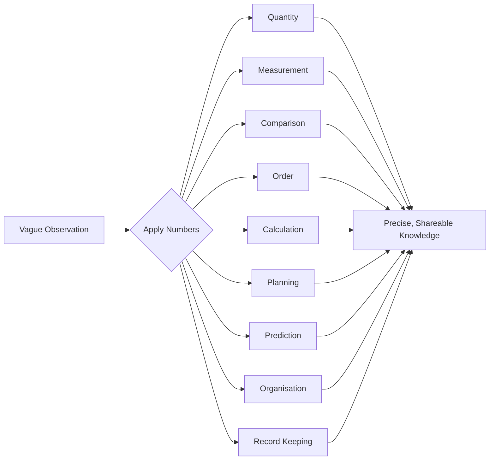
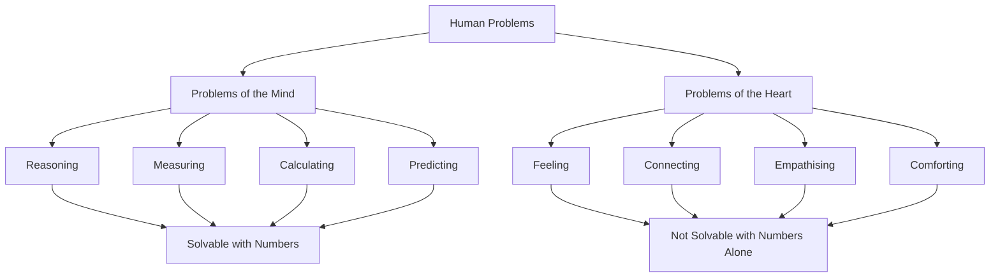

# What Problems Do Numbers Solve?

## Table of Contents

1. [What Problems Do Numbers Solve](#what-problems-do-numbers-solve-1)
   - [Common Misconceptions](#common-misconceptions)
   - [Quick Recap](#quick-recap)
2. [Problems of the Mind vs Problems of the Heart](#problems-of-the-mind-vs-problems-of-the-heart)
   - [Common Misconceptions](#common-misconceptions-1)
   - [Quick Recap](#quick-recap-1)
3. [Follow Me](#follow-me)
***Include notes pdf***

⋆˚꩜｡

## What Problems Do Numbers Solve

Numbers are problem-solving tools. They convert vague, subjective impressions into precise, shareable knowledge.

♡ Definition

- **Precision through numbers**: The process of converting an imprecise observation into an exact, measurable, and communicable value.

♡ Explanation

- A vague impression (e.g., "the wall seems tall") cannot be verified, compared, or communicated reliably.
- A numerical statement (e.g., "the wall is 3.2 metres tall") is exact, verifiable, and universally interpretable.
- This shift — from impression to precision — is the core function numbers serve across all practical and scientific domains.

| Category | Problem Solved | Example |
|---|---|---|
| Quantity | Determining how many units exist | How many mangoes are in the basket? |
| Measurement | Determining size, distance, or magnitude | How tall is this wall, in metres? |
| Comparison | Determining which of two values is greater | Which of the two rivers is longer? |
| Order | Determining sequence or rank | Who finished the race first, second, third? |
| Calculation | Determining a combined or derived value | What is the total cost of five books? |
| Planning | Determining time remaining or required | How many days until the exam? |
| Prediction | Estimating future outcomes from current data | At this rate of saving, when will I reach my goal? |
| Organisation | Structuring items into an identifiable system | How should these 200 files be sorted and numbered? |
| Record keeping | Preserving quantitative history for reference | What was last year's rainfall, recorded month by month? |

♡ Examples

### Example 1

"The wall seems tall" becomes "the wall is 3.2 metres tall." The numerical statement is exact and independent of the observer's perception.

### Example 2

"We sold quite a lot of books" becomes "we sold 214 books." The numerical value removes ambiguity and allows direct comparison with other data points, such as sales from a previous month.

♡ Why It Matters

- Numbers enable objective communication of facts that would otherwise be subjective or ambiguous.
- Precision enables verification, comparison, and reproducibility, which are prerequisites for science, engineering, trade, and planning.

## Common Misconceptions

| Incorrect Idea | Why It Is Incorrect | Correct Understanding |
|---|---|---|
| A vague description is functionally equivalent to a numerical one. | Vague descriptions cannot be verified, compared consistently, or reproduced. | Numerical statements are precise, verifiable, and comparable; vague statements are not. |

## Quick Recap

- Numbers convert vague impressions into precise, shareable knowledge.
- Numbers solve problems of quantity, measurement, comparison, order, calculation, planning, prediction, organisation, and record-keeping.
- Precision enables verification and comparison, which vague language cannot provide.

⋆˚꩜｡

## Problems of the Mind vs Problems of the Heart

This is a learning framework used to illustrate the boundary of what numbers can solve. It is a teaching tool, not an established scientific classification.

♡ Definition

- **Problems of the Mind**: Problems involving reasoning, measurement, calculation, and prediction — domains well-suited to numerical treatment.
- **Problems of the Heart**: Problems involving feeling, connection, empathy, and comfort — domains not well captured by numbers alone.

| Category | Problems of the Mind | Problems of the Heart |
|---|---|---|
| Nature | Reasoning, measuring, calculating, predicting | Feeling, connecting, empathising, comforting |
| Relationship to numbers | Well-suited to numbers and logic | Not well captured by numbers alone |
| Example | How many bricks are needed for this wall? | How do I comfort a grieving friend? |

♡ Explanation

- Numbers are effective for problems of quantity, precision, and logic.
- Numbers cannot generate empathy, love, or compassion, and cannot resolve grief.
- The number of days since a loss can be counted, but the magnitude of the loss itself cannot be measured numerically.
- This is not a limitation of mathematics as a discipline — it reflects the intended scope of what mathematics is designed to address.

♡ Why It Matters

- Establishes a clear boundary for the applicability of numerical reasoning.
- Prevents the misapplication of quantitative methods to inherently qualitative or emotional domains.

## Common Misconceptions

| Incorrect Idea | Why It Is Incorrect | Correct Understanding |
|---|---|---|
| Greater numerical precision always implies greater truth or importance. | Some of the most significant human experiences cannot be meaningfully reduced to numerical values. | Numerical precision is valuable for quantifiable domains, but not all meaningful experiences are quantifiable. |

## Quick Recap

- The Mind vs Heart framework is a teaching tool, not a scientific classification.
- Numbers excel at reasoning, measurement, calculation, and prediction.
- Numbers cannot solve emotional or relational problems such as grief, love, or empathy.
- Numerical precision does not equate to importance or truth in every domain.

⋆˚꩜｡

## Follow Me

If you enjoyed these notes, you'll probably enjoy the rest too.

| Platform | Link |
|---|---|
| Instagram | [@mehrunnisa.ai](https://www.instagram.com/mehrunnisa.ai/) |
| SubStack | [The Epoch](https://theepoch.substack.com/) |
| YouTube | [@mehrunnisa.ai](https://www.youtube.com/@Mehrunnisa-ai) |

**Download:** [Number – By Mehrunnisa.pdf](https://github.com/user-attachments/files/30637570/Number.-.By.Mehrunnisa.pdf) — for offline reading.

**Usage Terms**

These notes are free to use for personal learning, revision, and study. Please do not:

- Sell or redistribute for profit.
- Claim them as your own work.
- Modify and republish without permission.
- Use for any unethical or unauthorized purpose.

Thank you for respecting the effort behind these notes. Happy learning. ♡

---
