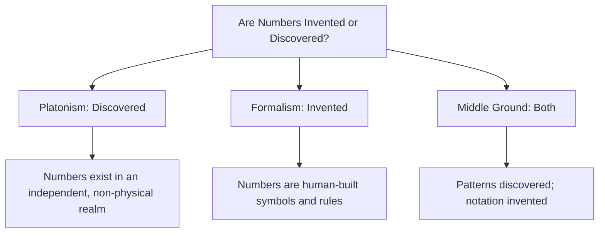
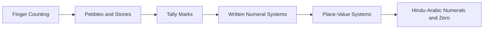
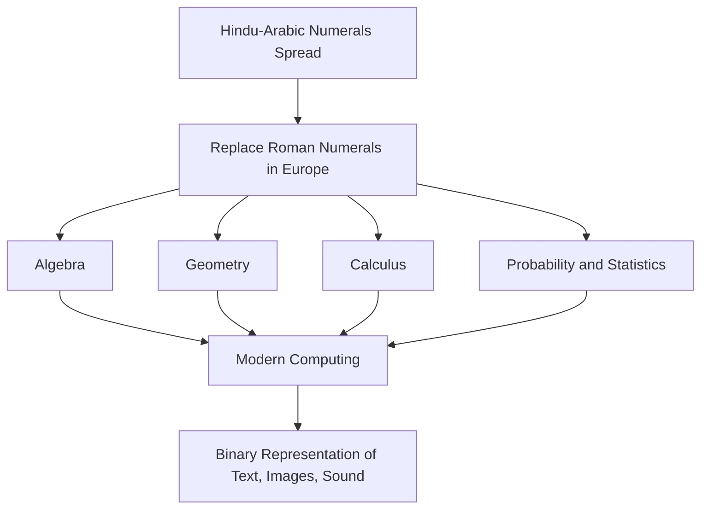
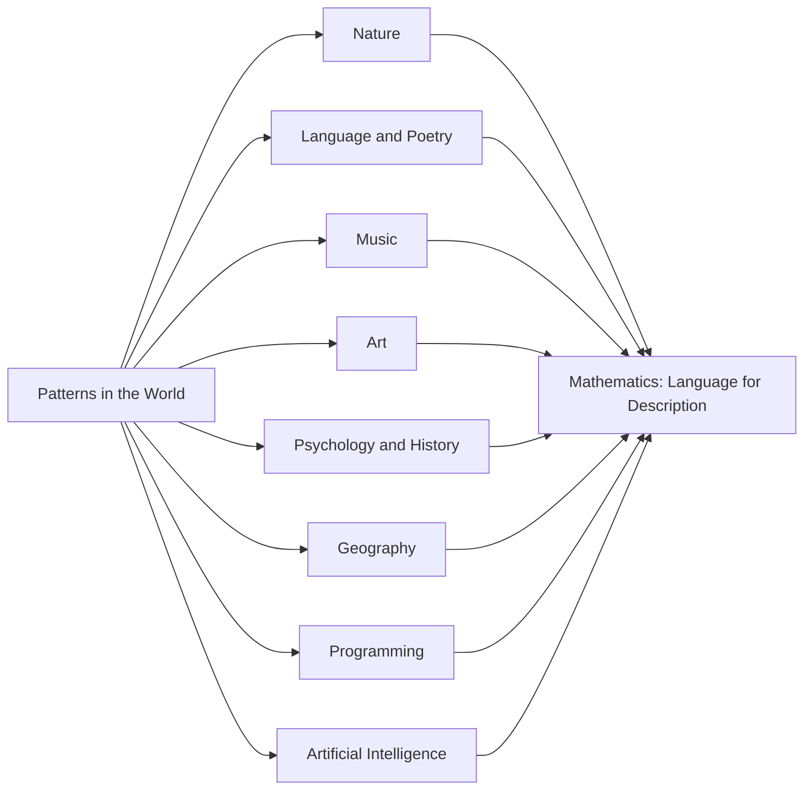
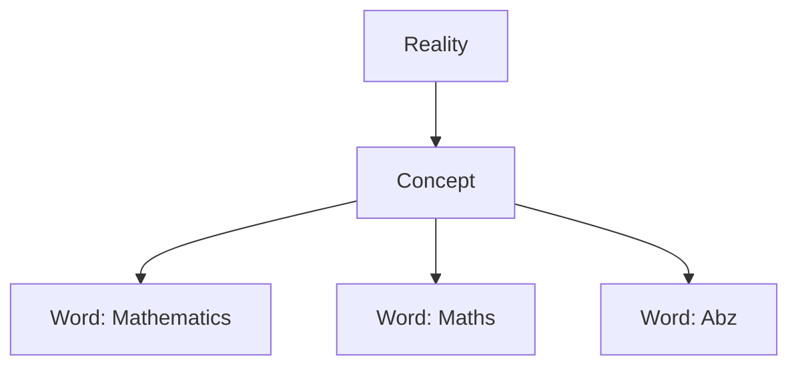

# Were Numbers Invented or Discovered?

## Table of Contents

1. [Were Numbers Invented or Discovered](#were-numbers-invented-or-discovered-1)
   - [Platonism — Numbers Are Discovered](#platonism--numbers-are-discovered)
   - [Formalism — Numbers Are Invented](#formalism--numbers-are-invented)
   - [A Middle Ground](#a-middle-ground)
   - [Common Misconceptions](#common-misconceptions)
   - [Quick Recap](#quick-recap)
2. [History of Numbers](#history-of-numbers)
   - [The Earliest Counting](#the-earliest-counting)
   - [Ancient Number Systems](#ancient-number-systems)
   - [The Birth of Hindu-Arabic Numerals and Zero](#the-birth-of-hindu-arabic-numerals-and-zero)
   - [From Ancient Notation to Modern Mathematics](#from-ancient-notation-to-modern-mathematics)
   - [Common Misconceptions](#common-misconceptions-1)
   - [Quick Recap](#quick-recap-1)
3. [Patterns Everywhere](#patterns-everywhere)
   - [Common Misconceptions](#common-misconceptions-2)
   - [Quick Recap](#quick-recap-2)
4. [Mathematics as Language](#mathematics-as-language)
   - [Common Misconceptions](#common-misconceptions-3)
   - [Quick Recap](#quick-recap-3)
5. [Follow Me](#follow-me)

⋆˚꩜｡

## Were Numbers Invented or Discovered

This is one of the oldest open questions in the philosophy of mathematics: whether numbers were invented, in the manner of a human tool such as the wheel, or discovered, in the manner of a pre-existing feature of reality such as an island. No single answer is universally accepted. The major viewpoints are presented below without asserting a resolution.

| Viewpoint | Core Claim |
|---|---|
| Platonism | Numbers exist independently of human minds; we discover them. |
| Formalism | Numbers are human-created symbols and rules; we invent them. |
| Middle Ground | Underlying patterns may be discovered; the language describing them is invented. |

### Platonism — Numbers Are Discovered

♡ Definition

- **Platonism**: The position that numbers and mathematical truths exist independently of the human mind, in a timeless, non-physical realm of pure concepts.

♡ Explanation

- Under this view, humans did not create the number 7 or the truth that 2 + 2 = 4; these truths were uncovered, not constructed.
- Mathematical truths are treated as universal and unchangeable, comparable to how an astronomer discovers a pre-existing star.
- Supporters point to the apparent timelessness of mathematical truths: 2 + 2 = 4 was true before humans existed and would remain true if humans vanished.

### Formalism — Numbers Are Invented

♡ Definition

- **Formalism**: The position that mathematics is a human-made system of symbols and rules, comparable to a constructed game such as chess.

♡ Explanation

- Under this view, humans invented numerals, operations, and axioms, and mathematical results are the logical consequences of the rules chosen.
- There is no independent realm in which numbers exist; mathematics is a consistent language built incrementally by humans.
- Mathematical "truths" are understood as logical consequences of agreed-upon rules, not as discoveries of a pre-existing reality.

### A Middle Ground

♡ Definition

- **Middle Ground view**: The position that underlying patterns and relationships in the world may be discovered, while the specific symbols and notation used to describe them are invented.

♡ Explanation

- Under this view, the consistent behavior of grouping objects — such as the pattern of "threeness" — may be discovered.
- The numeral "3" and the notation of arithmetic used to describe that pattern are considered invented human tools.
- This position combines elements of both Platonism and Formalism rather than fully endorsing either.

## Common Misconceptions

| Incorrect Idea | Why It Is Incorrect | Correct Understanding |
|---|---|---|
| This question has been definitively resolved by modern mathematicians. | The debate remains active within the philosophy of mathematics. | The invented-versus-discovered question remains genuinely open, with multiple respected viewpoints. |

## Quick Recap

- Platonism: numbers exist independently of minds and are discovered.
- Formalism: numbers are human-invented symbols and rule systems.
- Middle Ground: patterns are discovered; the symbols describing them are invented.
- No single, universally accepted answer exists for this question.

⋆˚꩜｡

## History of Numbers

The development of numbers reflects the gradual refinement of human quantitative reasoning, from physical counting tools to abstract, symbolic systems.

### The Earliest Counting

♡ Explanation

- Early humans required methods to track quantities, including herd size, elapsed days, and stored grain.
- Finger counting was among the earliest counting tools, which is why many number systems are structured around groups of five and ten.
- As counting needs exceeded ten, humans used small stones and pebbles, assigning one object per counted item.
- Tally marks — scratches on bone, wood, or cave walls — followed, with each mark representing one unit.
- Some of the oldest known tally artefacts, carved into animal bones, date back tens of thousands of years.

### Ancient Number Systems

| Civilisation | Notable Contribution |
|---|---|
| Egyptians | Developed one of the earliest written numeral systems, using distinct hieroglyphic symbols for powers of ten. |
| Babylonians | Created a base-60 (sexagesimal) number system, which is the reason an hour is divided into 60 minutes today. |
| Romans | Used letter-based numerals (I, V, X, L, C, D, M), suited to inscriptions but impractical for arithmetic. |
| Indian mathematicians | Developed the Hindu-Arabic numeral system, including the place-value system. |

### The Birth of Hindu-Arabic Numerals and Zero

♡ Explanation

- Zero is considered one of the most transformative developments in the history of numbers.
- Ancient Indian mathematicians developed zero not only as a representation of absence, but as an active placeholder and a number capable of being added, subtracted, and reasoned about.
- This concept transmitted through the Islamic world, where scholars refined and further disseminated it, eventually reaching Europe.

♡ Why It Matters

- Place-value systems, in which the position of a digit determines its meaning (as in 10 versus 100), require zero to function correctly.
- Zero enabled efficient arithmetic and algebra, and underlies the binary systems used in modern computing.

### From Ancient Notation to Modern Mathematics

♡ Explanation

- The Hindu-Arabic numeral system (digits 0–9) spread through trade routes into the Islamic world and then into medieval Europe, replacing less efficient systems such as Roman numerals for calculation.
- Building on this numerical foundation, mathematics expanded into algebra, geometry, calculus, probability, and statistics.
- In the twentieth and twenty-first centuries, this foundation extended into computing, where all information — text, images, sound — is represented using binary numbers (0s and 1s).

## Common Misconceptions

| Incorrect Idea | Why It Is Incorrect | Correct Understanding |
|---|---|---|
| The numerals used today are "Arabic" in the sense of originating in Arabia. | These numerals originated in India and were later transmitted and refined through the Arab world. | They are correctly termed Hindu-Arabic numerals, reflecting both their Indian origin and Arab transmission. |

## Quick Recap

- Counting began with fingers, pebbles, and tally marks.
- Egyptians, Babylonians, and Romans each developed distinct numeral systems.
- Indian mathematicians developed the place-value system and the concept of zero.
- Hindu-Arabic numerals spread globally and became the foundation of modern mathematics.
- This numerical foundation eventually enabled computing and digital technology.

⋆˚꩜｡

## Patterns Everywhere

Patterns occur throughout nature, art, language, and human society. Mathematics functions as the language humans developed to notice, describe, and reason about these patterns.

♡ Explanation

- Mathematics does not create patterns; it provides a structured means of describing patterns that already exist.
- Patterns appear across a wide range of domains, from natural structures to human-created systems such as music, poetry, and computation.

| Field | A Pattern Mathematics Helps Describe |
|---|---|
| Nature | The spiral arrangement of seeds in a sunflower, or the branching of a tree. |
| Languages | The rhythmic count of syllables in structured verse. |
| Hindi poetry | The matras (syllabic beats) that shape the metre of a doha or chaupai. |
| Urdu poetry | The precise beher (metre) that gives a ghazal its musical rhythm. |
| Music | The counting of beats (taal) that gives a composition its rhythm and structure. |
| Art | Proportion and symmetry, such as the golden ratio used in classical composition. |
| Psychology | Statistical patterns in how large groups of people tend to respond or behave. |
| History | Patterns of population growth, trade cycles, and the rise and fall of empires. |
| Geography | Patterns in river networks, coastlines, and population distribution. |
| Programming | Logical patterns and loops that let a small set of instructions repeat efficiently. |
| Artificial Intelligence | Statistical patterns learned from large amounts of numerical data. |

♡ Why It Matters

- Mathematics provides a precise descriptive framework applicable across disciplines, from natural science to the arts.
- Recognizing mathematics as a descriptive language, rather than an explanatory force in itself, clarifies both its power and its limits.

## Common Misconceptions

| Incorrect Idea | Why It Is Incorrect | Correct Understanding |
|---|---|---|
| Mathematics explains everything about nature, art, and human experience. | Not every meaningful human experience reduces neatly to numbers, and describing a pattern is not equivalent to fully explaining it. | Mathematics offers one powerful lens among several, including art, philosophy, literature, and lived experience. |

## Quick Recap

- Patterns exist throughout nature, art, language, and human society.
- Mathematics is a language for recognising and describing many of these patterns.
- Mathematics provides description, not a total explanation of every phenomenon.

⋆˚꩜｡

## Mathematics as Language

The word "mathematics" is a label attached to an underlying concept. The concept remains constant even when the label used to describe it changes.

♡ Explanation

- Three distinct layers are useful for analysing this idea: the word, the concept, and the reality.

| Layer | Example (using "water") |
|---|---|
| Word | "Water" / "पानी" / "Eau" — sounds and spellings only. |
| Concept | The mental idea of a clear liquid consumed and found in rivers and oceans. |
| Reality | The physical substance itself, composed of H₂O molecules, existing independently of any label. |

**Same Concept, Different Labels**

| Concept | Labels |
|---|---|
| Water | Water, पानी, Eau |
| Mathematics | Mathematics, Maths, Abz (an invented label) |

In each case, the underlying concept remains unchanged; only the label varies.

♡ Why It Matters

- Mathematics functions as a language layer positioned between concept and reality, allowing precise communication about quantity, pattern, and relationship independent of spoken language.
- This framework clarifies why mathematical notation is regarded as a broadly universal system of communication.

## Common Misconceptions

| Incorrect Idea | Why It Is Incorrect | Correct Understanding |
|---|---|---|
| Mathematics is equivalent to a specific set of English or Western terms. | The terms used to teach mathematics vary by language and culture. | Mathematics refers to the underlying concept; the vocabulary used to express it differs across languages. |

## Quick Recap

- "Mathematics" is a label attached to an underlying concept.
- Changing the word does not change the concept it represents.
- Word, concept, and reality form three distinct but connected layers.
- Mathematics functions as a precise, broadly universal language for concepts such as quantity and pattern.

⋆˚꩜｡

## Follow Me

If you enjoyed these notes, you'll probably enjoy the rest too.

| Platform | Link |
|---|---|
| Instagram | [@mehrunnisa.ai](https://www.instagram.com/mehrunnisa.ai/) |
| SubStack | [The Epoch](https://theepoch.substack.com/) |
| YouTube | [@mehrunnisa.ai](https://www.youtube.com/@Mehrunnisa-ai) |

**Download:** [Number – By Mehrunnisa.pdf](https://github.com/user-attachments/files/30637570/Number.-.By.Mehrunnisa.pdf) — for offline reading.

**Usage Terms**

These notes are free to use for personal learning, revision, and study. Please do not:

- Sell or redistribute for profit.
- Claim them as your own work.
- Modify and republish without permission.
- Use for any unethical or unauthorized purpose.

Thank you for respecting the effort behind these notes. Happy learning. ♡
