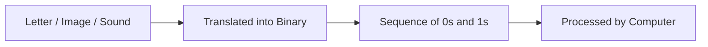
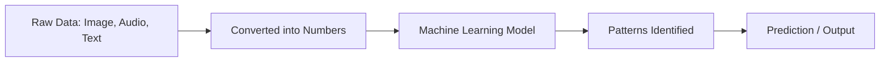
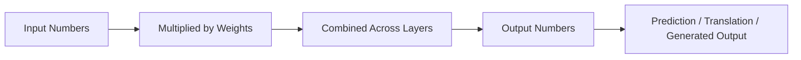
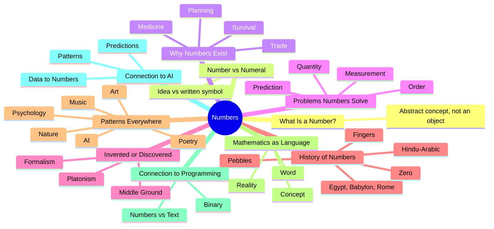

# Connection to Programming and Artificial Intelligence

## Table of Contents

1. [Connection to Programming](#connection-to-programming-1)
   - [Common Misconceptions](#common-misconceptions)
   - [Quick Recap](#quick-recap)
2. [Connection to Artificial Intelligence](#connection-to-artificial-intelligence-1)
   - [Common Misconceptions](#common-misconceptions-1)
   - [Quick Recap](#quick-recap-1)
3. [Revision and Reflection — Chapter 1: The Story of Numbers](#revision-and-reflection--chapter-1-the-story-of-numbers)
   - [Key Takeaways](#key-takeaways)
   - [Mind Map](#mind-map)
   - [Summary Table](#summary-table)
   - [Flashcards](#flashcards)
   - [20 Revision Questions](#20-revision-questions)
   - [10 Challenge Questions](#10-challenge-questions)
   - [10 Philosophical Questions to Think About](#10-philosophical-questions-to-think-about)
4. [Follow Me](#follow-me)

⋆˚꩜｡

## Connection to Programming

Every operation a computer performs — displaying an image, playing a sound, sending a message — ultimately reduces to numbers. Computers do not process words, colours, or sounds directly; they process numbers represented internally as binary (0s and 1s).

♡ Explanation

- A computer is composed of a large number of electronic switches, each capable of only two states: on or off, labelled 0 and 1.
- Every letter, image, and sound is translated into long sequences of 0s and 1s before a computer can process it.



### Text vs Numbers: A Crucial Difference

♡ Explanation

- Programming distinguishes between a number used for calculation and a number written as text.
- The value `10` is numeric and can be used in arithmetic operations.
- The value `"10"` is a string (text) that contains digits but is not directly usable in calculations.

| Form | What It Is | What You Can Do With It |
|---|---|---|
| `10` | A numeric value. | Add, subtract, multiply, divide — used for calculation. |
| `"10"` | A piece of text (a string) containing digits. | Display, join with other text, search — not directly calculated with. |

♡ Examples

### Example 1

```python
age = 10        # stores the number ten, ready for calculation
age_text = "10"  # stores the text "10", treated as characters, not a quantity

print(age + 5)         # 15   (numeric addition)
print(age_text + "5")  # "105" (joining two pieces of text together)
```

♡ Why It Matters

- Confusing a numeric value with its text representation is a common early error in programming.
- Understanding the distinction between numeric and text data types is foundational to writing correct code.

## Common Misconceptions

| Incorrect Idea | Why It Is Incorrect | Correct Understanding |
|---|---|---|
| Any value that looks like a number automatically behaves as a number in code. | Whether a value is treated as numeric or textual depends on how it was stored, not on its appearance. | A value's data type — number or text — determines what operations can be performed on it. |

## Quick Recap

- Computers process only numbers, represented internally as 0s and 1s.
- A numeric value behaves differently in code than the same digits stored as text.
- Confusing numeric values with text values is a common early programming error.

⋆˚꩜｡

## Connection to Artificial Intelligence

Since computers process only numbers, artificial intelligence systems, which run entirely on computers, are fundamentally built on numerical data — including systems that process images, sound, or language.

### Turning the World Into Numbers

| Type of Data | How It Becomes Numbers |
|---|---|
| Images | Each pixel is stored as a set of numbers representing colour and brightness. |
| Videos | A sequence of image frames, each already represented numerically, played in rapid succession. |
| Audio | Sound waves are measured thousands of times per second, with each measurement stored as a number. |
| Text | Words and letters are converted into numeric codes that a model can process mathematically. |

♡ Explanation

- Once data is converted into numbers, a machine learning model identifies patterns within that numerical data.
- This process reflects the same principle discussed under Mathematics as Language: mathematics functions as the language of pattern, applied here at large scale.



### How Neural Networks Use Numbers

♡ Explanation

- A neural network, the structure underlying most modern AI systems, consists of a large sequence of numerical calculations.
- Numbers representing input data flow into the network, are multiplied and combined according to numerical parameters called weights, and numbers representing an output — a prediction, translation, or generated image — flow out.



♡ Why It Matters

- The same underlying concept used in early physical counting — converting the world into countable, comparable quantities — underlies the numerical foundation of artificial intelligence.
- A solid understanding of numbers directly supports later understanding of AI systems.

## Common Misconceptions

| Incorrect Idea | Why It Is Incorrect | Correct Understanding |
|---|---|---|
| AI understands images or language the way humans do. | AI systems process numerical patterns extracted from data, which is a fundamentally different process from human comprehension. | AI performs structured numerical computation on data; it does not understand content in the human sense. |

## Quick Recap

- Images, video, audio, and text are converted into numbers before AI can process them.
- Machine learning identifies patterns within large collections of numerical data.
- Neural networks are, at their core, structured numerical calculations.
- A strong foundation in numbers supports a deeper understanding of AI systems.

⋆˚꩜｡

## Revision and Reflection — Chapter 1: The Story of Numbers

### Key Takeaways

- A number is an abstract concept representing quantity, order, or relationship, not a physical object.
- A numeral is the written symbol for a number; the same number can be written using many numeral systems.
- Numbers arose from practical human needs: trade, planning, medicine, agriculture, and survival.
- Numbers solve problems of quantity, measurement, comparison, order, calculation, planning, prediction, and organisation, but not problems of emotion, such as grief or love.
- Whether numbers are invented or discovered remains an open philosophical question, with Platonism, Formalism, and middle-ground views each offering a distinct perspective.
- Numbers evolved historically from fingers and pebbles, through Egyptian, Babylonian, and Roman systems, to the Hindu-Arabic system and the development of zero.
- Mathematics is a language for describing patterns found throughout nature, art, poetry, music, and society, not a total explanation of every phenomenon.
- As with any word, "mathematics" is a label; the underlying concept remains constant regardless of the term used.
- Computers process only numbers, represented as 0s and 1s, and programming distinguishes numeric values from text.
- Artificial intelligence converts images, video, audio, and text into numbers, then identifies patterns within that numerical data, meaning AI systems are built fundamentally on the concept of number.

### Mind Map



### Summary Table

| Topic | One-Line Summary |
|---|---|
| What is a number? | An abstract idea of quantity, not a physical thing. |
| Number vs Numeral | A number is the idea; a numeral is its written symbol. |
| Why numbers exist | Born from real needs like trade, medicine, and planning. |
| Problems numbers solve | Quantity, measurement, comparison, order, prediction — not emotion. |
| Invented or discovered? | An open philosophical debate with no single accepted answer. |
| History of numbers | From fingers and pebbles to zero and Hindu-Arabic numerals. |
| Patterns everywhere | Mathematics describes patterns in nature, art, and society. |
| Mathematics as language | The word can change; the concept underneath stays the same. |
| Connection to programming | Computers process only numbers, stored as 0s and 1s. |
| Connection to AI | AI converts data into numbers and learns patterns within them. |

### Flashcards

| Front (Question) | Back (Answer) |
|---|---|
| What is a number? | An abstract concept representing quantity, order, or relationship. |
| What is a numeral? | A written symbol used to represent a number. |
| Give three numerals for the number five. | 5, V, ٥ (or 五). |
| What civilisation is credited with developing the concept of zero as a number? | Ancient Indian mathematicians. |
| What number system do we use today, and where did it originate? | The Hindu-Arabic numeral system, originating in India. |
| What is Platonism, in the context of numbers? | The view that numbers exist independently of the mind and are discovered. |
| What is Formalism, in the context of numbers? | The view that numbers are human-invented systems of symbols and rules. |
| Name three things numbers help us do. | Any three of: count, measure, compare, order, calculate, plan, predict, organise. |
| Can numbers solve emotional problems like grief? | No — numbers are suited to reasoning and measurement, not emotional experience. |
| Why can't computers understand text or images directly? | Because computers only process numbers, represented as 0s and 1s. |
| What happens to images, audio, and text before an AI can process them? | They are converted into numerical data. |
| What is a neural network, at its core? | A structured sequence of numerical calculations. |

### 20 Revision Questions

1. Define, in your own words, what a number is.
2. Explain why a number cannot be physically touched.
3. What is the difference between a number and a numeral?
4. Give an example of the same number written using two different numeral systems.
5. List three practical reasons early humans needed numbers.
6. Describe one consequence of the vanishing numbers thought experiment.
7. Name five distinct problems that numbers help us solve.
8. Explain the Problems of the Mind vs Problems of the Heart framework in your own words.
9. Why is this Mind/Heart framework described as a learning tool rather than scientific fact?
10. Summarise the Platonist view of numbers in one or two sentences.
11. Summarise the Formalist view of numbers in one or two sentences.
12. What does the middle-ground viewpoint suggest about invention versus discovery?
13. Name two ancient civilisations and one numeral contribution from each.
14. Why was the invention of zero so historically important?
15. Describe, briefly, the journey of Hindu-Arabic numerals from India to the wider world.
16. Give an example of a mathematical pattern found in nature.
17. Give an example of a mathematical pattern found in poetry or music.
18. Explain the difference between word, concept, and reality using the water example.
19. Explain why `10` and `"10"` behave differently in programming.
20. Explain, briefly, how an image is converted into numbers for an AI system to use.

### 10 Challenge Questions

1. If numbers are truly abstract and cannot be touched, why do they feel so reliable in everyday life?
2. Could a civilisation function completely without any concept of number? Justify your answer with examples.
3. Is it possible for two completely different numeral systems to ever disagree about a basic arithmetic fact, such as 2 + 2 = 4? Explain your reasoning.
4. If mathematics is a language, could there be alien civilisations with an entirely different mathematics that still describes the same universe?
5. Construct an argument for why zero might be considered the most philosophically important number ever conceived.
6. Explain, using your own reasoning, why more data expressed as numbers does not always mean more truth about a situation.
7. Some patterns in nature, such as the spiral of a shell, can be described mathematically. Does this mean nature uses mathematics, or that mathematics simply describes nature well? Defend your position.
8. If a machine learning model only ever processes numbers, in what sense, if any, can it be said to understand an image or a sentence?
9. Design a simple thought experiment, similar to the vanishing numbers experiment, that explores what would happen if all numerals — but not the concept of number — disappeared.
10. How might the debate between Platonism and Formalism change the way a mathematician approaches an unsolved problem?

### 10 Philosophical Questions to Think About

1. If every mind in the universe disappeared, would "2 + 2 = 4" still be true somewhere?
2. Is mathematics discovered, invented, or something in between, and does the answer matter practically?
3. Can something be real if it cannot be seen, touched, or physically located anywhere?
4. Do numbers exist outside of time, or are they tied to the moment humans first conceived them?
5. If an alien civilisation counted using base-8 instead of base-10, would their mathematics be the same as ours underneath the notation?
6. Is a perfect circle a real thing, or only ever an idea that physical circles imperfectly approximate?
7. Can a machine that only processes numbers ever be said to understand anything, or only to calculate?
8. Is there a limit to what mathematics can ever describe about human experience?
9. If mathematics is a human language, why does it work so effectively at describing the physical universe?
10. Does knowledge of the history of numbers change one's perspective on mathematics?

⋆˚꩜｡

## Follow Me

If you enjoyed these notes, you'll probably enjoy the rest too.

| Platform | Link |
|---|---|
| Instagram | [@mehrunnisa.ai](https://www.instagram.com/mehrunnisa.ai/) |
| SubStack | [The Epoch](https://theepoch.substack.com/) |
| YouTube | [@mehrunnisa.ai](https://www.youtube.com/@Mehrunnisa-ai) |

**Download:** [Number – By Mehrunnisa.pdf](https://github.com/user-attachments/files/30637570/Number.-.By.Mehrunnisa.pdf) — for offline reading.

**Usage Terms**

These notes are free to use for personal learning, revision, and study. Please do not:

- Sell or redistribute for profit.
- Claim them as your own work.
- Modify and republish without permission.
- Use for any unethical or unauthorized purpose.

Thank you for respecting the effort behind these notes. Happy learning. ♡
