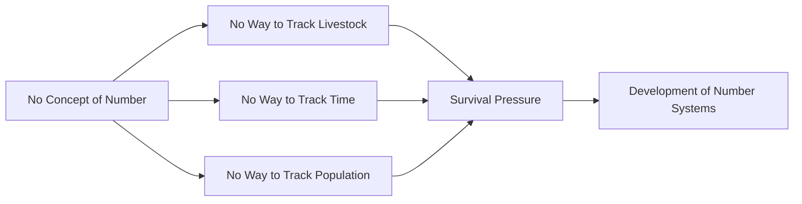
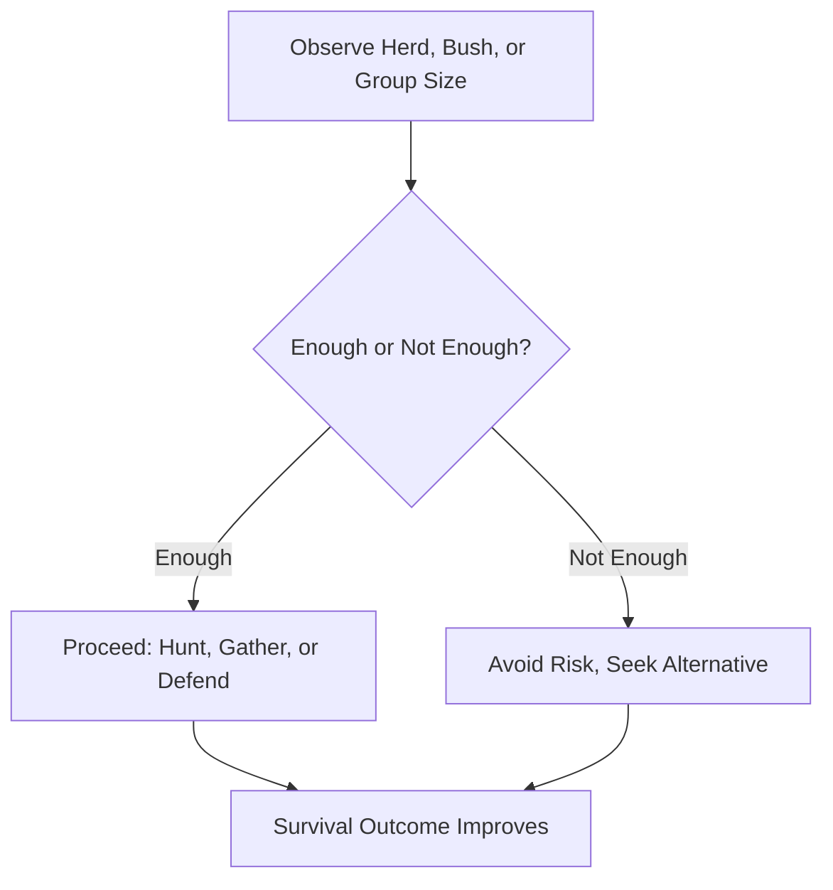
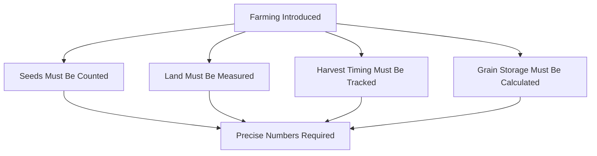
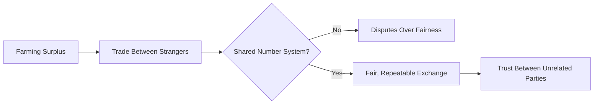
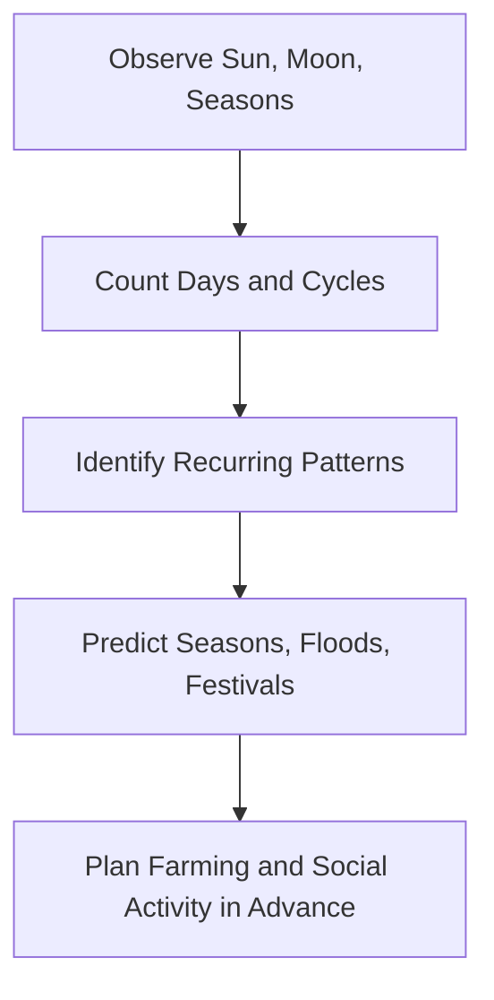
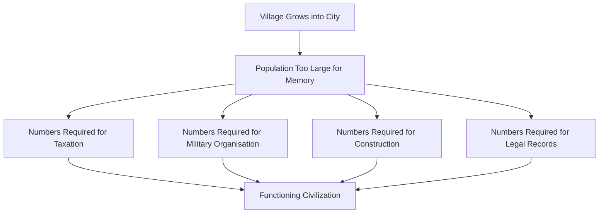
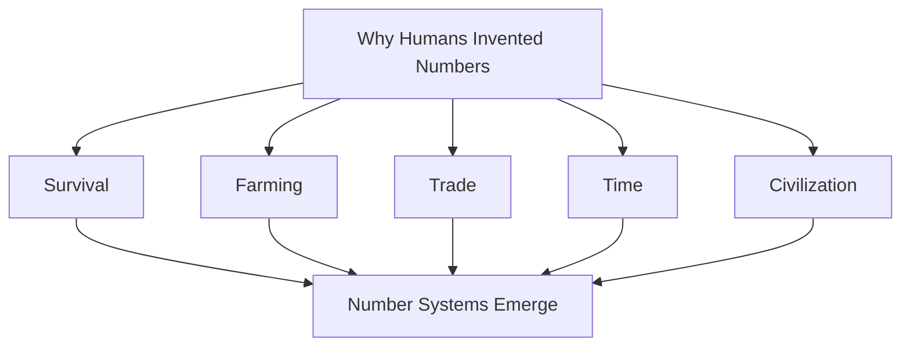
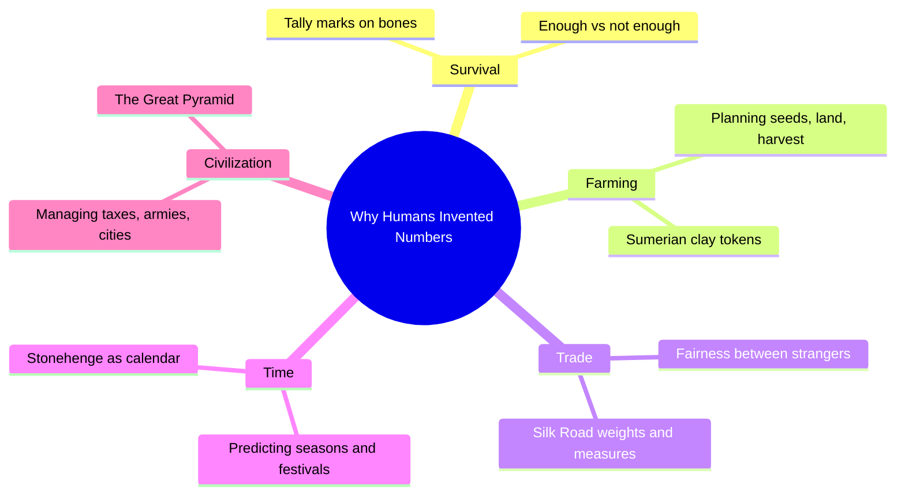

# Why Did Humans Invent Numbers?

## Table of Contents

1. [Before Numbers Existed](#before-numbers-existed)
2. [Survival — The First Reason Numbers Were Needed](#survival--the-first-reason-numbers-were-needed)
   - [AI Engineering Connection](#ai-engineering-connection)
   - [Common Misconceptions](#common-misconceptions)
   - [Quick Recap](#quick-recap)
3. [Farming — Numbers Become Necessary for Planning](#farming--numbers-become-necessary-for-planning)
   - [Common Misconceptions](#common-misconceptions-1)
   - [Quick Recap](#quick-recap-1)
4. [Trade — Numbers as a Tool for Fairness](#trade--numbers-as-a-tool-for-fairness)
   - [Common Misconceptions](#common-misconceptions-2)
   - [Quick Recap](#quick-recap-2)
5. [Time — Numbers as a Way to Understand the Sky](#time--numbers-as-a-way-to-understand-the-sky)
   - [Common Misconceptions](#common-misconceptions-3)
   - [Quick Recap](#quick-recap-3)
6. [Building Civilizations — Numbers as the Backbone of Society](#building-civilizations--numbers-as-the-backbone-of-society)
   - [Common Misconceptions](#common-misconceptions-4)
   - [Quick Recap](#quick-recap-4)
7. [Bringing It All Together](#bringing-it-all-together)
8. [Chapter Revision](#chapter-revision)
   - [Key Takeaways](#key-takeaways)
   - [Mind Map](#mind-map)
   - [Revision Notes](#revision-notes)
   - [Practice Questions](#practice-questions)
   - [Mini Quiz](#mini-quiz)
   - [Reflection Questions](#reflection-questions)
   - [Further Reading](#further-reading)
9. [Follow Me](#follow-me)

⋆˚꩜｡

## Before Numbers Existed

- Numbers were not always part of human life; they were not inherited from nature the way sunlight or rainfall was.
- Numbers are a human invention, developed gradually out of necessity, tens of thousands of years ago.
- Some remote communities studied by anthropologists have number systems with distinct words only for "one," "two," and "many."
- This indicates that detailed counting is a skill that develops according to a society's needs, rather than being automatic in every human culture.

⋆˚꩜｡

## Survival — The First Reason Numbers Were Needed

♡ Definition

- **Survival counting**: The earliest and simplest use of quantity-awareness — distinguishing "enough" from "not enough" — used by early humans to remain alive.

♡ Explanation

- Before writing, farming, or villages, early humans lived by hunting and gathering.
- Survival required judgments such as:
  - Whether a herd contained enough animals to justify a hunt.
  - Whether a bush held enough berries to feed a family.
  - Whether a hunting group was large enough to safely take down an animal.
- These judgments did not require exact numbers such as 7 or 23; they required only a rough sense of "more" or "less," "enough" or "not enough."
- This rough sense of quantity is considered the earliest spark that eventually developed into full number systems.

♡ Why It Matters

- Without any sense of quantity, early human groups could not judge whether hunting was worth the risk, whether food would last through a season, or whether their group could defend itself.
- Quantity-awareness was directly tied to survival.

♡ Examples

### Example 1

- The Lebombo bone, over 40,000 years old, is carved with tally marks and is considered one of the earliest recorded acts of counting in human history.

### Example 2

- The Ishango bone, approximately 20,000 years old, similarly contains notched tally marks believed to represent early counting activity.

### AI Engineering Connection

- Computers store information as sequences of 0s and 1s, a structure conceptually similar to tally marks: each mark or digit records that something occurred and should be counted.
- AI systems that estimate quantities from images — for example, counting the number of people in a photograph — perform a numerical and probabilistic version of the same quantity-judgment task early humans performed instinctively.

## Common Misconceptions

| Incorrect Idea | Why It Is Incorrect | Correct Understanding |
|---|---|---|
| Numbers were invented for academic or abstract purposes. | Numbers emerged from urgent, practical, everyday survival pressures; formal mathematical philosophy developed much later. | Numbers began as a practical survival tool, not an abstract academic subject. |

## Quick Recap

- Survival needs created the earliest, roughest sense of quantity: enough versus not enough.
- This rough quantity-awareness, not exact counting, is believed to be the origin of number systems.
- Ancient tally-marked bones, such as the Lebombo and Ishango bones, provide physical evidence of this early counting activity.
- Words for small numbers such as "one" and "two" are among the oldest words in many human languages.

⋆˚꩜｡

## Farming — Numbers Become Necessary for Planning

♡ Definition

- **Agricultural need for numbers**: The requirement, arising with the invention of farming roughly 10,000 years ago, for far more precise counting and measurement than hunting and gathering demanded.

♡ Explanation

- Farming required knowing:
  - How many seeds to plant.
  - How much land was available.
  - How many days remained until harvest.
  - How much grain needed to be stored for winter.
- Farming converted food from something simply found into something that had to be measured, planned, and managed across an entire year.
- Rough estimates such as "a little" or "a lot" were no longer sufficient; precise counting became essential.

♡ Why It Matters

- A farmer who miscounted seeds risked not having enough for the next planting season.
- A community that miscounted grain stores risked starvation during winter.
- Precise numbers directly protected human lives in agricultural societies.

♡ Examples

### Example 1

- Ancient Sumerian farmers, around 5,000 years ago, used small clay tokens shaped like cones, spheres, and discs to represent quantities of grain, oil, and livestock.
- This token system is considered a direct ancestor of written numbers.

### Example 2

- A farmer holding a set of tokens could demonstrate the size of a harvest to a trading partner without transporting the entire harvest, functioning as an early accounting system.

## Common Misconceptions

| Incorrect Idea | Why It Is Incorrect | Correct Understanding |
|---|---|---|
| Writing was invented before numbers. | In Mesopotamia, the earliest writing-like marks were number and accounting symbols used for farming and trade; full written language developed somewhat later. | Numerical record-keeping preceded, and partly gave rise to, written language in several early civilizations. |

## Quick Recap

- Farming required precise counting of seeds, land, time, and stored grain.
- Sumerian clay tokens represent one of the earliest known accounting systems.
- The word "calculate" derives from the Latin "calculus," meaning small stone or pebble.
- Numerical record-keeping in agricultural societies is considered a precursor to written language.

⋆˚꩜｡

## Trade — Numbers as a Tool for Fairness

♡ Definition

- **Trade counting**: The use of numbers to fairly measure and exchange goods between people, such as determining how many baskets of wheat equal one goat.

♡ Explanation

- Farming produced surplus food, prompting people to trade extra goods with others.
- Determining a fair exchange rate between goods required a shared, objective measurement system.
- Without numbers, trade becomes prone to disputes over fairness.
- As societies grew and people began trading with strangers, trust could no longer rely solely on personal relationships; numbers provided a neutral standard.

♡ Why It Matters

- Numbers gave trade a shared, objective language, comparable to the function of price tags in modern commerce.
- Standardised weights, measures, and numerical record-keeping allowed trade routes such as the Silk Road to function across different languages.

♡ Examples

### Example 1

- Modern currency exchange rates function as a direct descendant of ancient trade-counting needs, allowing two different value systems to interact fairly.

### Example 2

- Some of the earliest known writing from ancient Sumer consists of trade receipts, recording quantities of goods exchanged between people, rather than literature or poetry.

## Common Misconceptions

| Incorrect Idea | Why It Is Incorrect | Correct Understanding |
|---|---|---|
| Money was the first thing traded using numbers. | Numbers were used to measure and trade physical goods — grain, animals, cloth — long before coins or currency existed. | Numerical trade of physical goods preceded the invention of currency. |

## Quick Recap

- Trade required numbers to establish fair exchange rates between goods.
- Numbers provided a neutral standard of value for trading with strangers.
- Standardised weights and measures supported long-distance trade routes such as the Silk Road.
- Some of the earliest Sumerian writing consists of numerical trade records.

⋆˚꩜｡

## Time — Numbers as a Way to Understand the Sky

♡ Definition

- **Time-counting**: The use of numbers to track recurring natural patterns — the day, the month, and the year — enabling human activities to be planned in advance.

♡ Explanation

- Early humans observed recurring patterns in nature: the daily solar cycle, the lunar cycle, and the annual seasonal cycle.
- Using these patterns to plan activities such as planting crops or preparing for rain required counting days, months, and years.
- Natural patterns are not obvious without tracking; counting was the tool used to identify, for example, that the moon returns to the same shape roughly every 29 to 30 days.

♡ Why It Matters

- A community able to predict seasons could plant crops at the correct time, prepare for floods or droughts, and organise social or religious gatherings.
- A community unable to track time remained vulnerable to unpredictable natural events.

♡ Examples

### Example 1

- Stonehenge, in England, and comparable ancient stone structures are believed to have functioned partly as calendars, with stone alignments corresponding to the sun's position on specific days of the year.

### Example 2

- Ancient Egyptian priests tracked days carefully to predict the annual flooding of the Nile River, a flood essential for successful farming.

## Common Misconceptions

| Incorrect Idea | Why It Is Incorrect | Correct Understanding |
|---|---|---|
| Calendars are a modern invention. | Calendar-like counting systems are among the oldest applications of numbers, appearing independently in nearly every ancient civilization. | Time-counting through calendars is one of the earliest recorded uses of numbers. |

## Quick Recap

- Time-counting allowed humans to track the day, month, and year using numbers.
- Predicting seasons and natural events supported farming, disaster preparation, and social planning.
- Stonehenge is one example of an ancient structure believed to function as a solar calendar.
- The seven-day week has no basis in astronomy and persisted through ancient Babylonian counting systems and cultural continuity.

⋆˚꩜｡

## Building Civilizations — Numbers as the Backbone of Society

♡ Definition

- **Civilizational counting**: The large-scale use of numbers required to organise cities, governments, construction projects, and laws.

♡ Explanation

- As villages grew into cities and empires, numbers became necessary for:
  - Counting citizens for taxation.
  - Counting soldiers for an army.
  - Counting materials for construction.
  - Recording laws for a population to follow.
- A small village can be managed through memory and conversation; a large city cannot.
- Numbers allowed leaders to manage populations far too large to know personally.

♡ Why It Matters

- Taxation, large-scale construction, military organisation, and fair resource distribution across thousands of people required a shared, reliable numerical system.
- Numbers functioned as a communication system across a society too large for any single person to track from memory.

♡ Examples

### Example 1

- The Great Pyramid of Giza required an estimated 2.3 million stone blocks, depending on precise counting, measuring, and planning by ancient Egyptian engineers over approximately twenty years.

### Example 2

- Ancient Rome conducted a census — an official count of citizens — partly to organise taxation and military service.

### Example 3

- Ancient China used counting rods for engineering, astronomy, and government record-keeping over 2,000 years ago.

## Common Misconceptions

| Incorrect Idea | Why It Is Incorrect | Correct Understanding |
|---|---|---|
| Writing, art, and philosophy preceded numbers in the development of civilization. | In most early civilizations, numerical record-keeping for taxes, trade, and construction was among the first organised systems, often preceding elaborate writing or literature. | Numerical systems frequently developed before, and contributed to, the development of writing and literature. |

## Quick Recap

- Growing populations required numbers to manage taxation, military organisation, construction, and law.
- The Great Pyramid of Giza is an example of a large-scale project dependent on precise numerical planning.
- Numerical record-keeping often preceded the development of full written language in early civilizations.
- Numbers functioned as an organisational backbone for large-scale societies.

⋆˚꩜｡

## Bringing It All Together

- Five distinct pressures — survival, farming, trade, time, and civilization — independently and gradually pushed early humans toward the invention of numbers.
- None of these pressures were academic in origin; numbers were invented because human life depended on them.

| Human Need | What Numbers Solved | Example |
|---|---|---|
| Survival | Judging "enough" versus "not enough" food or people | Tally marks on ancient bones |
| Farming | Planning seeds, land, and harvest over a year | Sumerian clay tokens for grain |
| Trade | Fair exchange of goods between strangers | Silk Road weights and measures |
| Time | Predicting seasons, floods, and festivals | Stonehenge as a solar calendar |
| Civilization | Managing cities, taxes, armies, and laws | The Great Pyramid's construction records |

⋆˚꩜｡

## Chapter Revision

### Key Takeaways

- Numbers are a human invention, born from necessity, not a natural law handed down ready-made.
- Each new stage of human society — hunting, farming, trading, building cities — demanded more precise numbers than the stage before it.
- The earliest number systems, such as tally marks and clay tokens, were practical tools, not abstract mathematics.
- Time-keeping through numbers allowed humans to work with natural cycles instead of being surprised by them.
- Large civilizations could not have existed without numbers to manage their scale.

### Mind Map

### Revision Notes

- Tally marks on the Lebombo and Ishango bones are among the earliest known evidence of counting.
- Sumerian clay tokens are considered an ancestor of both numbers and writing.
- Stonehenge likely functioned partly as a solar calendar.
- The Great Pyramid of Giza required advanced numerical planning to construct.
- The seven-day week is a cultural invention, not an astronomical necessity.

### Practice Questions

1. Explain, in your own words, why "enough versus not enough" was an important idea before exact numbers existed.
2. Describe one way farming made counting more necessary than hunting and gathering did.
3. Why did trade between strangers specifically require numbers, rather than personal trust alone?
4. Give one example of how ancient humans used the sky or seasons to develop a sense of time.
5. Explain why a large city could not function without numbers, using your own example.
6. What were Sumerian clay tokens, and what purpose did they serve?
7. What is the connection between the word "calculate" and ancient counting methods?
8. Why might numerical record-keeping have appeared before full written language in some civilizations?
9. Describe how Stonehenge may have functioned as an early calendar.
10. Summarise, in your own words, the five reasons numbers were invented.
11. How did numbers help create fairness in trade between people who did not know each other?
12. Why was tracking the flooding of the Nile important to ancient Egyptians?
13. What does the census in ancient Rome tell us about the role of numbers in governing a civilization?
14. Compare the needs of a small village and a large city in terms of why numbers become necessary.
15. Why do you think the seven-day week survived even though it has no astronomical basis?

### Mini Quiz

1. Which ancient bone, over 40,000 years old, contains some of the earliest known tally marks?
   **Answer:** The Lebombo bone.
2. True or False: Numbers have always existed as a natural part of every human language.
   **Answer:** False.
3. What ancient civilization used clay tokens shaped like cones and spheres to represent grain and livestock?
   **Answer:** The Sumerians.
4. Fill in the blank: The word "calculate" comes from the Latin word for ______.
   **Answer:** Small stone / pebble ("calculus").
5. Which famous stone structure in England is believed to have functioned as a solar calendar?
   **Answer:** Stonehenge.
6. True or False: Writing always developed before numerical record-keeping in ancient civilizations.
   **Answer:** False.
7. What river's annual flooding did ancient Egyptians track carefully using numbers?
   **Answer:** The Nile.
8. What was one purpose of the census conducted in ancient Rome?
   **Answer:** Organising taxation and military service.
9. Approximately how many stone blocks were used to build the Great Pyramid of Giza?
   **Answer:** Approximately 2.3 million.
10. True or False: The seven-day week is based on a natural astronomical cycle.
    **Answer:** False.
11. What ancient trade route depended heavily on standardised weights and numerical records?
    **Answer:** The Silk Road.
12. Name one of the five major human needs that pushed the invention of numbers.
    **Answer:** Any one of: survival, farming, trade, time, civilization.
13. What do historians believe was one of the very first uses of writing-like symbols in Sumer?
    **Answer:** Numerical and accounting records.
14. True or False: Rough quantity-awareness like "more" or "less" came before precise number systems.
    **Answer:** True.
15. Why did large cities need numbers to manage taxes and armies?
    **Answer:** Populations became too large to track through memory alone, requiring a reliable numerical system.

### Reflection Questions

1. Which of the five reasons — survival, farming, trade, time, civilization — feels most surprising, and why?
2. Identify a modern situation that still relies on a rough sense of "enough" rather than an exact number.
3. In an ancient farming community, which numerical problem would likely have felt most urgent?

### Further Reading

- The Ishango bone and the ongoing debates among historians regarding its markings.
- The Sumerian clay token system and its possible connection to the invention of writing.
- Ancient calendar systems (Egyptian, Mayan, Babylonian) and how each tracked time using numbers.

⋆˚꩜｡

## Follow Me

If you enjoyed these notes, you'll probably enjoy the rest too.

| Platform | Link |
|---|---|
| Instagram | [@mehrunnisa.ai](https://www.instagram.com/mehrunnisa.ai/) |
| SubStack | [The Epoch](https://theepoch.substack.com/) |
| YouTube | [@mehrunnisa.ai](https://www.youtube.com/@Mehrunnisa-ai) |

**Download:** [Number – By Mehrunnisa.pdf](https://github.com/user-attachments/files/30637570/Number.-.By.Mehrunnisa.pdf) — for offline reading.

**Usage Terms**

These notes are free to use for personal learning, revision, and study. Please do not:

- Sell or redistribute for profit.
- Claim them as your own work.
- Modify and republish without permission.
- Use for any unethical or unauthorized purpose.

Thank you for respecting the effort behind these notes. Happy learning. ♡
