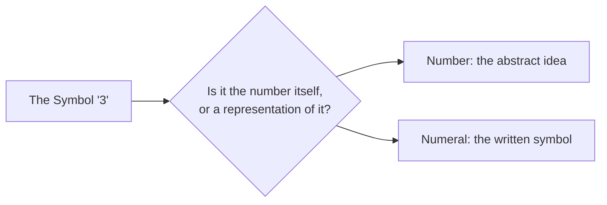
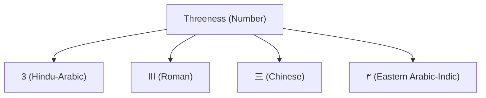
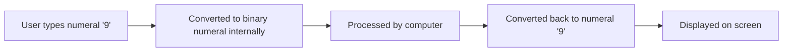
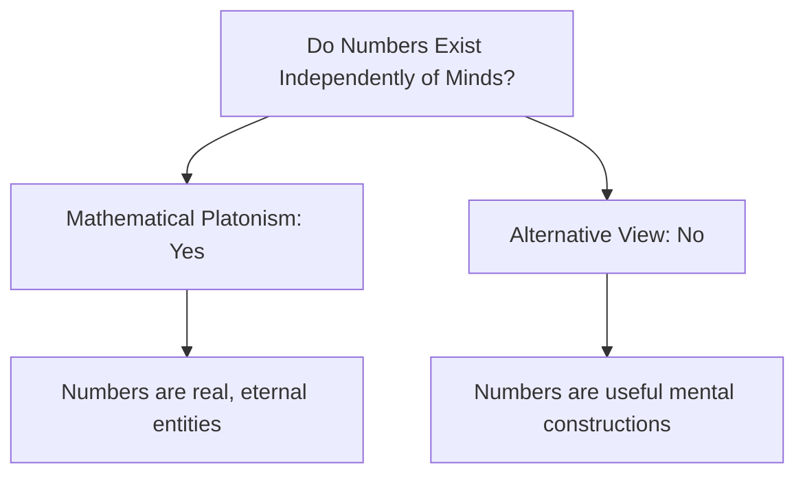
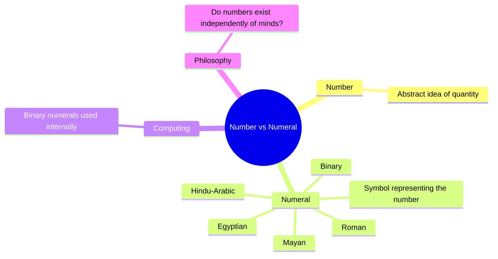

# Numbers and Philosophy: Number vs Numeral

## Table of Contents

1. [A Question That Sounds Simple But Isn't](#a-question-that-sounds-simple-but-isnt)
2. [What Is a Number?](#what-is-a-number)
   - [Common Misconceptions](#common-misconceptions)
   - [Quick Recap](#quick-recap)
3. [What Is a Numeral?](#what-is-a-numeral)
   - [Common Misconceptions](#common-misconceptions-1)
   - [Quick Recap](#quick-recap-1)
4. [Comparing Number and Numeral Side by Side](#comparing-number-and-numeral-side-by-side)
5. [Why This Distinction Matters](#why-this-distinction-matters)
   - [AI Engineering Connection](#ai-engineering-connection)
   - [Quick Recap](#quick-recap-2)
6. [A Brief History of Changing Numerals](#a-brief-history-of-changing-numerals)
   - [Common Misconceptions](#common-misconceptions-2)
7. [Number Versus Numeral: A Deeper Philosophical Reflection](#number-versus-numeral-a-deeper-philosophical-reflection)
   - [Quick Recap](#quick-recap-3)
8. [Chapter Revision](#chapter-revision)
   - [Chapter Summary](#chapter-summary)
   - [Key Takeaways](#key-takeaways)
   - [Mind Map](#mind-map)
   - [Revision Notes](#revision-notes)
   - [Practice Questions](#practice-questions)
   - [Mini Quiz](#mini-quiz)
   - [Reflection Questions](#reflection-questions)
   - [Further Reading](#further-reading)
9. [Follow Me](#follow-me)

⋆˚꩜｡

## A Question That Sounds Simple But Isn't

When the symbol "3" is seen, a foundational question in the philosophy of mathematics arises: is that symbol the number itself, or a representation of the number? Answering this requires separating two concepts that are commonly treated as identical: the number and the numeral.

⋆˚꩜｡

## What Is a Number?

♡ Definition

- A **number** is an abstract idea — a concept of quantity, order, or amount — that exists independently of any symbol used to write it down.

♡ Explanation

- "Threeness" is the shared quality among three apples, three claps, and three days. It is not ink on paper or a spoken sound; it is a concept the mind can hold, compare, and reason about without any written symbol.
- Numbers exist as ideas because quantity is a real feature of the world: three apples on a table remain three apples regardless of whether anyone counts them or writes "3."
- To reason about quantity — comparing, adding, or predicting — humans required the abstract idea of quantity itself, independent of any specific object counted. This abstraction allows the same reasoning ("three plus two equals five") to apply equally to apples, sheep, or minutes.

♡ Examples

### Example 1

The idea of "redness" is shared by a rose, a fire truck, and a ripe tomato, despite these being entirely different objects. Similarly, "threeness" is not any one specific group of three objects, but the abstract quality all such groups share.

### Example 2

If every human language and counting symbol vanished, the quantity of stars in the sky or apples on a tree would remain unchanged. The numbers describing those quantities would remain true; only the means of writing them down would be lost.

♡ Why It Matters

- Philosophers have debated for centuries whether numbers exist independently, in the way physical objects exist, or whether they are mental constructions. This question, known as mathematical realism, remains unresolved among philosophers and mathematicians.
- Different cultures represented identical numbers using entirely different symbols — Roman numerals, Chinese numerals, Mayan dot-and-bar numerals — demonstrating that symbols are optional while the underlying idea of quantity is universal.

## Common Misconceptions

| Incorrect Idea | Why It Is Incorrect | Correct Understanding |
|---|---|---|
| The symbol "3" is the number three. | The symbol is only one possible representation of the idea. | The symbol is a numeral; the number is the abstract quantity it represents. |

## Quick Recap

- A number is a pure idea of quantity or order, independent of any symbol, sound, or written mark used to represent it.
- Numbers exist as concepts corresponding to real features of the world.
- Whether numbers exist independently of human minds remains an open philosophical question.

⋆˚꩜｡

## What Is a Numeral?

♡ Definition

- A **numeral** is a symbol, mark, or written character used to represent a number.

♡ Explanation

- The characters "3," "III," and "三" are three different numerals, all representing the same underlying number.
- Ideas alone cannot be written, spoken across distances, or preserved for future generations without a symbol. Numerals give the abstract idea of number a visible or audible, shareable form.
- Without numerals, quantity could only be communicated through direct physical demonstration, such as holding up fingers or placing pebbles in a row. Numerals allow quantity to be recorded, transmitted, and preserved across time.

♡ Examples

### Example 1

A person's name written on an official document is a label representing the person, not the person themselves. Similarly, a numeral is a label representing a number, not the number itself.

### Example 2

The Hindu-Arabic numeral system (0–9), used almost worldwide today, was developed in India and later spread through the Islamic world into Europe. The numbers these numerals represent are the same numbers ancient Babylonians, Egyptians, and Mayans reasoned about using entirely different symbols.

♡ Why It Matters

- The numeral "0," functioning both as a placeholder and as a number in its own right, was a significant development attributed largely to Indian mathematicians, transforming the efficiency of written calculation with large numbers.

## Common Misconceptions

| Incorrect Idea | Why It Is Incorrect | Correct Understanding |
|---|---|---|
| A change in number system (e.g., Roman to Hindu-Arabic) means the numbers themselves changed. | Only the numerals — the symbols — changed across history; the quantities represented remained constant. | Numeral systems have varied throughout history, while the underlying numbers have not. |

## Quick Recap

- A numeral is a symbol used to represent a number.
- The same number can be written using many different numeral systems across history and culture.
- Zero as a numeral and number was a major historical development.

⋆˚꩜｡

## Comparing Number and Numeral Side by Side

| Feature | Number | Numeral |
|---|---|---|
| What it is | An abstract idea of quantity or order | A written or spoken symbol |
| Where it exists | In the mind, as a concept | On paper, screens, stone, or in speech |
| Can it change across cultures? | No — the underlying quantity is universal | Yes — symbols differ (Roman, Arabic, Mayan, etc.) |
| Example | The idea of "threeness" | "3," "III," "三," "٣" |
| Analogy | A person's identity | A person's name written on paper |

⋆˚꩜｡

## Why This Distinction Matters

♡ Explanation

- Computers do not use the numeral "3" internally. The number three is represented using binary — a numeral system composed only of 0s and 1s.
- The underlying number never changes; only the numeral system representing it changes, from the Hindu-Arabic "3" typed by a user to the binary numeral "11" processed internally by a machine.

## AI Engineering Connection

- **Computer Science**: When a numeral is typed on a keyboard, the computer converts it into binary to process it internally, then converts it back to the original numeral system for display. The underlying number is unchanged throughout this process.
- **Artificial Intelligence**: AI language models process text, including numerals, by converting them into numerical patterns the model can calculate with. This relies on the same distinction: the visible symbol is not the same as the underlying numerical representation being processed.

## Quick Recap

- The number-versus-numeral distinction has direct practical relevance in computing and AI.
- Computers and AI systems convert numerals between systems (such as decimal and binary) while the underlying number remains constant.

⋆˚꩜｡

## A Brief History of Changing Numerals

| Civilization / System | Approx. Time Period | Numeral Style |
|---|---|---|
| Tally marks (bone carvings) | 40,000+ years ago | Simple notches, one per unit |
| Ancient Egyptian numerals | ~3000 BCE | Picture-symbols for 1, 10, 100, etc. |
| Babylonian numerals | ~1900 BCE | Wedge-shaped marks in base 60 |
| Roman numerals | ~500 BCE onward | Letters such as I, V, X, L, C, M |
| Mayan numerals | ~1st century CE | Dots and bars in base 20 |
| Hindu-Arabic numerals | ~7th century CE onward | 0–9 digits, place-value system (used worldwide today) |
| Binary numerals | Formalised ~17th century, used in computing today | Only two digits: 0 and 1 |

## Common Misconceptions

| Incorrect Idea | Why It Is Incorrect | Correct Understanding |
|---|---|---|
| Roman numerals are "less mathematical" than modern numerals. | Roman numerals represent the same numbers as modern numerals; they are simply a less efficient notation system. | Numeral systems differ in efficiency, not in the mathematical validity of the numbers they represent. |
| Zero has always existed as a numeral in every culture. | Zero as a full numeral and number, usable in calculation, was a major and relatively late historical development. | Zero's status as both placeholder and number was a significant, non-universal historical invention. |
| Numerals must be written to exist. | Spoken number words, such as "five" or "ten," are also numerals. | Numerals may be written or spoken; both are symbolic representations of numbers. |

⋆˚꩜｡

## Number Versus Numeral: A Deeper Philosophical Reflection

♡ Explanation

- A central question in the philosophy of mathematics asks whether numbers would still exist if every numeral system and language on Earth were destroyed. This question remains without a single agreed-upon answer.
- **Mathematical Platonism**, associated with the philosopher Plato, holds that numbers are real, eternal entities existing independently of human minds — that "3" would remain true even if no being ever thought about it.
- An alternative view holds that numbers are useful mental constructions, invented by human minds to describe patterns in reality, rather than independently existing objects.

## Quick Recap

- The question of whether numbers exist independently of numeral systems or minds remains philosophically open.
- Mathematical Platonism holds that numbers exist independently of human minds.
- An alternative view holds that numbers are human mental constructions describing patterns in reality.

⋆˚꩜｡

## Chapter Revision

### Chapter Summary

- A number is an abstract idea of quantity or order, existing in the mind rather than on paper.
- A numeral is a symbol — written, carved, or spoken — used to represent a number.
- The same number can be represented by many different numeral systems across history and culture (Roman, Egyptian, Mayan, Hindu-Arabic, binary).
- Computers and AI systems rely on this distinction constantly, converting numerals between systems (such as decimal and binary) while the underlying number stays the same.
- Philosophers continue to debate whether numbers exist independently of human minds, a question known as mathematical Platonism.

### Key Takeaways

- Number is the idea; numeral is the symbol representing that idea.
- Changing a numeral system does not change the underlying number.
- Zero, as both a numeral and a number used in calculation, was a major historical development.
- Computers constantly convert between numeral systems (decimal, binary) without changing the numbers themselves.
- Whether numbers exist independently of minds remains an open philosophical debate.

### Mind Map

### Revision Notes

- Number = abstract idea; Numeral = symbol or written representation.
- The Hindu-Arabic numeral system (0–9) is the most widely used system in the world today.
- Binary numerals (0 and 1 only) are used internally by computers.
- Mathematical Platonism is the view that numbers exist independently of human minds.
- Zero was a significant and relatively late invention as both a placeholder and a number.

### Practice Questions

1. In your own words, define the difference between a number and a numeral.
2. Give three different numerals that all represent the same number.
3. Why can the same number be represented by many different numeral systems?
4. Explain how computers use numerals differently from humans, using the idea of binary.
5. What is mathematical Platonism, and what question does it try to answer?
6. Why was the invention of zero considered significant?
7. Describe an everyday analogy that helps explain the number vs numeral distinction.
8. Why is it a mistake to think Roman numerals are "less mathematical" than modern numerals?
9. Explain why spoken number words also count as numerals.
10. If all numeral systems were destroyed, would numbers themselves disappear? Explain your reasoning.

### Mini Quiz

1. True or False: A numeral is the same thing as a number.
   Answer: False — a numeral is a symbol; a number is the abstract idea it represents.
2. Fill in the blank: A number is an abstract ______, while a numeral is a ______.
   Answer: Idea (of quantity); symbol.
3. Which ancient numeral system used wedge-shaped marks in base 60?
   Answer: Babylonian numerals.
4. Which numeral system is most widely used across the world today?
   Answer: The Hindu-Arabic numeral system.
5. True or False: Binary numerals use ten different digits.
   Answer: False — binary uses only two digits, 0 and 1.
6. What philosophical view holds that numbers exist independently of human minds?
   Answer: Mathematical Platonism.
7. Name one numeral system used by the ancient Maya.
   Answer: A dot-and-bar system in base 20.
8. True or False: The number "three" changes if you write it as III instead of 3.
   Answer: False — only the numeral changes; the number stays the same.
9. What historical invention allowed zero to be used both as a placeholder and as a number?
   Answer: The development of zero by Indian mathematicians.
10. Which ancient Greek philosopher is associated with the idea that number governs reality?
    Answer: Pythagoras.

### Reflection Questions

1. Before reading this chapter, had you consciously separated the idea of "number" from the symbol used to write it?
2. Which philosophical view feels more convincing personally — that numbers are real and independent, or that they are useful human inventions?
3. How does knowing that computers convert numerals internally change the way typing a number on a keyboard is understood?

### Further Reading

- Mathematical Platonism and its major supporters and critics.
- The history of the invention of zero in Indian mathematics.
- How different ancient numeral systems (Egyptian, Babylonian, Mayan) performed calculations.

⋆˚꩜｡

## Follow Me

If you enjoyed these notes, you'll probably enjoy the rest too.

| Platform | Link |
|---|---|
| Instagram | [@mehrunnisa.ai](https://www.instagram.com/mehrunnisa.ai/) |
| SubStack | [The Epoch](https://theepoch.substack.com/) |
| YouTube | [@mehrunnisa.ai](https://www.youtube.com/@Mehrunnisa-ai) |

**Download:** [Number – By Mehrunnisa.pdf](https://github.com/user-attachments/files/30637570/Number.-.By.Mehrunnisa.pdf) — for offline reading.

**Usage Terms**

These notes are free to use for personal learning, revision, and study. Please do not:

- Sell or redistribute for profit.
- Claim them as your own work.
- Modify and republish without permission.
- Use for any unethical or unauthorized purpose.

Thank you for respecting the effort behind these notes. Happy learning. ♡
