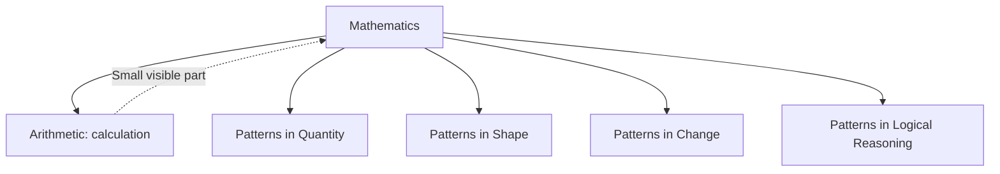
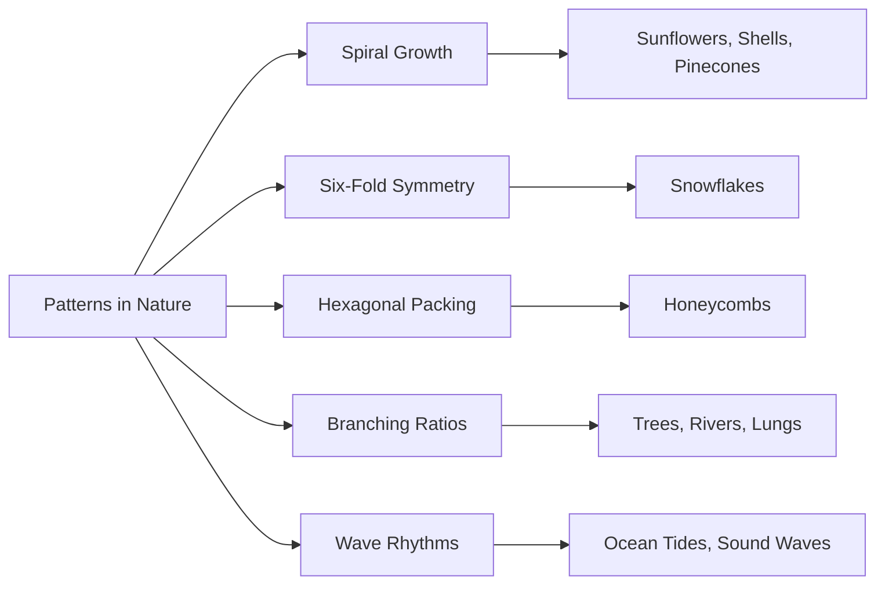
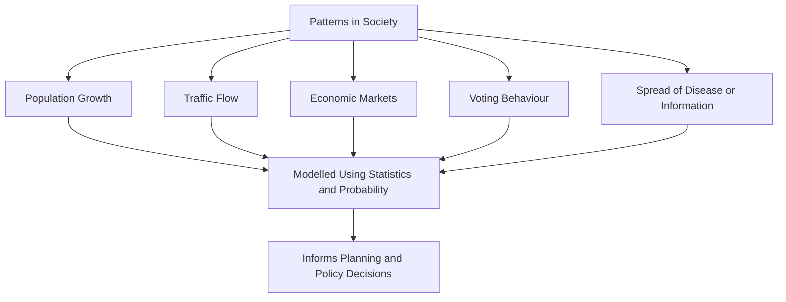
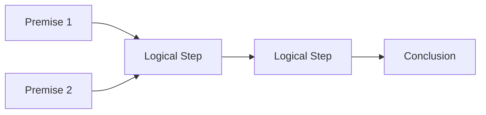
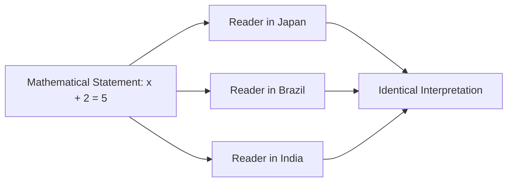
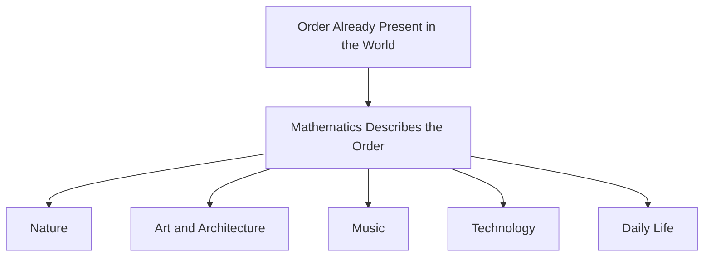
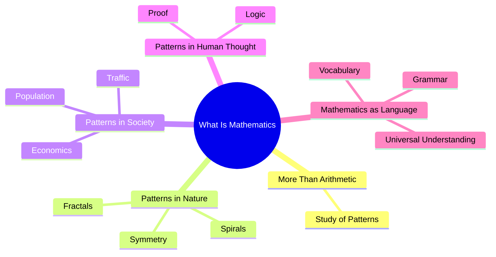

# What Is Mathematics? More Than Arithmetic — The Study of Patterns

## Table of Contents

1. [Mathematics Is Not Just Arithmetic](#mathematics-is-not-just-arithmetic)
2. [Mathematics as the Study of Patterns](#mathematics-as-the-study-of-patterns)
   - [Common Misconceptions](#common-misconceptions)
   - [Quick Recap](#quick-recap)
3. [Patterns in Nature](#patterns-in-nature)
4. [Patterns in Society](#patterns-in-society)
5. [Patterns in Human Thought](#patterns-in-human-thought)
6. [Mathematics as a Language](#mathematics-as-a-language)
   - [Common Misconceptions](#common-misconceptions-1)
   - [Quick Recap](#quick-recap-1)
7. [Why Mathematics Appears Everywhere](#why-mathematics-appears-everywhere)
8. [Chapter Revision](#chapter-revision)
   - [Chapter Summary](#chapter-summary)
   - [Key Takeaways](#key-takeaways)
   - [Mind Map](#mind-map)
   - [Revision Notes](#revision-notes)
   - [Practice Questions](#practice-questions)
   - [Mini Quiz](#mini-quiz)
   - [Reflection Questions](#reflection-questions)
   - [Further Reading](#further-reading)
9. [Follow Me](#follow-me)

⋆˚꩜｡

## Mathematics Is Not Just Arithmetic

Arithmetic — addition, subtraction, multiplication, and division — is one visible component of mathematics, but it represents only a small portion of the discipline. Mathematics, at its core, is the study of patterns in quantity, shape, change, and logical reasoning.

♡ Why It Matters

- Professional mathematicians frequently spend careers without performing complex arithmetic by hand; their work centers on discovering and proving patterns, relationships, and structures, with arithmetic serving as one tool among many.

⋆˚꩜｡

## Mathematics as the Study of Patterns

♡ Definition

- **Mathematics**, at its deepest level, is the systematic study of patterns — in numbers, shapes, structures, change, and logical relationships — and the rules governing how those patterns behave.

♡ Explanation

- A pattern is something that repeats or follows a predictable rule. Even numbers ending in 0, 2, 4, 6, or 8 form a pattern; a snail shell spiraling outward in a specific, repeating way forms a pattern as well.
- The universe exhibits order rather than pure randomness: planets orbit predictably, plants grow leaves in specific arrangements, and sound waves vibrate at measurable frequencies. Mathematics developed as a systematic method for understanding, describing, and predicting this order.
- Recognising patterns enables prediction, and prediction supports survival and progress. A farmer who identifies seasonal patterns can plant at the correct time; an engineer who understands force patterns can construct a stable bridge.

| Aspect | Detail |
|---|---|
| Core focus | Patterns in number, shape, change, and logical reasoning |
| Analogy | A detective identifying the hidden pattern connecting scattered clues |
| Example | The Fibonacci sequence (1, 1, 2, 3, 5, 8, 13, 21...), where each number is the sum of the two preceding it |

♡ Examples

### Example 1

The Fibonacci sequence appears repeatedly in nature — in the spiral of sunflower seeds, the arrangement of pinecone scales, and the curve of a nautilus shell.

### Example 2

Traffic light timing systems apply mathematical patterns derived from traffic flow data to predict congestion and adjust signal timing.

♡ Why It Matters

- The mathematician G. H. Hardy described a mathematician as fundamentally "a maker of patterns," comparing mathematical work to art.

## Common Misconceptions

| Incorrect Idea | Why It Is Incorrect | Correct Understanding |
|---|---|---|
| Being good at mathematics means being fast at mental arithmetic. | Many accomplished mathematicians are unremarkable at rapid mental calculation. | Mathematical ability centers on recognising deep patterns and structures, not calculation speed. |

## Quick Recap

- Mathematics is the disciplined study of patterns in number, shape, structure, and change.
- Pattern recognition, formalised into mathematics, supports prediction and practical progress.
- Mathematical skill is defined by pattern recognition, not calculation speed.

⋆˚꩜｡

## Patterns in Nature

Mathematical patterns appear extensively throughout the natural world, including in forms not commonly expected.

| Natural Pattern | Mathematical Concept | Where It Appears |
|---|---|---|
| Spiral growth | Fibonacci sequence / golden ratio | Sunflowers, shells, pinecones |
| Six-fold symmetry | Geometric symmetry | Snowflakes |
| Hexagonal packing | Optimisation / efficient shapes | Honeycombs |
| Branching ratios | Fractals / recursive patterns | Trees, rivers, lungs |
| Wave rhythms | Periodic functions | Ocean tides, sound waves |

⋆˚꩜｡

## Patterns in Society

♡ Explanation

- Human societies, while appearing chaotic, also exhibit mathematical patterns. Population growth, traffic flow, economic markets, voting behaviour, and the spread of rumours or diseases all follow patterns studied through statistics and probability.
- Governments and organisations rely on mathematics to plan cities, manage economies, and respond to public health crises, since human behaviour, while never perfectly predictable, follows patterns precise enough to guide meaningful decisions.

⋆˚꩜｡

## Patterns in Human Thought

♡ Explanation

- Mathematics also studies patterns in logical reasoning — the rules determining when an argument is valid and when a conclusion follows from its premises. This branch forms the foundation beneath all other mathematics.
- A mathematical proof is a step-by-step argument demonstrating that a statement must be true, structured so that each step follows inevitably from the one before it.

| Pattern Territory | Focus |
|---|---|
| Numbers | Quantity patterns |
| Shapes | Geometric patterns |
| Changes | Patterns of motion or growth |
| Thoughts | Patterns of logical reasoning |

⋆˚꩜｡

## Mathematics as a Language

♡ Definition

- Describing mathematics as a language means it possesses a vocabulary (numbers, symbols), a grammar (rules for combining symbols), and a purpose (communicating precise meaning), applied to describing patterns, quantities, and relationships with precision.

♡ Explanation

- Mathematics uses symbols such as +, =, ×, and π, combined according to rules, to build meaningful statements such as "x + 2 = 5," comparable to how words and grammar build meaningful sentences in spoken language.
- Ordinary spoken language allows flexibility that can introduce ambiguity. Mathematics was developed to communicate ideas about quantity and pattern without ambiguity, so that a mathematical statement means exactly one thing to any trained reader.
- Precision is critical in fields such as engineering, science, medicine, and finance, where misunderstood instructions could cause harm. Mathematics provides a shared, unambiguous language that reduces this risk.

♡ Examples

### Example 1

A bridge engineer in Japan and a bridge engineer in Brazil, without sharing a spoken language, can both interpret the same mathematical equations describing load-bearing requirements identically.

### Example 2

The equation E = mc², written by Albert Einstein, is understood identically by physicists worldwide regardless of native spoken language, demonstrating mathematics functioning as a universal language.

♡ Why It Matters

- Mathematical notation has evolved over centuries; the equals sign "=" was introduced in 1557 by Welsh mathematician Robert Recorde, who selected two parallel lines to represent equality.

## Common Misconceptions

| Incorrect Idea | Why It Is Incorrect | Correct Understanding |
|---|---|---|
| Mathematical symbols are arbitrary and interchangeable. | Each symbol carries a precise, agreed-upon meaning, similar to a dictionary definition of a word. | Mathematical symbols have fixed, specific meanings within the language of mathematics. |

## Quick Recap

- Mathematics functions as a precise, universal language with its own vocabulary and grammar.
- Precision in mathematical notation prevents ambiguity in fields where misinterpretation could cause harm.
- Mathematical notation has developed and changed over centuries.

⋆˚꩜｡

## Why Mathematics Appears Everywhere

♡ Explanation

- Understanding mathematics as the study of patterns and as a universal language clarifies why mathematics appears throughout nature, art, music, technology, and daily life.
- Mathematics functions as a description of order that already exists, rather than a structure imposed onto the world externally.
- The golden ratio (approximately 1.618), found in flower petal arrangements, also appears in the proportions of the Parthenon in ancient Greece and in the composition of numerous Renaissance paintings.

⋆˚꩜｡

## Chapter Revision

### Chapter Summary

- Mathematics is far more than arithmetic — it is the disciplined study of patterns in number, shape, change, and logical thought.
- Patterns appear throughout nature, from spiral shells to hexagonal honeycombs to branching trees.
- Patterns also appear in society and human behaviour, studied through statistics and probability.
- Patterns of logical reasoning form the foundation of mathematical proof.
- Mathematics functions as a precise, universal language, understood identically across all cultures and spoken languages.

### Key Takeaways

- Mathematical ability centers on recognising patterns and structures, not calculating quickly.
- Nature contains measurable mathematical patterns, from the Fibonacci sequence to hexagonal symmetry.
- Mathematics helps model and predict patterns in human society, such as traffic or population growth.
- As a language, mathematics uses precise vocabulary (numbers, symbols) and grammar (rules) to avoid ambiguity.
- The universality of mathematics allows people from different cultures to interpret the same equation identically.

### Mind Map

### Revision Notes

- Mathematics studies patterns in numbers, shapes, change, and logical reasoning.
- The Fibonacci sequence appears frequently in natural growth patterns.
- Mathematical proofs are structured, step-by-step patterns of reasoning.
- The equals sign (=) was invented in 1557 by Robert Recorde.
- The golden ratio appears in nature, architecture, and art alike.

### Practice Questions

1. Explain why arithmetic is only a small part of what mathematics actually studies.
2. Give two examples of mathematical patterns found in nature.
3. How can mathematics help describe patterns in human society?
4. Why is mathematics often described as a universal language?
5. Explain, using your own analogy, why mathematical notation needs to be precise.
6. What is the Fibonacci sequence, and where does it appear in nature?
7. Why might a mathematician disagree with the idea that mathematics is just calculation?
8. Describe the philosophical debate about whether mathematics is discovered or invented.
9. Who invented the equals sign, and what was his reasoning for its design?
10. Why does E = mc² serve as a good example of mathematics as a universal language?
11. How do patterns of logical reasoning relate to mathematical proofs?
12. Give one everyday example of a pattern you have personally noticed in society.

### Mini Quiz

1. True or False: Mathematics is only about arithmetic calculations.
   Answer: False — mathematics is the broader study of patterns in number, shape, change, and reasoning.
2. What sequence, where each number is the sum of the two before it, appears frequently in nature?
   Answer: The Fibonacci sequence.
3. What shape do honeycombs use, and why is it efficient?
   Answer: Hexagons — they store the most honey using the least wax.
4. Who invented the equals sign, and in what year?
   Answer: Robert Recorde, in 1557.
5. Fill in the blank: Mathematics can be understood as a universal ______.
   Answer: Language.
6. True or False: Mathematical symbols are arbitrary and mean different things to different mathematicians.
   Answer: False — each symbol has a precise, agreed-upon meaning.
7. What famous equation, written by Einstein, is understood identically worldwide?
   Answer: E = mc².
8. What approximate numerical value is the golden ratio?
   Answer: Approximately 1.618.
9. Which mathematician compared mathematicians to painters and poets as "makers of patterns"?
   Answer: G. H. Hardy.
10. True or False: Patterns in society, like traffic flow, can be studied mathematically.
    Answer: True.

### Reflection Questions

1. Before this chapter, was mathematics primarily understood as arithmetic? Has that view shifted?
2. Can a mathematical pattern be identified in a personal daily routine that had not been noticed before?
3. Is the idea of mathematics as a universal language comforting, surprising, or something else? Why?

### Further Reading

- The golden ratio and its appearances in art, architecture, and nature.
- The history and evolution of mathematical notation and symbols.
- How statistics and probability are used to model patterns in society, such as public health or economics.

⋆˚꩜｡

## Follow Me

If you enjoyed these notes, you'll probably enjoy the rest too.

| Platform | Link |
|---|---|
| Instagram | [@mehrunnisa.ai](https://www.instagram.com/mehrunnisa.ai/) |
| SubStack | [The Epoch](https://theepoch.substack.com/) |
| YouTube | [@mehrunnisa.ai](https://www.youtube.com/@Mehrunnisa-ai) |

**Download:** [Number – By Mehrunnisa.pdf](https://github.com/user-attachments/files/30637570/Number.-.By.Mehrunnisa.pdf) — for offline reading.

**Usage Terms**

These notes are free to use for personal learning, revision, and study. Please do not:

- Sell or redistribute for profit.
- Claim them as your own work.
- Modify and republish without permission.
- Use for any unethical or unauthorized purpose.

Thank you for respecting the effort behind these notes. Happy learning. ♡
