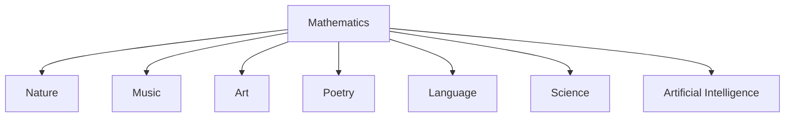
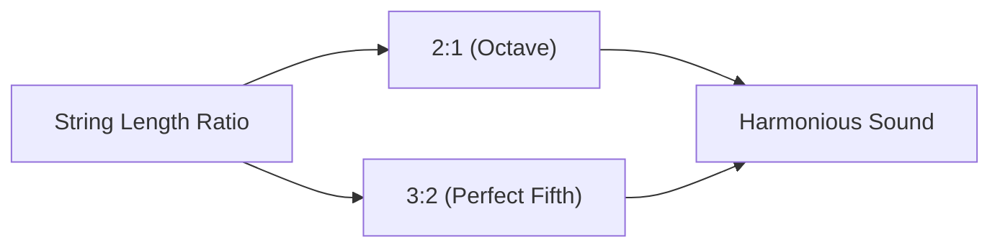
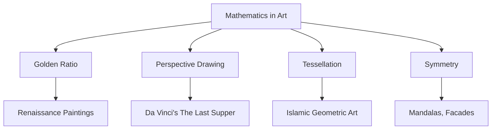
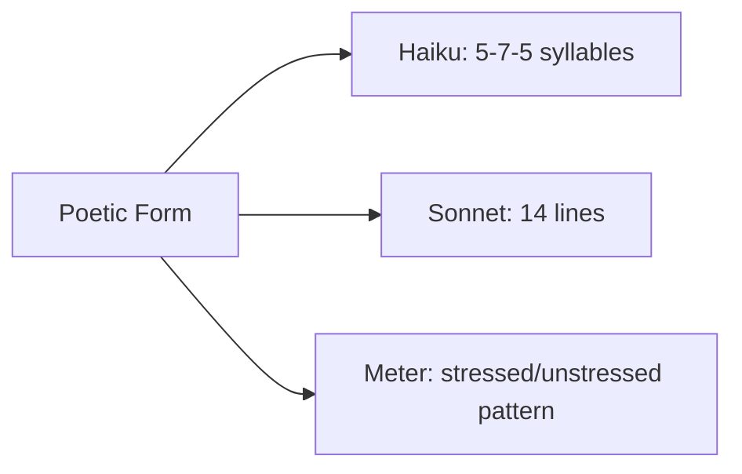
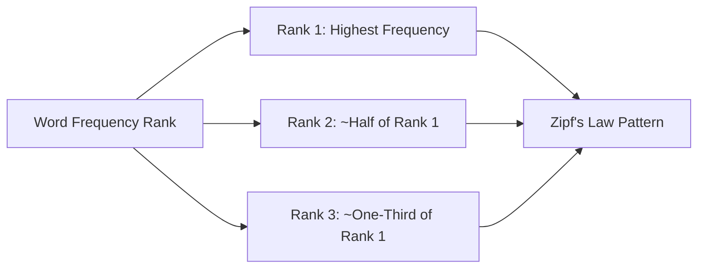
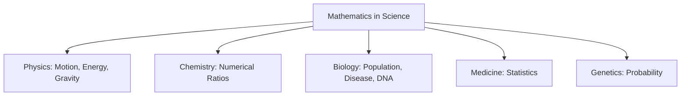
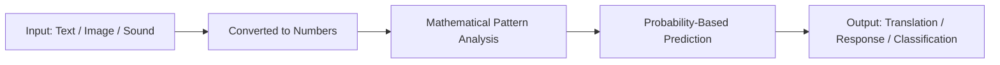
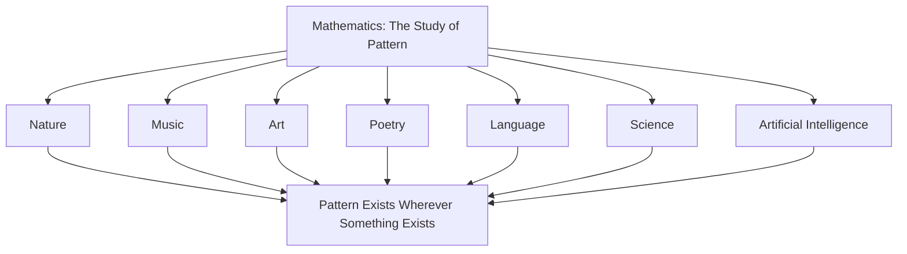
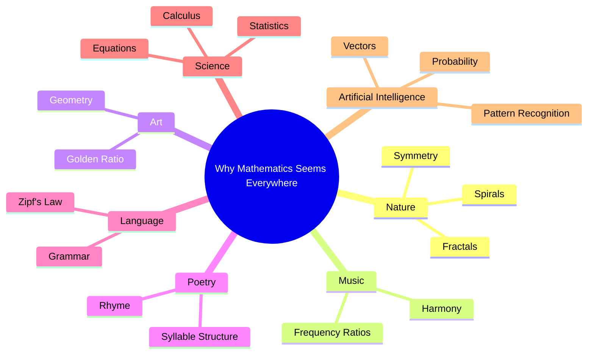

# Why Does Mathematics Seem to Be Everywhere?

## Table of Contents

1. [One Subject, A Thousand Disguises](#one-subject-a-thousand-disguises)
2. [Mathematics and Nature](#mathematics-and-nature)
3. [Mathematics and Music](#mathematics-and-music)
   - [Common Misconceptions](#common-misconceptions)
   - [Quick Recap](#quick-recap)
4. [Mathematics and Art](#mathematics-and-art)
5. [Mathematics and Poetry](#mathematics-and-poetry)
6. [Mathematics and Language](#mathematics-and-language)
7. [Mathematics and Science](#mathematics-and-science)
8. [Mathematics and Artificial Intelligence](#mathematics-and-artificial-intelligence)
   - [AI Engineering Connection](#ai-engineering-connection)
   - [Common Misconceptions](#common-misconceptions-1)
   - [Quick Recap](#quick-recap-1)
9. [Bringing the Connections Together](#bringing-the-connections-together)
10. [Chapter Revision](#chapter-revision)
    - [Chapter Summary](#chapter-summary)
    - [Key Takeaways](#key-takeaways)
    - [Mind Map](#mind-map)
    - [Revision Notes](#revision-notes)
    - [Practice Questions](#practice-questions)
    - [Mini Quiz](#mini-quiz)
    - [Reflection Questions](#reflection-questions)
    - [Further Reading](#further-reading)
11. [Follow Me](#follow-me)

⋆˚꩜｡

## One Subject, A Thousand Disguises

Mathematics is not confined to classrooms and textbooks. This chapter examines how mathematics is embedded in music, art, poetry, language, science, and artificial intelligence.

⋆˚꩜｡

## Mathematics and Nature

♡ Explanation

- Rivers branch in fractal patterns describable mathematically. The spiral of a galaxy follows the same logarithmic spiral shape as a nautilus shell.
- The apparently irregular shape of a coastline can be measured using fractal dimension, a mathematical concept developed by Benoît Mandelbrot.
- Weather forecasters use mathematical models built from patterns in air pressure, temperature, and humidity to predict weather.

⋆˚꩜｡

## Mathematics and Music

♡ Definition

- The **mathematics of music** refers to the numerical relationships underlying rhythm, pitch, harmony, and scale.

♡ Explanation

- Two notes sounding pleasant together reflects a precise mathematical relationship between their sound frequencies. A note one octave higher than another vibrates at exactly double the frequency.
- Sound is physically a wave — a repeating vibration measurable through frequency (rate of vibration) and amplitude (loudness). Musical harmony arises because certain simple numerical ratios between frequencies, such as 2:1 or 3:2, are perceived as pleasant.
- Understanding these numerical relationships allowed musicians and instrument-makers to design instruments that reliably produce harmonious sounds.

| Aspect | Detail |
|---|---|
| Underlying mechanism | Numerical ratios between sound wave frequencies |
| Example ratio | 2:1 (octave), 3:2 (perfect fifth) |
| Historical attribution | Pythagoras, credited with linking string-length ratios to harmonious sound |
| Modern application | Digital music production, converting sound waves into numerical data |

♡ Why It Matters

- Digital music production relies entirely on mathematics, converting sound waves into numerical data that computers can store, edit, and play back with precision.

## Common Misconceptions

| Incorrect Idea | Why It Is Incorrect | Correct Understanding |
|---|---|---|
| Musical talent and mathematical ability are entirely separate skills. | Musical rhythm, timing, and harmony are governed by mathematical relationships. | Musicians frequently apply mathematical relationships without consciously performing calculation. |

## Quick Recap

- Musical harmony, rhythm, and structure are governed by mathematical relationships between frequencies and timing.
- Simple numerical frequency ratios, such as 2:1, underlie perceived harmony.

⋆˚꩜｡

## Mathematics and Art

♡ Explanation

- Painters and architects have used the golden ratio (approximately 1.618) as a proportion believed to create balanced, pleasing compositions.
- Perspective drawing, the technique allowing a flat painting to appear three-dimensional, relies on geometric projection and proportion.

| Art Concept | Mathematical Idea Behind It | Example |
|---|---|---|
| Golden ratio composition | Ratio of approximately 1.618:1 | Renaissance paintings, classical architecture |
| Perspective drawing | Geometric projection and vanishing points | Leonardo da Vinci's "The Last Supper" |
| Tessellation patterns | Repeating geometric shapes with no gaps | Islamic geometric art, M.C. Escher's artwork |
| Symmetry | Balance and mirrored proportions | Mandalas, architectural facades |

⋆˚꩜｡

## Mathematics and Poetry

♡ Explanation

- A haiku follows a strict pattern of 5, 7, and 5 syllables across three lines. A sonnet traditionally contains fourteen lines, often with a precise rhyme pattern.
- Poetic meter, the recurring pattern of stressed and unstressed syllables, is fundamentally a numerical, countable structure.

⋆˚꩜｡

## Mathematics and Language

♡ Explanation

- Zipf's Law describes a mathematical relationship between how frequently a word is used in a language and its rank in frequency: the most common word appears roughly twice as often as the second most common word, three times as often as the third, and so forth, across nearly every human language studied.
- Grammar can be described using formal, rule-based mathematical structures, related to logical systems studied in computer science, enabling computers to process and generate human language.
- Similar frequency patterns to Zipf's Law have also been observed in city population sizes and website popularity rankings.

⋆˚꩜｡

## Mathematics and Science

♡ Explanation

- Physics uses mathematical equations to describe motion, energy, and gravity. Chemistry uses numerical ratios to describe how elements combine. Biology uses mathematics to model population growth, disease spread, and DNA structure.
- Isaac Newton developed calculus specifically because existing mathematics could not adequately describe motion and change.
- Modern medicine relies on statistics to determine treatment effectiveness, and genetics relies on probability to predict the likelihood of inherited traits.

⋆˚꩜｡

## Mathematics and Artificial Intelligence

♡ Definition

- In artificial intelligence, mathematics refers to the numerical patterns, probability, and logical structure that allow machines to process information, recognise patterns, and generate responses.

♡ Explanation

- Every AI system performs extensive mathematical calculation, analysing numerical patterns representing words, images, or sounds, and using probability to determine output.
- Machines cannot directly process meaning, emotion, or intention. Mathematics functions as the bridge, translating language, images, and ideas into numerical form.
- Engineers require a precise, mathematical method to represent human knowledge and reasoning inside a computer to build systems capable of translation, writing assistance, image recognition, and diagnostic support.

♡ Examples

### Example 1

A translation app converts input words into numerical representations, performs mathematical operations on those numbers, and converts the result back into words, all within a fraction of a second.

### Example 2

AI language models represent words as vectors — long lists of numbers capturing relationships in meaning. The mathematical relationship between the vectors for "king" and "queen" closely mirrors the relationship between the vectors for "man" and "woman."

## AI Engineering Connection

- Modern AI language models represent every word as a numerical vector, capturing mathematical relationships in meaning. This numerical structure underlies tasks such as translation, text generation, and semantic search.
- Training a large AI language model can involve mathematical calculations performed trillions of times across large-scale computing systems over extended periods.

## Common Misconceptions

| Incorrect Idea | Why It Is Incorrect | Correct Understanding |
|---|---|---|
| AI systems understand language the way humans consciously do. | AI systems operate through probability, statistics, and pattern recognition across large amounts of numerical data. | AI performs mathematical computation on data; it does not possess conscious understanding. |

## Quick Recap

- Artificial intelligence is fundamentally a mathematical system, translating language, images, and ideas into numbers.
- AI systems identify patterns within numerical data and use those patterns to generate output.
- AI does not understand content in the human sense; it performs structured mathematical computation.

⋆˚꩜｡

## Bringing the Connections Together

| Field | Mathematical Connection |
|---|---|
| Nature | Fractals, spirals, symmetry, growth patterns |
| Music | Frequency ratios, rhythm, harmony |
| Art | Golden ratio, geometry, perspective, symmetry |
| Poetry | Syllable counts, meter, rhyme structure |
| Language | Zipf's Law, grammar as formal structure |
| Science | Equations, statistics, probability, calculus |
| Artificial Intelligence | Vectors, probability, pattern recognition |

♡ Why It Matters

- Mathematics functions as a thread woven through nearly every meaningful human activity, reflecting its core identity as the study of pattern, applicable wherever pattern exists.

⋆˚꩜｡

## Chapter Revision

### Chapter Summary

- Mathematics connects deeply to music through frequency ratios that create harmony.
- Art often relies on mathematical proportion, geometry, and symmetry, such as the golden ratio.
- Poetry frequently follows numerical structures, such as syllable counts in a haiku or line counts in a sonnet.
- Human language contains mathematical regularities, such as Zipf's Law.
- Every branch of science relies on mathematics to describe and predict the natural world.
- Artificial intelligence is fundamentally a mathematical system, translating language and ideas into numbers to find patterns.

### Key Takeaways

- Musical harmony arises from simple numerical ratios between sound frequencies.
- The golden ratio appears repeatedly in art and architecture regarded as visually pleasing.
- Poetic forms such as haiku and sonnets are built on strict numerical structures.
- Zipf's Law reveals a mathematical pattern in how frequently words are used in language.
- AI systems represent words and ideas as numerical vectors and use mathematics to identify patterns among them.

### Mind Map

### Revision Notes

- Pythagoras is credited with discovering the mathematical ratios behind musical harmony.
- The golden ratio (approx. 1.618) appears often in art and architecture.
- A haiku follows a 5-7-5 syllable pattern; a sonnet traditionally has 14 lines.
- Zipf's Law describes a mathematical pattern in word-frequency across languages.
- AI language models represent words as numerical vectors capturing relationships in meaning.

### Practice Questions

1. Explain the mathematical relationship Pythagoras discovered between string length and musical harmony.
2. What is the golden ratio, and where does it appear in art or architecture?
3. Describe the numerical structure of a haiku.
4. What is Zipf's Law, and what does it reveal about language?
5. Why do scientists across all fields rely on mathematics as a foundational tool?
6. Explain, in simple terms, how an AI system represents a word using numbers.
7. Why is it a misconception to say AI understands language the way humans do?
8. Give one example of mathematics connecting to a subject you personally enjoy.
9. Why did Isaac Newton need to invent calculus?
10. How does perspective drawing rely on mathematics?

### Mini Quiz

1. True or False: Musical harmony is based on simple numerical ratios between frequencies.
   Answer: True.
2. What is the approximate numerical value of the golden ratio?
   Answer: Approximately 1.618.
3. How many syllables does a haiku traditionally use, and in what pattern?
   Answer: 17 syllables, in a 5-7-5 pattern across three lines.
4. How many lines does a traditional sonnet contain?
   Answer: 14 lines.
5. What law describes a mathematical pattern in word frequency across languages?
   Answer: Zipf's Law.
6. Which ancient philosopher is credited with discovering ratios behind musical harmony?
   Answer: Pythagoras.
7. True or False: AI language models represent words using numerical vectors.
   Answer: True.
8. What branch of mathematics did Isaac Newton invent to describe motion and change?
   Answer: Calculus.
9. True or False: Perspective drawing in art has no mathematical basis.
   Answer: False — perspective drawing relies on geometric projection and proportion.
10. Name one field of science that relies heavily on statistics.
    Answer: Any one of: medicine, genetics, biology, physics.

### Reflection Questions

1. Which connection in this chapter (music, art, poetry, language, science, or AI) was most unexpected, and why?
2. Can a hobby or interest be identified that might contain a hidden mathematical structure not previously noticed?
3. How does understanding AI as a mathematical system change the perception of interacting with an AI assistant?

### Further Reading

- The mathematics behind musical scales and tuning systems.
- Zipf's Law and its appearances beyond language, such as in city populations.
- How AI language models convert words into numerical vectors, sometimes called embeddings.

⋆˚꩜｡

## Follow Me

If you enjoyed these notes, you'll probably enjoy the rest too.

| Platform | Link |
|---|---|
| Instagram | [@mehrunnisa.ai](https://www.instagram.com/mehrunnisa.ai/) |
| SubStack | [The Epoch](https://theepoch.substack.com/) |
| YouTube | [@mehrunnisa.ai](https://www.youtube.com/@Mehrunnisa-ai) |

**Download:** [Number – By Mehrunnisa.pdf](https://github.com/user-attachments/files/30637570/Number.-.By.Mehrunnisa.pdf) — for offline reading.

**Usage Terms**

These notes are free to use for personal learning, revision, and study. Please do not:

- Sell or redistribute for profit.
- Claim them as your own work.
- Modify and republish without permission.
- Use for any unethical or unauthorized purpose.

Thank you for respecting the effort behind these notes. Happy learning. ♡
