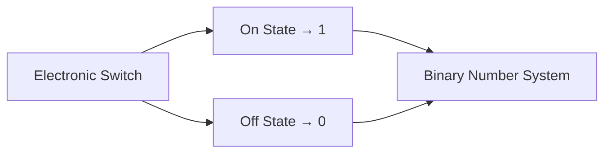
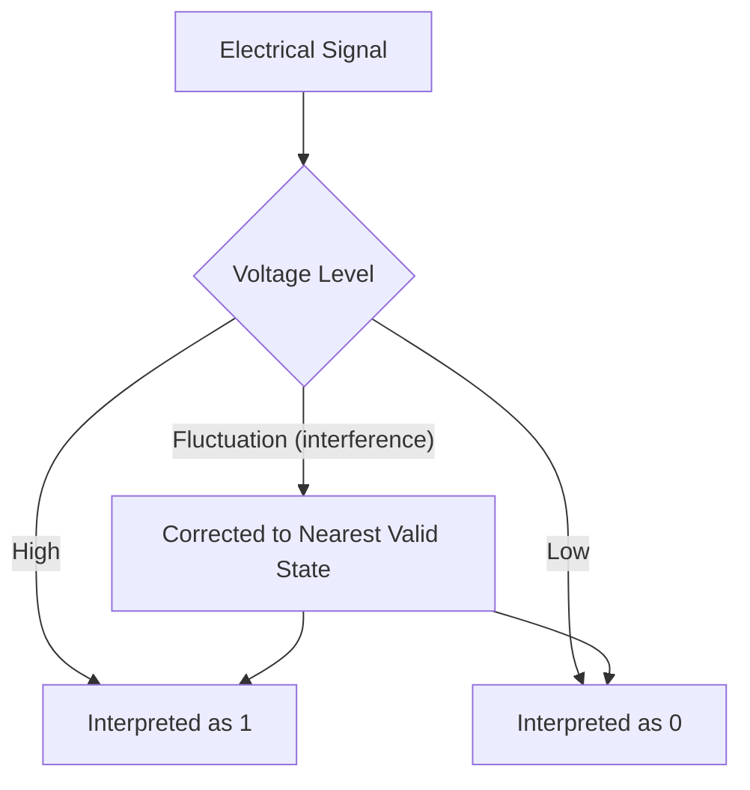
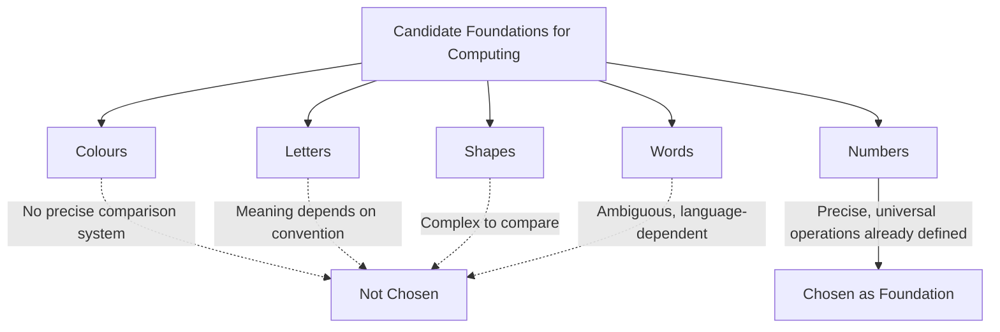
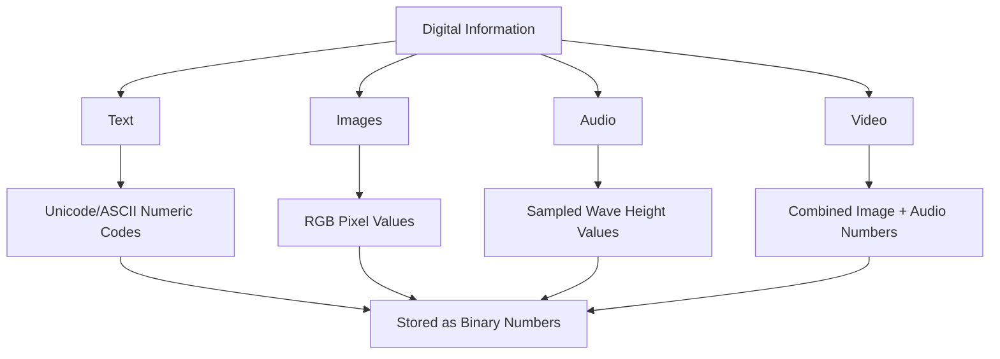
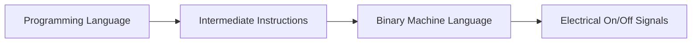
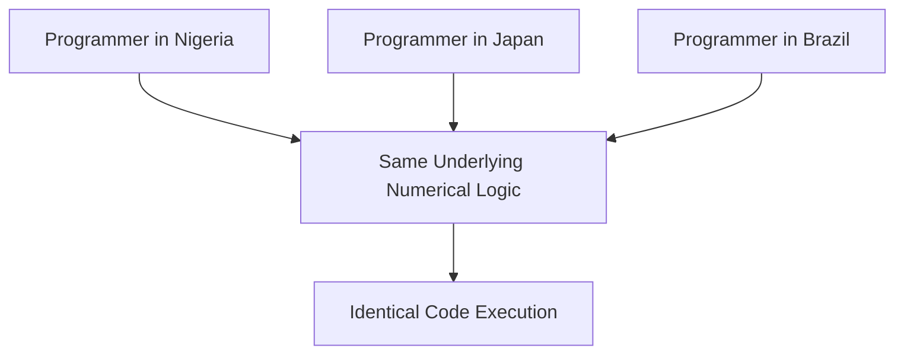
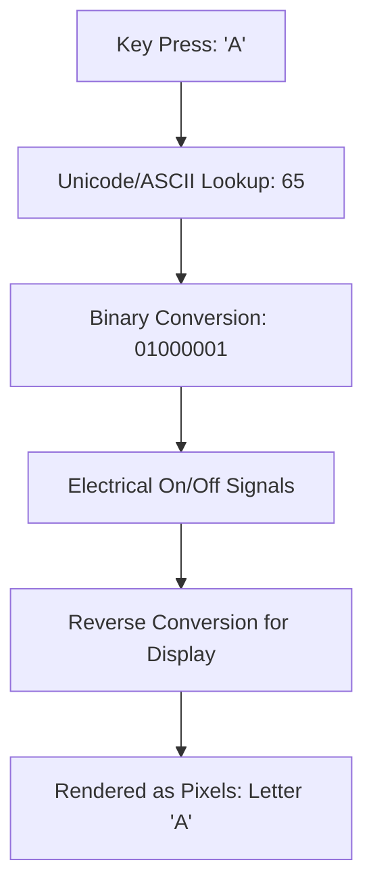
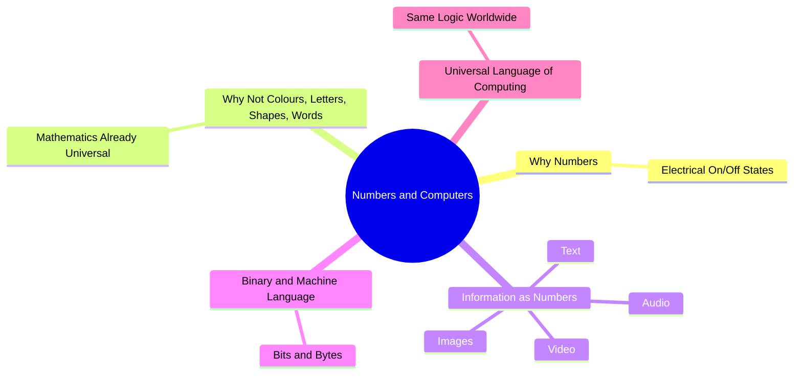

# Numbers and Computers: How Machines Think Entirely in Numbers

## Table of Contents

1. [Why Computers Use Numbers](#why-computers-use-numbers)
   - [Common Misconceptions](#common-misconceptions)
   - [Quick Recap](#quick-recap)
2. [Physical States and Electrical Signals](#physical-states-and-electrical-signals)
3. [Why Humans Chose Numbers Instead of Colours, Letters, Shapes, or Words](#why-humans-chose-numbers-instead-of-colours-letters-shapes-or-words)
4. [Why Every Kind of Information Eventually Becomes Numbers](#why-every-kind-of-information-eventually-becomes-numbers)
5. [Binary Representation and Machine Language](#binary-representation-and-machine-language)
6. [Why Numbers Became the Universal Language of Computing](#why-numbers-became-the-universal-language-of-computing)
   - [AI Engineering Connection](#ai-engineering-connection)
7. [A Beginner-Friendly Walkthrough Example](#a-beginner-friendly-walkthrough-example)
8. [Chapter Revision](#chapter-revision)
   - [Chapter Summary](#chapter-summary)
   - [Key Takeaways](#key-takeaways)
   - [Mind Map](#mind-map)
   - [Revision Notes](#revision-notes)
   - [Practice Questions](#practice-questions)
   - [Mini Quiz](#mini-quiz)
   - [Reflection Questions](#reflection-questions)
   - [Further Reading](#further-reading)
9. [Follow Me](#follow-me)

⋆˚꩜｡

## Why Computers Use Numbers

♡ Definition

- **Why computers use numbers** refers to the physical reasons every computer represents all internal information using numbers, and nothing else.

♡ Explanation

- A computer is, at its physical foundation, a large collection of tiny electronic switches, each capable of only two states: on or off.
- These two states map directly onto the two digits of binary numbers: 1 (on) and 0 (off).
- Electronic components are more reliable when designed to recognise only two clearly distinct states rather than many subtly different ones, since a switch either passes current or does not, with no ambiguous intermediate state.
- Binary numbers, built from simple on/off electrical states, provided engineers with a system resistant to small errors and interference, enabling reliable calculation at high speed and large scale.

♡ Why It Matters

- A single binary digit (0 or 1) is called a bit; eight bits grouped together form a byte. File size descriptions, such as "2 megabytes," are built from this binary foundation.
- The term "bit" was popularised by Claude Shannon, whose work established the mathematical foundation for representing and transmitting information using binary numbers.

## Common Misconceptions

| Incorrect Idea | Why It Is Incorrect | Correct Understanding |
|---|---|---|
| Computers understand letters, images, and sounds directly. | A computer never directly processes a letter or a colour; it processes numbers assigned by convention to represent those things. | Computers process only numbers, which are assigned to represent letters, colours, and sounds by agreed standards. |

## Quick Recap

- Computers use binary numbers because their physical components reliably represent exactly two distinct electrical states.
- A bit is a single binary digit; eight bits form a byte.

⋆˚꩜｡

## Physical States and Electrical Signals

♡ Explanation

- Inside a computer chip, transistors act as microscopic switches controlling electrical flow. Only two voltage levels are treated as meaningful: a high voltage (representing 1) and a low voltage (representing 0).
- Small fluctuations caused by heat, electrical interference, or manufacturing imperfections are ignored or corrected back toward the nearest meaningful state, providing the reliability of binary computing despite imperfect real-world electrical signals.
- A system using ten distinct voltage levels, corresponding directly to decimal digits 0–9, would be considerably more vulnerable to misreading caused by electrical interference than a two-state binary system.

⋆˚꩜｡

## Why Humans Chose Numbers Instead of Colours, Letters, Shapes, or Words

♡ Explanation

- Mathematics already provided a complete, precise, universal reasoning system, with defined rules for combining, comparing, and transforming numbers, prior to the invention of computers.
- Colours, letters, and shapes do not naturally include a built-in, universal system of precise operations.

| Candidate System | Why It Was Not Chosen as the Foundation | Why Numbers Were Chosen Instead |
|---|---|---|
| Colours | No natural, precise system for combining or comparing colours mathematically | Numbers can be added, compared, and transformed with exact, defined rules |
| Letters | Letters carry meaning only through language convention, without built-in logical operations | Numbers already had universal logical operations, provided by mathematics |
| Shapes | Comparing and combining shapes precisely is more complex than comparing numbers | Numerical comparison (greater than, less than, equal to) is simple and exact |
| Words | Words vary across languages and carry ambiguous meaning | Numbers carry the same meaning across every culture and language |

♡ Why It Matters

- Computation requires the ability to compare, combine, and follow logical rules. Mathematics already defines these operations with precision, which is why every computation a computer performs is, at its core, a mathematical operation.

⋆˚꩜｡

## Why Every Kind of Information Eventually Becomes Numbers

♡ Explanation

- All information a computer processes — text, images, audio, and video — is converted into numbers at the level the computer actually operates on.

### How Computers Represent Text

- Each letter, digit, punctuation mark, and emoji is assigned a specific number under the Unicode standard, which grew out of the earlier ASCII standard. The capital letter "A" corresponds to the number 65.

### How Computers Represent Images

- A digital image consists of a grid of pixels, each represented by numbers describing the intensity of red, green, and blue light combined to form the pixel's colour.

### How Computers Represent Audio

- Sound, a physical wave, is digitised through sampling — measuring the wave's height thousands of times per second and recording each measurement as a number.

### How Computers Represent Video

- Video consists of a rapid sequence of numerically-encoded image frames combined with a synchronised, numerically-encoded audio track.

| Information Type | How It Becomes Numbers |
|---|---|
| Text | Each character assigned a number via Unicode/ASCII |
| Images | Each pixel represented by red, green, blue colour numbers |
| Audio | Sound wave height measured (sampled) thousands of times per second |
| Video | A rapid sequence of numerically-encoded images plus synchronised numerical audio |

⋆˚꩜｡

## Binary Representation and Machine Language

♡ Explanation

- Every number representing a letter, pixel, or sound sample is ultimately stored using binary numerals, for the electrical reasons described earlier. This lowest-level numerical instruction set is called machine language — the only language a computer's hardware directly executes.
- Programmers write instructions in higher-level programming languages, which are automatically translated, layer by layer, into binary machine language executable by hardware.

⋆˚꩜｡

## Why Numbers Became the Universal Language of Computing

♡ Explanation

- Because every kind of information can be converted into numbers, and numbers already carry a complete, universal system of mathematical operations, numbers became the shared foundation beneath all computing worldwide.
- Programmers using different native languages can write code using the same underlying mathematical logic, and their computers process that code identically, since all computation reduces to numbers obeying the same universal mathematical rules.

## AI Engineering Connection

- AI language models process human languages — English, Hindi, Spanish, Mandarin, and others — by converting all of them into numerical representations before computation.
- The model does not process any single human language internally; it operates on numbers, following the same universal mathematical logic regardless of the output language.

⋆˚꩜｡

## A Beginner-Friendly Walkthrough Example

♡ Example: Typing the Letter "A"

1. The "A" key is pressed on the keyboard.
2. The computer looks up the numerical code for "A" in the Unicode/ASCII standard, finding the number 65.
3. The computer converts 65 into binary: 01000001.
4. This binary sequence is represented physically as a pattern of electrical on/off signals across transistors.
5. When the letter is displayed on screen, the process reverses: the binary signal converts back into the number 65, which converts back into the visual shape of "A," drawn using pixels represented by further numbers.

⋆˚꩜｡

## Chapter Revision

### Chapter Summary

- Computers use numbers because their electronic components are physically most reliable with only two distinct states — on and off — matching binary digits 1 and 0.
- Numbers were chosen as computing's foundation over colours, letters, shapes, or words because mathematics already provided a complete, precise, universal system of operations.
- Every kind of digital information — text, images, audio, and video — is ultimately represented as numbers.
- Binary numerals form machine language, the lowest-level instructions a computer's hardware can directly execute.
- Because all computing is built on numbers and universal mathematical rules, programmers worldwide, regardless of spoken language, can write and share code that works identically everywhere.

### Key Takeaways

- A bit is a single binary digit (0 or 1); eight bits form a byte.
- Mathematics provided computing with a ready-made, precise, and universal reasoning system.
- Text is represented using Unicode/ASCII numerical codes; images use red-green-blue colour numbers per pixel.
- Audio is represented through sampling — measuring a sound wave's height thousands of times per second.
- Video combines numerically-encoded images and audio, synchronised together.

### Mind Map

### Revision Notes

- A bit is a single binary digit (0 or 1); a byte is eight bits.
- Unicode/ASCII assigns numerical codes to letters and characters (e.g., "A" = 65).
- Images are represented using red, green, and blue colour numbers per pixel.
- Audio is digitised by sampling sound wave height thousands of times per second.
- Machine language refers to the lowest-level binary instructions a computer's hardware executes directly.

### Practice Questions

1. Explain why computer hardware relies on only two stable electrical states.
2. Why was mathematics, rather than colours or letters, chosen as the foundation of computing?
3. Describe how a single letter typed becomes represented as numbers inside a computer.
4. Explain how a digital image is represented using numbers.
5. Describe the process of sampling used to digitise audio.
6. Why is video considered a combination of both image and audio numerical encoding?
7. What is the difference between a bit and a byte?
8. Explain, step by step, what happens when the "A" key is pressed on a keyboard.
9. Why can programmers from different countries, speaking different languages, still write compatible code?
10. How does mathematics as a universal language relate to computing's numerical foundation?
11. Why is a two-state (binary) electrical system more reliable than a ten-state one?
12. What role does Unicode/ASCII play in representing text numerically?

### Mini Quiz

1. What are the only two digits used in binary numbers?
   Answer: 0 and 1.
2. True or False: Computers directly understand letters and colours without converting them to numbers.
   Answer: False.
3. What is a single binary digit called?
   Answer: A bit.
4. How many bits make up one byte?
   Answer: Eight.
5. What numerical standard assigns numbers to letters and characters, such as "A" = 65?
   Answer: Unicode/ASCII.
6. What three colours are typically combined to represent a pixel's colour numerically?
   Answer: Red, green, and blue.
7. What is the process called where a sound wave's height is measured thousands of times per second?
   Answer: Sampling.
8. True or False: Video files only contain numerically-encoded images, with no numerical audio involved.
   Answer: False — video also contains numerically-encoded audio.
9. What term describes the lowest-level binary instructions a computer's hardware directly executes?
   Answer: Machine language.
10. Who is often called "the father of information theory" and popularised the term "bit"?
    Answer: Claude Shannon.
11. True or False: Mathematics needed to be invented specifically for computers to use it.
    Answer: False — mathematics already existed and was adopted as computing's foundation.
12. Fill in the blank: Numbers became the universal language of computing because mathematics already provided a complete ______ system.
    Answer: Reasoning (logical/operational).

### Reflection Questions

1. Had the fact that a photograph is fundamentally a long list of numbers been considered before this chapter?
2. Does understanding binary representation change the perception of the device being used to read this content?
3. Why might it matter that mathematics, rather than a newly invented system, was chosen as the foundation of computing?

### Further Reading

- Claude Shannon and his foundational work in information theory.
- How the Unicode standard represents characters from many different world languages.
- How image compression, such as JPEG, reduces the numerical data needed to store a picture.

⋆˚꩜｡

## Follow Me

If you enjoyed these notes, you'll probably enjoy the rest too.

| Platform | Link |
|---|---|
| Instagram | [@mehrunnisa.ai](https://www.instagram.com/mehrunnisa.ai/) |
| SubStack | [The Epoch](https://theepoch.substack.com/) |
| YouTube | [@mehrunnisa.ai](https://www.youtube.com/@Mehrunnisa-ai) |

**Download:** [Number – By Mehrunnisa.pdf](https://github.com/user-attachments/files/30637570/Number.-.By.Mehrunnisa.pdf) — for offline reading.

**Usage Terms**

These notes are free to use for personal learning, revision, and study. Please do not:

- Sell or redistribute for profit.
- Claim them as your own work.
- Modify and republish without permission.
- Use for any unethical or unauthorized purpose.

Thank you for respecting the effort behind these notes. Happy learning. ♡
