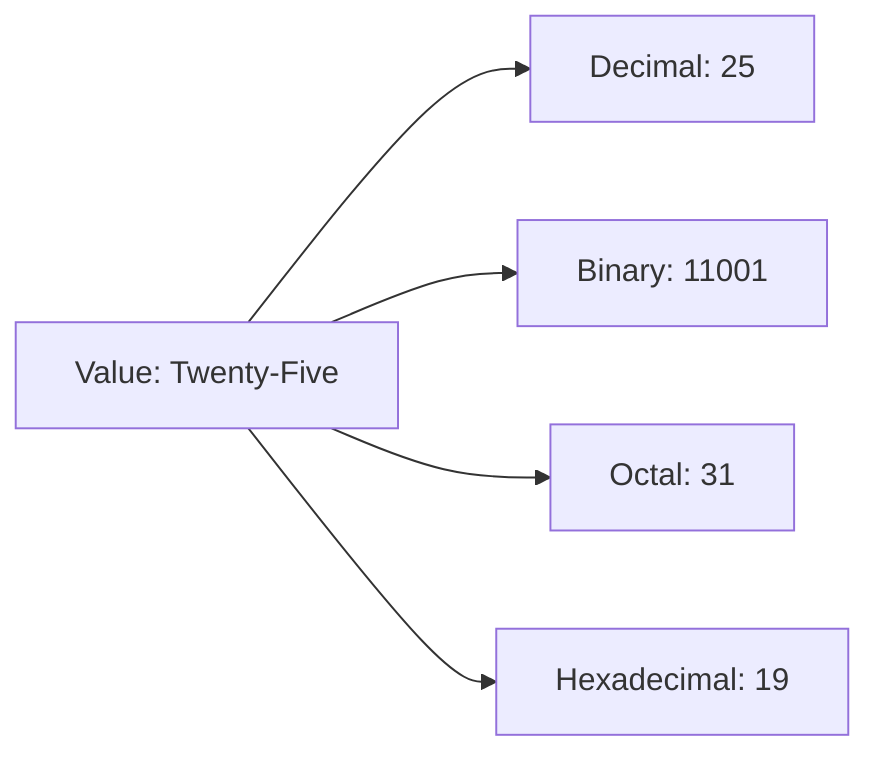
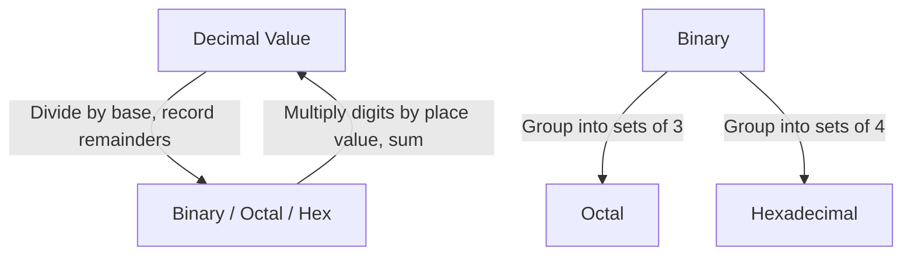
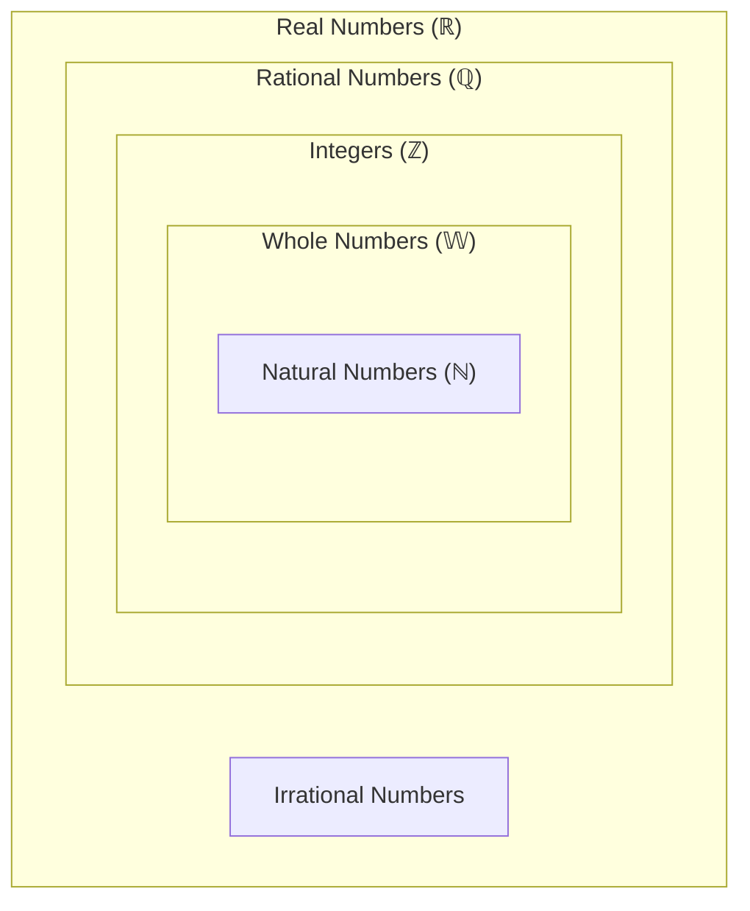
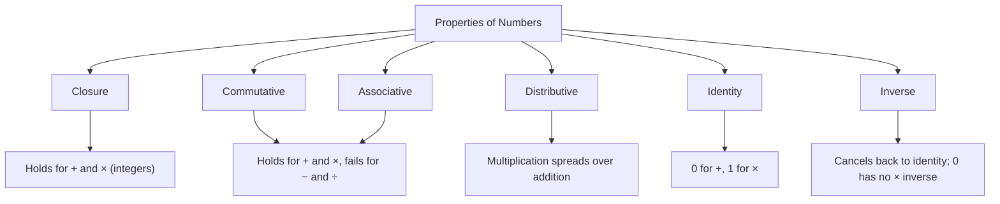
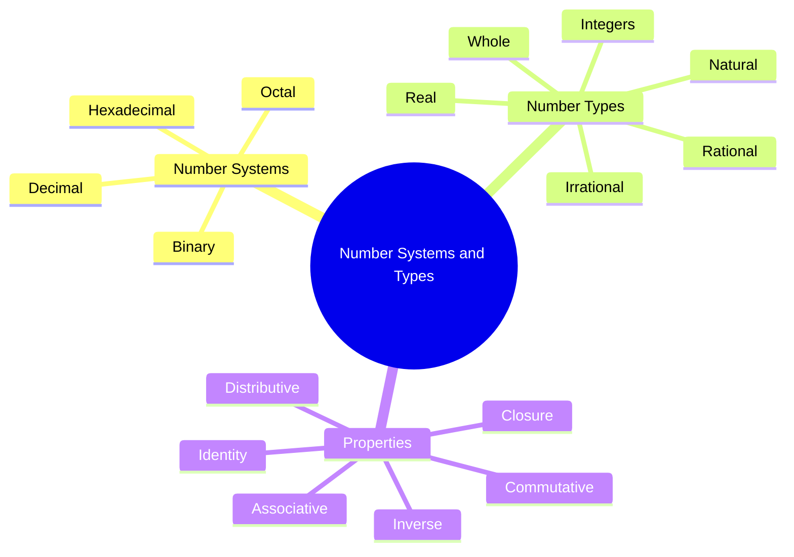

# Number Systems and Number Types

## Mathematics Foundations for AI Engineering

## Table of Contents

1. [Number Systems](#number-systems)
   - [Decimal Number System](#decimal-number-system)
   - [Binary Number System](#binary-number-system)
   - [Octal Number System](#octal-number-system)
   - [Hexadecimal Number System](#hexadecimal-number-system)
   - [Converting Between Systems](#converting-between-systems)
   - [Why This Matters](#why-this-matters)
   - [Common Misconceptions](#common-misconceptions)
   - [Quick Recap](#quick-recap)
2. [Number Types](#number-types)
   - [Natural Numbers](#natural-numbers-)
   - [Whole Numbers](#whole-numbers-w)
   - [Integers](#integers-)
   - [Rational Numbers](#rational-numbers-)
   - [Irrational Numbers](#irrational-numbers)
   - [Real Numbers](#real-numbers-)
   - [The Hierarchy: How They All Nest Together](#the-hierarchy-how-they-all-nest-together)
   - [Common Misconceptions](#common-misconceptions-1)
   - [Quick Recap](#quick-recap-1)
3. [Properties of Numbers](#properties-of-numbers)
   - [Common Misconceptions](#common-misconceptions-2)
   - [Quick Recap](#quick-recap-2)
4. [Quick Final Summary](#quick-final-summary)
   - [Key Things to Remember](#key-things-to-remember)
   - [AI Engineering Connection](#ai-engineering-connection)
5. [Follow Me](#follow-me)

⋆˚꩜｡

## Number Systems

A **number system** refers to how a value is written — which symbols and place-value rules are used. A **number type** refers to what kind of number it is (whole, negative, fraction, etc.). These are distinct concepts, and this chapter addresses number systems first.

♡ Definition

- **Number system**: A structured method of writing a numeric value using a defined base and a specific set of digit symbols.

| Comparison | Detail |
|---|---|
| Number system | Describes how a value is written (e.g., decimal, binary) |
| Number type | Describes what kind of value it is (e.g., natural, rational) |
| Example | 25 is a value; decimal is the writing scheme used to express it |

### Decimal Number System

| Property | Detail |
|---|---|
| Base | 10 |
| Digits used | 0, 1, 2, 3, 4, 5, 6, 7, 8, 9 |
| Place value | Powers of 10 (units, tens, hundreds, thousands...) |
| Example | 25 = 2×10¹ + 5×10⁰ = 20 + 5 = 25 |
| Where used | Everyday counting, money, measurement, general mathematics |

♡ Why It Matters

- Decimal is the number system humans use for everyday reasoning, but it is not the system computers use internally.

### Binary Number System

| Property | Detail |
|---|---|
| Base | 2 |
| Digits used | 0, 1 |
| Place value | Powers of 2 (1, 2, 4, 8, 16, 32...) |
| Example | 11001₂ = (1×16) + (1×8) + (0×4) + (0×2) + (1×1) = 25 |
| Where used | The native representation used internally by computers |

♡ Why It Matters

- Text, images, audio, and every model weight trained in AI systems are ultimately stored as binary underneath all higher-level representations.

### Octal Number System

| Property | Detail |
|---|---|
| Base | 8 |
| Digits used | 0, 1, 2, 3, 4, 5, 6, 7 (no 8 or 9) |
| Place value | Powers of 8 (1, 8, 64, 512...) |
| Example | 31₈ = (3×8) + (1×1) = 25 |
| Where used | Older Unix/Linux file-permission codes (e.g., chmod 755) and some legacy computing systems |

### Hexadecimal Number System

| Property | Detail |
|---|---|
| Base | 16 |
| Digits used | 0–9, then A–F (A=10, B=11, C=12, D=13, E=14, F=15) |
| Place value | Powers of 16 (1, 16, 256...) |
| Example | 19₁₆ = (1×16) + (9×1) = 25 |
| Where used | Colour codes, memory addresses, hashes, error codes |

♡ Why It Matters

- One hexadecimal digit represents exactly four binary digits, making long binary strings shorter and more readable in hexadecimal form.

## AI Engineering Connection

- Binary and hexadecimal representations rarely need to be typed by hand in AI engineering work, but they appear constantly in memory sizes, GPU addresses, colour values, and hash identifiers. Recognising them removes unnecessary ambiguity when reading system-level output.

### Converting Between Systems

Every number system describes the same value using a different grouping structure.

| Conversion | Method |
|---|---|
| Decimal → Binary/Octal/Hex | Divide the decimal number repeatedly by the new base (2, 8, or 16), recording remainders; read remainders bottom-to-top. |
| Binary/Octal/Hex → Decimal | Multiply each digit by its place value (a power of that base) and sum the results. |
| Binary → Octal | Group binary digits into sets of 3 (since 2³ = 8), then convert each group. |
| Binary → Hexadecimal | Group binary digits into sets of 4 (since 2⁴ = 16), then convert each group. |

**Quick check — the number 25 in every system covered:**

| System | Representation |
|---|---|
| Decimal | 25 |
| Binary | 11001₂ |
| Octal | 31₈ |
| Hexadecimal | 19₁₆ |

### Why This Matters

| System | Role |
|---|---|
| Decimal | The natural choice for humans and general mathematics |
| Binary | The language computers compute in; all AI model operations ultimately run as binary operations |
| Octal | Niche today, but still present in certain systems-level and Unix contexts |
| Hexadecimal | A compact, human-readable way to represent binary data (memory, colours, hashes) |

## Common Misconceptions

| Incorrect Idea | Why It Is Incorrect | Correct Understanding |
|---|---|---|
| A number's value changes when written in a different number system. | The value remains identical; only the symbolic representation changes. | 25, 11001₂, 31₈, and 19₁₆ all represent the same quantity. |

## Quick Recap

- A number system defines how a value is written; a number type defines what kind of value it is.
- Decimal, binary, octal, and hexadecimal each use a different base and digit set to represent the same underlying values.
- Binary is the foundational representation used internally by computers; hexadecimal offers a compact, readable form of binary data.

⋆˚꩜｡

## Number Types

Number types form nested families — every number belonging to a smaller group also belongs to every larger group that contains it.

### Natural Numbers ℕ

| Property | Detail |
|---|---|
| Notation | ℕ = {1, 2, 3, 4, 5, ...} |
| Belongs | 1, 2, 3, 100, 1,000,000 — any positive counting number |
| Does not belong | 0, negative numbers, fractions, decimals |
| AI/CS use | Counting items, loop counters, dataset sizes |

### Whole Numbers 𝕎

| Property | Detail |
|---|---|
| Notation | W = {0, 1, 2, 3, 4, ...} |
| Belongs | Everything natural, plus 0 |
| Does not belong | Negative numbers, fractions, decimals |
| AI/CS use | Array and list indexing typically starts at 0 |

## Common Misconceptions

| Incorrect Idea | Why It Is Incorrect | Correct Understanding |
|---|---|---|
| Natural numbers and whole numbers are the same set. | The sets differ by exactly one element: zero. | Natural numbers begin at 1; whole numbers include 0 in addition to all natural numbers. |

### Integers ℤ

| Property | Detail |
|---|---|
| Notation | ℤ = {..., −3, −2, −1, 0, 1, 2, 3, ...} |
| Belongs | ..., −3, −2, −1, 0, 1, 2, 3, ... |
| Does not belong | Fractions or decimals, such as 1/2 or 2.5 |
| AI/CS use | Temperature changes, gains/losses, gradient direction (positive or negative) |

### Rational Numbers ℚ

| Property | Detail |
|---|---|
| Notation | ℚ = { p⁄q : p, q are integers, q ≠ 0 } |
| Belongs | 1/2, 3/4, −5/2, 7 (=7/1), 0.25 (=1/4) |
| Does not belong | Numbers with non-repeating, non-terminating decimals, such as √2 or π |
| Characteristic | As a decimal, terminates (0.25) or repeats in a pattern (0.333...) |
| AI/CS use | Probabilities, ratios, most fractional computed values |

### Irrational Numbers

| Property | Detail |
|---|---|
| Belongs | √2, √3, π, e |
| Does not belong | Any value expressible as p/q — no simple fractions or terminating/repeating decimals |
| Characteristic | As a decimal, continues indefinitely with no repeating pattern (3.14159265...) |
| AI/CS use | e (Euler's number) is the base of the exponential function used in sigmoid and softmax equations in neural networks |

## Common Misconceptions

| Incorrect Idea | Why It Is Incorrect | Correct Understanding |
|---|---|---|
| Some numbers are partially rational and partially irrational. | Every real number is classified as either rational or irrational, with no overlap. | Rational numbers can be written as p/q; irrational numbers cannot, with no middle category. |

### Real Numbers ℝ

| Property | Detail |
|---|---|
| Notation | ℝ = ℚ ∪ (irrational numbers) |
| Belongs | Any point on the number line: −3, 0, 1/2, √2, π, 100 |
| AI/CS use | Model weights, activations, and gradients are almost always treated as real numbers |

### The Hierarchy: How They All Nest Together

Every natural number is also a whole number. Every whole number is also an integer. Every integer is also rational. Every rational number is also real. No number is excluded from a larger group as the hierarchy expands.

**ℕ ⊂ 𝕎 ⊂ ℤ ⊂ ℚ ⊂ ℝ**

| Level | Set | Contains |
|---|---|---|
| 1 | Natural (ℕ) | Counting numbers |
| 2 | Whole (𝕎) | Natural + 0 |
| 3 | Integers (ℤ) | Whole + negatives |
| 4 | Rational (ℚ) | Integers + fractions |
| 5 | Real (ℝ) | Rational + Irrational |

## Common Misconceptions

| Incorrect Idea | Why It Is Incorrect | Correct Understanding |
|---|---|---|
| Irrational numbers fit somewhere within the ℕ ⊂ 𝕎 ⊂ ℤ ⊂ ℚ chain. | Irrational numbers are not rational and therefore fall outside this nested chain. | Irrational numbers exist alongside rational numbers as a separate branch, both belonging to the real numbers as a whole. |

## Quick Recap

- Number types form a nested hierarchy: ℕ ⊂ 𝕎 ⊂ ℤ ⊂ ℚ ⊂ ℝ.
- Irrational numbers stand outside the nested chain but belong to the real numbers.
- Rational numbers can always be expressed as p/q; irrational numbers never can.

⋆˚꩜｡

## Properties of Numbers

These are consistent behaviour rules that numbers follow under addition and multiplication, determining which operations can be safely reordered or regrouped.

| Property | Meaning | Form | Example | Applies To | Does Not Apply To |
|---|---|---|---|---|---|
| Closure | Combining two numbers from a set keeps the result in the same set | a, b ∈ ℤ ⟹ a + b ∈ ℤ | 2 + 3 = 5 (still an integer) | Integers under addition and multiplication | Natural numbers under subtraction (2 − 5 = −3, not natural) |
| Commutative | Order does not affect the result | a + b = b + a; a × b = b × a | 3 + 5 = 5 + 3 = 8 | Addition, multiplication | Subtraction, division (5 − 3 ≠ 3 − 5) |
| Associative | Grouping does not affect the result | (a + b) + c = a + (b + c) | (2+3)+4 = 2+(3+4) = 9 | Addition, multiplication | Subtraction, division |
| Distributive | Multiplication can be spread over addition | a × (b + c) = (a×b) + (a×c) | 2×(3+4) = 6+8 = 14 | Multiplication over addition/subtraction | — |
| Identity | A special number leaves other numbers unchanged | a + 0 = a; a × 1 = a | 7+0=7; 7×1=7 | 0 for addition, 1 for multiplication | — |
| Inverse | Every number has a partner that returns it to the identity | a + (−a) = 0; a × (1/a) = 1 | 5+(−5)=0; 5×(1/5)=1 | Addition and multiplication (except 0 has no multiplicative inverse) | Division by zero |

## Common Misconceptions

| Incorrect Idea | Why It Is Incorrect | Correct Understanding |
|---|---|---|
| Commutative and associative properties apply to all four basic operations. | Subtraction and division do not preserve order or grouping. | Commutative and associative properties reliably hold only for addition and multiplication. |

## Quick Recap

- Closure, commutative, associative, and distributive properties primarily hold for addition and multiplication.
- Subtraction and division generally break commutativity and associativity.
- 0 is the additive identity; 1 is the multiplicative identity; 0 has no multiplicative inverse.

⋆˚꩜｡

## Quick Final Summary

| Number Type | Contains | Example | Key Idea | AI/CS Relevance |
|---|---|---|---|---|
| Natural (ℕ) | Counting numbers | 1, 2, 3... | Where counting begins | Loop counters, dataset sizes |
| Whole (𝕎) | Natural + 0 | 0, 1, 2... | Zero joins the group | Array/index start at 0 |
| Integers (ℤ) | Whole + negatives | −3, 0, 4 | Direction now matters | Gains/losses, gradients |
| Rational (ℚ) | Fractions p/q | 1/2, 0.25, 7 | Can be written as a fraction | Probabilities, ratios |
| Irrational | Non-fraction decimals | √2, π, e | Never a clean fraction | e in sigmoid / softmax |
| Real (ℝ) | Rational + Irrational | −2, 1/2, π | The full number line | Weights, activations |

### Key Things to Remember

- Number system = how a value is written (decimal, binary, octal, hex).
- Number type = what kind of value it is (natural, whole, integer, rational, irrational, real).
- The hierarchy: ℕ ⊂ 𝕎 ⊂ ℤ ⊂ ℚ ⊂ ℝ — irrational numbers sit outside this chain but still belong to ℝ.
- Rational numbers can be written as p/q; irrational numbers cannot, ever.
- Closure, commutative, associative, distributive, identity, and inverse are behaviour rules generally reliable for addition and multiplication, and generally broken by subtraction and division.

## AI Engineering Connection

- Model weights and activations are represented as real numbers.
- All computation is ultimately stored and executed in binary.
- Hexadecimal notation appears in memory addresses and colour codes encountered in engineering workflows.
- Understanding which operations can be reordered or regrouped supports reading formulas, debugging code, and reasoning about algorithms.

⋆˚꩜｡

## Follow Me

If you enjoyed these notes, you'll probably enjoy the rest too.

| Platform | Link |
|---|---|
| Instagram | [@mehrunnisa.ai](https://www.instagram.com/mehrunnisa.ai/) |
| SubStack | [The Epoch](https://theepoch.substack.com/) |
| YouTube | [@mehrunnisa.ai](https://www.youtube.com/@Mehrunnisa-ai) |

**Download:** [Number – By Mehrunnisa.pdf](https://github.com/user-attachments/files/30637570/Number.-.By.Mehrunnisa.pdf) — for offline reading.

**Usage Terms**

These notes are free to use for personal learning, revision, and study. Please do not:

- Sell or redistribute for profit.
- Claim them as your own work.
- Modify and republish without permission.
- Use for any unethical or unauthorized purpose.

Thank you for respecting the effort behind these notes. Happy learning. ♡
