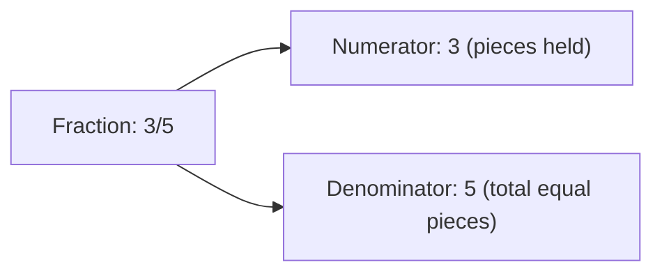
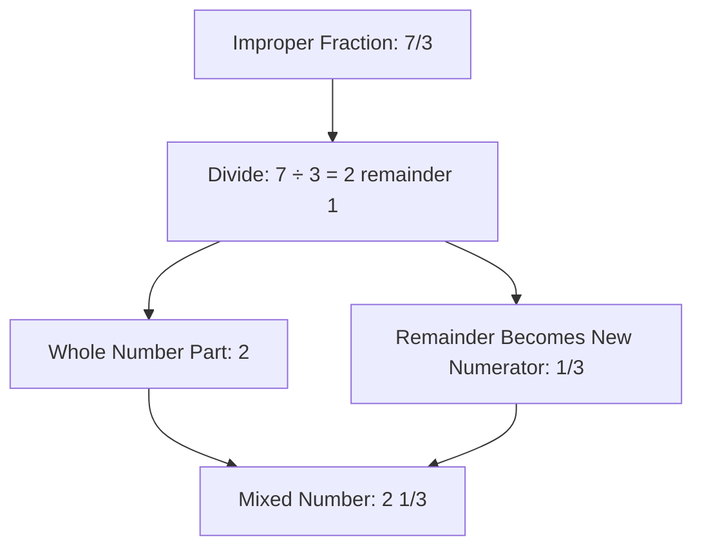
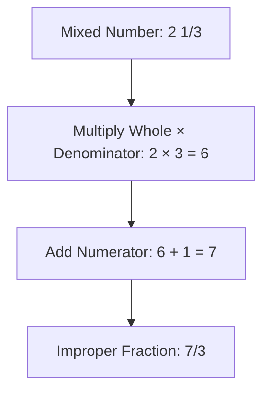
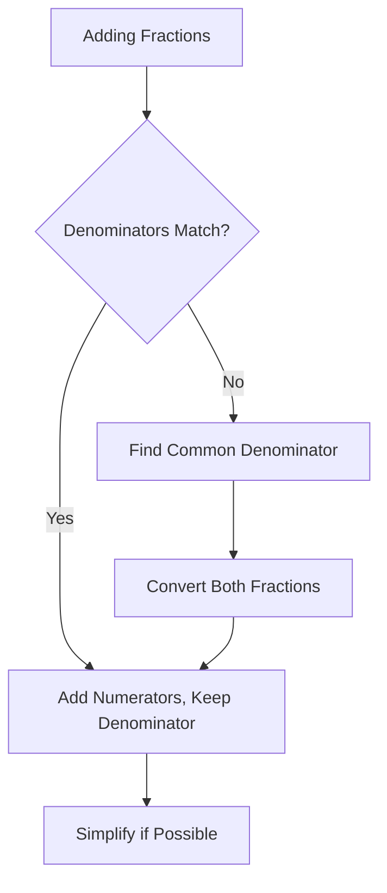
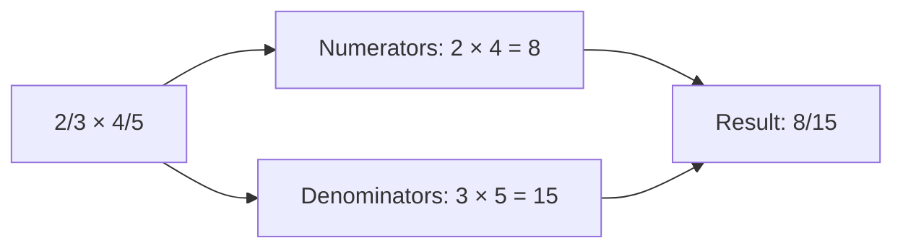
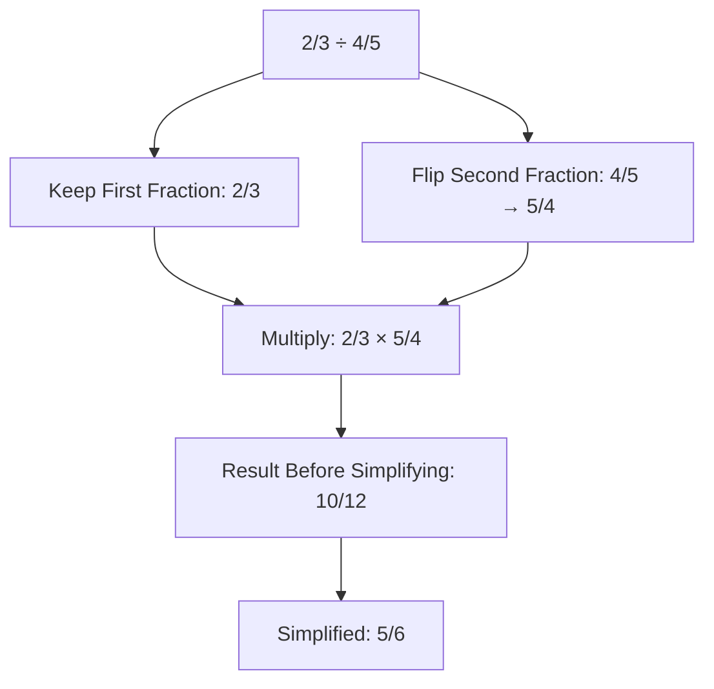
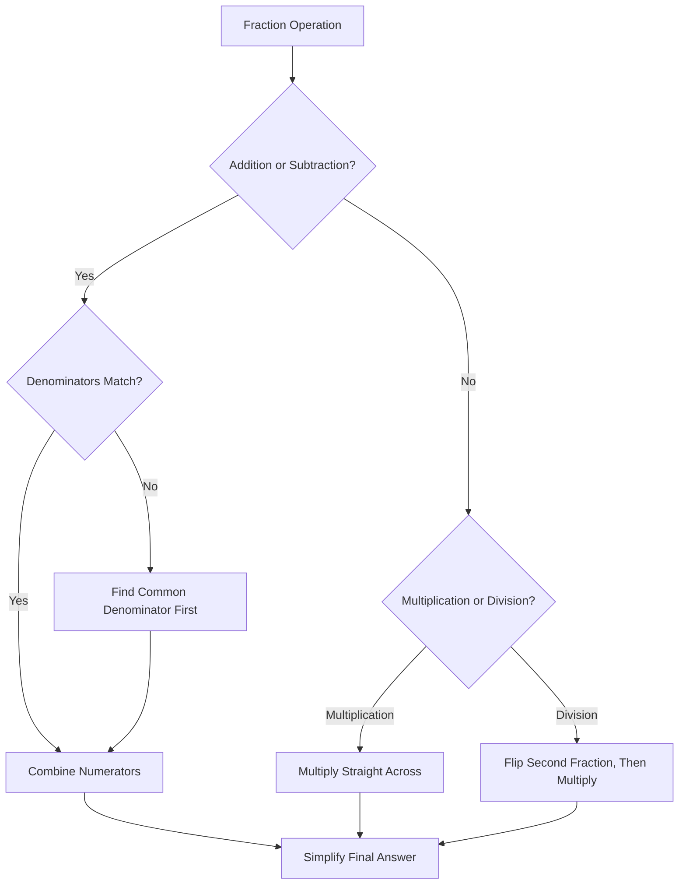
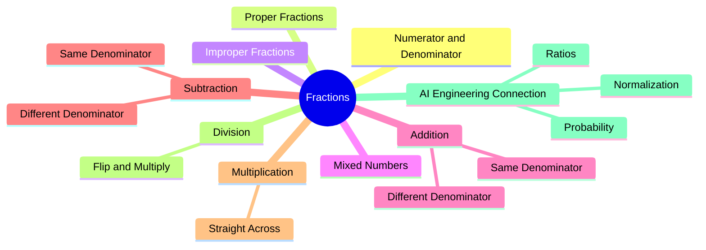

# Fractions

## Mathematics Foundations for AI Engineering

## Table of Contents

1. [What Is a Fraction?](#what-is-a-fraction)
2. [Proper Fractions](#proper-fractions)
   - [Common Misconceptions](#common-misconceptions)
3. [Improper Fractions](#improper-fractions)
   - [Common Misconceptions](#common-misconceptions-1)
4. [Mixed Fractions](#mixed-fractions)
   - [Converting Improper to Mixed Numbers](#converting-improper-to-mixed-numbers)
   - [Converting Mixed Numbers to Improper Fractions](#converting-mixed-numbers-to-improper-fractions)
   - [Common Misconceptions](#common-misconceptions-2)
5. [Adding Fractions](#adding-fractions)
   - [Same Denominators](#same-denominators)
   - [Different Denominators](#different-denominators)
6. [Subtracting Fractions](#subtracting-fractions)
   - [Same Denominators](#same-denominators-1)
   - [Different Denominators](#different-denominators-1)
   - [Common Misconceptions](#common-misconceptions-3)
7. [Multiplying Fractions](#multiplying-fractions)
8. [Dividing Fractions](#dividing-fractions)
   - [Common Misconceptions](#common-misconceptions-4)
9. [Common Beginner Mistakes](#common-beginner-mistakes)
10. [AI Engineering Connection](#ai-engineering-connection)
11. [Quick Final Summary](#quick-final-summary)
12. [Follow Me](#follow-me)

⋆˚꩜｡

## What Is a Fraction?

♡ Definition

- A **fraction** describes a part of a whole, written as two numbers separated by a line.
- The **numerator** (top number) indicates how many pieces are held.
- The **denominator** (bottom number) indicates how many equal pieces the whole was divided into.

♡ Explanation

- In the fraction 3⁄5, the denominator (5) represents the total number of equal pieces the whole was divided into, and the numerator (3) represents how many of those pieces are held.

| Component | Meaning |
|---|---|
| Numerator (top) | How many pieces are held |
| Denominator (bottom) | How many equal pieces the whole was divided into |

♡ Why It Matters

- Every operation covered in this chapter — proper, improper, mixed, addition, subtraction, multiplication, division — builds on the numerator-denominator relationship.

⋆˚꩜｡

## Proper Fractions

♡ Definition

- A **proper fraction** is a fraction in which the numerator is smaller than the denominator.

♡ Explanation

- A proper fraction represents fewer pieces than the whole was divided into, so its value is always less than 1.

| Feature | Detail |
|---|---|
| Condition | Numerator < Denominator |
| Value range | Always less than 1 |
| Represents | A part of one whole, never a whole or more |

♡ Examples

### Example 1

1⁄2 — 1 is smaller than 2, representing half of a whole.

### Example 2

3⁄5 — 3 is smaller than 5, representing a proper fraction less than 1.

### Example 3

7⁄10 — 7 is smaller than 10, close to a whole but still less than 1.

## Common Misconceptions

| Incorrect Idea | Why It Is Incorrect | Correct Understanding |
|---|---|---|
| The numerator and denominator can be used interchangeably. | The numerator indicates pieces held; the denominator indicates total pieces the whole was divided into. | Confusing which number represents which quantity is a common early error; the two positions carry distinct meanings. |

⋆˚꩜｡

## Improper Fractions

♡ Definition

- An **improper fraction** is a fraction in which the numerator is greater than or equal to the denominator.

♡ Explanation

- An improper fraction represents a quantity equal to or greater than one whole.

| Feature | Detail |
|---|---|
| Condition | Numerator ≥ Denominator |
| Value range | Always greater than or equal to 1 |
| Represents | One whole, or several wholes plus additional parts |

♡ Examples

### Example 1

5⁄3 — 5 is greater than 3, so the value exceeds 1.

### Example 2

7⁄4 — 7 is greater than 4, so the value exceeds 1.

### Example 3

9⁄9 — numerator equals denominator, so the value equals exactly 1.

♡ Why It Matters

- An improper fraction and a mixed fraction can represent the same value, expressed in different formats.

## Common Misconceptions

| Incorrect Idea | Why It Is Incorrect | Correct Understanding |
|---|---|---|
| Determining proper versus improper requires multiple rules. | A single comparison determines the classification. | If the numerator is smaller than the denominator, the fraction is proper; if equal to or greater, it is improper. |

⋆˚꩜｡

## Mixed Fractions

♡ Definition

- A **mixed fraction** (or mixed number) combines a whole number with a proper fraction, such as 2 1⁄3.

♡ Explanation

- In 2 1⁄3, the whole number (2) represents two complete wholes, and the fractional part (1⁄3) represents an additional partial piece.
- A mixed fraction represents the same value as its equivalent improper fraction, expressed in a different format.

### Converting Improper to Mixed Numbers

**Example: Converting 7⁄3 to a mixed number**

1. Divide the numerator by the denominator: 7 ÷ 3 = 2, remainder 1.
2. The quotient (2) becomes the whole-number part.
3. The remainder (1) becomes the new numerator, with the denominator unchanged: 1⁄3.
4. Combine: 2 1⁄3.

### Converting Mixed Numbers to Improper Fractions

**Example: Converting 2 1⁄3 to an improper fraction**

1. Multiply the whole number by the denominator: 2 × 3 = 6.
2. Add the numerator to that result: 6 + 1 = 7.
3. Place the result over the original denominator: 7⁄3.

## Common Misconceptions

| Incorrect Idea | Why It Is Incorrect | Correct Understanding |
|---|---|---|
| Improper fractions and mixed numbers represent different values. | 7⁄3 and 2 1⁄3 represent the identical value, expressed in different formats. | Improper and mixed formats are interchangeable representations of the same quantity. |

⋆˚꩜｡

## Adding Fractions

♡ Explanation

- Addition of fractions depends on whether the denominators match.

### Same Denominators

**Example: 2⁄7 + 3⁄7**

1. Add the numerators: 2 + 3 = 5.
2. Keep the denominator unchanged: 7.

Result: 2⁄7 + 3⁄7 = 5⁄7

♡ Explanation

- The denominator describes piece size, which remains constant; only the count of pieces (numerator) changes.

### Different Denominators

**Example: 1⁄2 + 1⁄3**

A common denominator is required because the two fractions describe differently sized pieces.

1. Find the least common denominator of 2 and 3: 6.
2. Convert each fraction to an equivalent fraction with denominator 6: 1⁄2 × 3⁄3 = 3⁄6; 1⁄3 × 2⁄2 = 2⁄6.
3. Add the numerators, keeping the shared denominator: 3 + 2 = 5.
4. Check for simplification: 5⁄6 is already in simplest form.

Result: 3⁄6 + 2⁄6 = 5⁄6

| Concept | Detail |
|---|---|
| Common denominator | A number both original denominators divide into evenly |
| Equivalent fraction | Same value, different numerator/denominator pair, obtained by multiplying top and bottom by the same number |
| Simplification | Dividing numerator and denominator by a shared factor to reach simplest form |

⋆˚꩜｡

## Subtracting Fractions

♡ Explanation

- Subtraction follows the same logic as addition: matching denominators allow direct subtraction of numerators; differing denominators require conversion to a common denominator first.

### Same Denominators

**Example: 5⁄8 − 2⁄8**

1. Subtract the numerators: 5 − 2 = 3.
2. Keep the denominator unchanged: 8.

Result: 5⁄8 − 2⁄8 = 3⁄8

### Different Denominators

**Example: 3⁄4 − 1⁄6**

1. Find the common denominator of 4 and 6: 12.
2. Convert: 3⁄4 × 3⁄3 = 9⁄12; 1⁄6 × 2⁄2 = 2⁄12.
3. Subtract the numerators, keeping the shared denominator: 9 − 2 = 7.
4. Check for simplification: 7⁄12 is already in simplest form.

Result: 9⁄12 − 2⁄12 = 7⁄12

## Common Misconceptions

| Incorrect Idea | Why It Is Incorrect | Correct Understanding |
|---|---|---|
| 3⁄4 − 1⁄6 can be computed as (3−1)⁄(4−6). | Denominators describe piece size, not quantities to subtract directly. | Denominators must match before subtracting numerators; only numerators are combined once piece sizes align. |

⋆˚꩜｡

## Multiplying Fractions

♡ Explanation

- Multiplying fractions does not require a common denominator.

**Example: 2⁄3 × 4⁄5**

1. Multiply the numerators: 2 × 4 = 8.
2. Multiply the denominators: 3 × 5 = 15.
3. Simplify if possible: 8⁄15 has no common factors, so it is already in simplest form.

Result: 2⁄3 × 4⁄5 = 8⁄15

♡ Explanation

- Multiplication represents "a portion of a portion" rather than combining pieces of matching size, which is why matching denominators is unnecessary.

**Fraction × Whole Number Example: 2⁄3 × 4**

1. Rewrite the whole number as a fraction: 4 = 4⁄1.
2. Multiply straight across: numerators 2 × 4 = 8; denominators 3 × 1 = 3.
3. Result: 8⁄3 (an improper fraction, convertible to the mixed number 2 2⁄3).

⋆˚꩜｡

## Dividing Fractions

♡ Explanation

- Dividing by a fraction determines how many groups of a given size fit within a specified amount, which is why the reciprocal is used.
- Dividing by a number and multiplying by its reciprocal produce identical results.

**Example: 2⁄3 ÷ 4⁄5**

1. Keep the first fraction unchanged: 2⁄3.
2. Find the reciprocal of the second fraction: 4⁄5 becomes 5⁄4.
3. Change the operation from division to multiplication: 2⁄3 × 5⁄4.
4. Multiply straight across: numerators 2 × 5 = 10; denominators 3 × 4 = 12.
5. Simplify: divide numerator and denominator by 2 → 5⁄6.

Result: 2⁄3 ÷ 4⁄5 = 5⁄6

**Dividing by a Whole Number Example: 2⁄3 ÷ 4**

1. Write the whole number as a fraction: 4 = 4⁄1.
2. Flip it: 4⁄1 becomes 1⁄4.
3. Multiply straight across: 2⁄3 × 1⁄4 = 2⁄12 = 1⁄6.

## Common Misconceptions

| Incorrect Idea | Why It Is Incorrect | Correct Understanding |
|---|---|---|
| Either fraction can be flipped when dividing. | Only the second fraction (the one being divided by) is flipped. | The first fraction remains unchanged; only the divisor is inverted before multiplying. |

⋆˚꩜｡

## Common Beginner Mistakes

| Mistake | Correction |
|---|---|
| Mixing up numerator and denominator | The denominator (bottom) is total pieces; the numerator (top) is pieces held. |
| Assuming a bigger denominator means a bigger fraction | More pieces means smaller individual pieces; 1/8 is less than 1/2, despite 8 > 2. |
| Adding or subtracting denominators directly | Denominators describe piece size, not a quantity to combine; only numerators are added or subtracted, after denominators match. |
| Forgetting to find a common denominator | Required for addition and subtraction whenever denominators differ. |
| Assuming multiplication needs a common denominator | Multiplication is always performed straight across, without matching denominators. |
| Forgetting to flip the second fraction when dividing | Only the divisor (second fraction) is flipped, never the first. |
| Forgetting to simplify the final answer | Always check whether numerator and denominator share a common factor. |
| Confusing improper fractions with mixed numbers | These are different formats representing the same value, not different quantities. |

⋆˚꩜｡

## AI Engineering Connection

- **Ratios**: Comparing quantities, such as train/test split ratios, aspect ratios, and class balance, applies fraction reasoning.
- **Proportions**: Scaling data, resizing images, and adjusting learning rates proportionally rely on fraction logic.
- **Percentages**: Accuracy, precision, recall, and dropout rates are fractions expressed with a percentage symbol.
- **Probability**: Every probability value is a fraction between 0 and 1, forming the basis of machine learning.
- **Statistics**: Averages, distributions, and normalization involve dividing parts by wholes.
- **Mathematical formulas**: Loss functions, gradients, and activation functions frequently contain fractions and division.
- **Normalization**: Scaling values into a 0–1 range, a common preprocessing step, is fundamentally a fraction operation.
- **Machine learning calculations**: Batch sizes, weighted averages, and softmax outputs are fraction-based.

⋆˚꩜｡

## Quick Final Summary

| Type / Operation | Main Idea | Basic Rule | Example |
|---|---|---|---|
| Proper fraction | Less than one whole | Numerator < Denominator | 3/5 |
| Improper fraction | One whole or more | Numerator ≥ Denominator | 7/4 |
| Mixed number | Whole + fractional part | Whole number beside a proper fraction | 2 1/3 |
| Addition | Combine parts of the same size | Match denominators, then add numerators | 1/2 + 1/3 = 5/6 |
| Subtraction | Find the difference between parts | Match denominators, then subtract numerators | 3/4 − 1/6 = 7/12 |
| Multiplication | A portion of a portion | Multiply straight across | 2/3 × 4/5 = 8/15 |
| Division | How many groups fit inside | Flip the second fraction, then multiply | 2/3 ÷ 4/5 = 5/6 |

⋆˚꩜｡

## Follow Me

If you enjoyed these notes, you'll probably enjoy the rest too.

| Platform | Link |
|---|---|
| Instagram | [@mehrunnisa.ai](https://www.instagram.com/mehrunnisa.ai/) |
| SubStack | [The Epoch](https://theepoch.substack.com/) |
| YouTube | [@mehrunnisa.ai](https://www.youtube.com/@Mehrunnisa-ai) |

**Download:** [Number – By Mehrunnisa.pdf](https://github.com/user-attachments/files/30637570/Number.-.By.Mehrunnisa.pdf) — for offline reading.

**Usage Terms**

These notes are free to use for personal learning, revision, and study. Please do not:

- Sell or redistribute for profit.
- Claim them as your own work.
- Modify and republish without permission.
- Use for any unethical or unauthorized purpose.

Thank you for respecting the effort behind these notes. Happy learning. ♡
