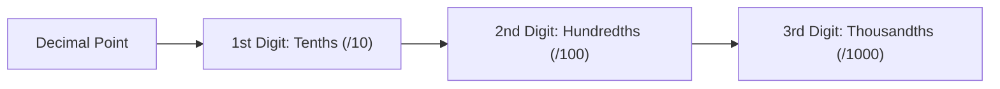
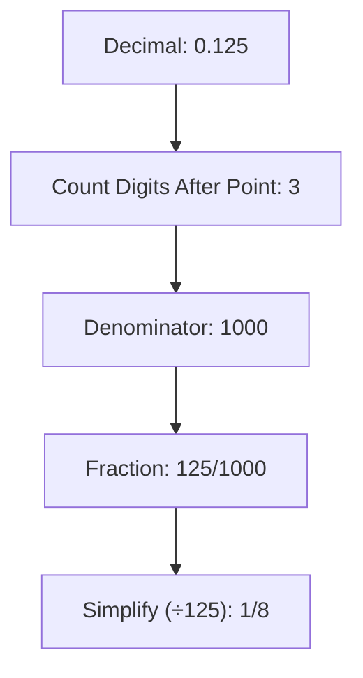
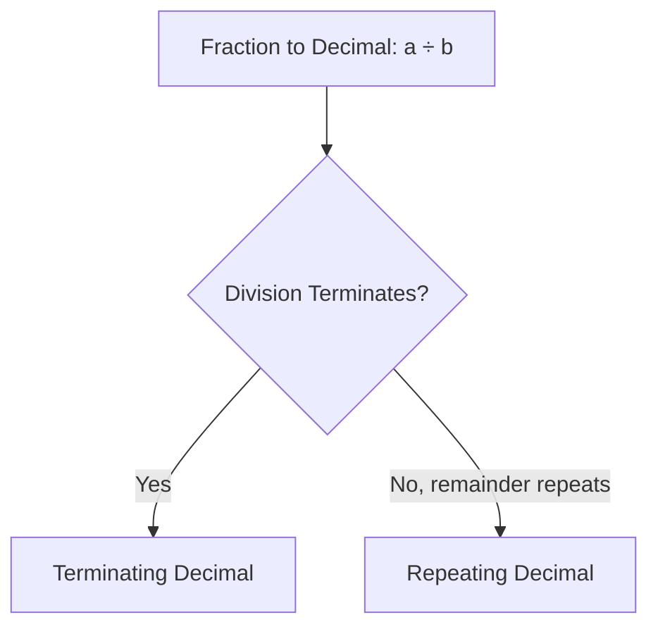
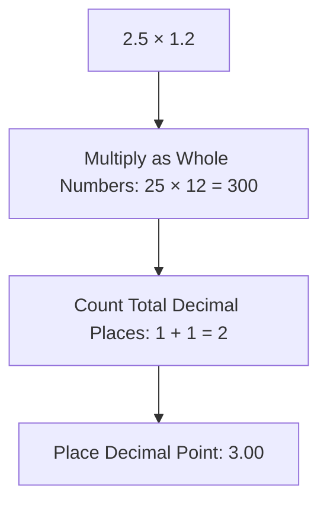
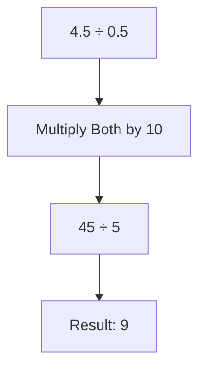
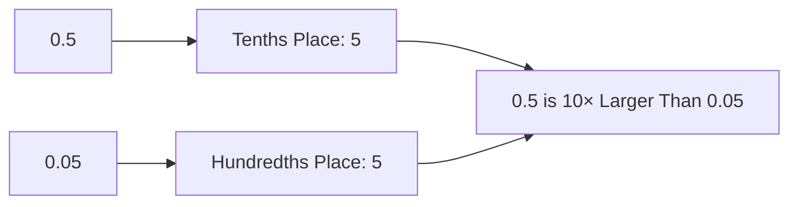
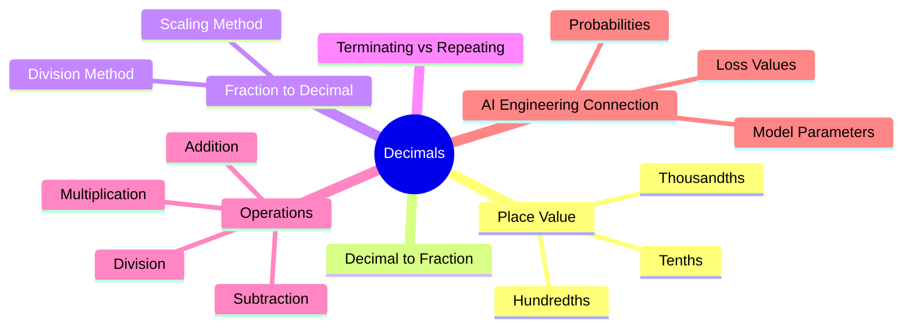

# Decimals

## Mathematics Foundations for AI Engineering

## Table of Contents

1. [Understanding Decimals](#understanding-decimals)
2. [Decimal to Fraction](#decimal-to-fraction)
3. [Fraction to Decimal](#fraction-to-decimal)
   - [Method 1: Division](#method-1-division)
   - [Method 2: Making the Denominator 10, 100, or 1000](#method-2-making-the-denominator-10-100-or-1000)
   - [Terminating vs. Repeating Decimals](#terminating-vs-repeating-decimals)
4. [Operations with Decimals](#operations-with-decimals)
   - [Addition](#addition)
   - [Subtraction](#subtraction)
   - [Multiplication](#multiplication)
   - [Division](#division)
5. [Common Beginner Mistakes](#common-beginner-mistakes)
6. [AI Engineering Connection](#ai-engineering-connection)
7. [Quick Final Summary](#quick-final-summary)
8. [Follow Me](#follow-me)

⋆˚꩜｡

## Understanding Decimals

♡ Definition

- A **decimal** is a way of writing a fraction whose denominator is 10, 100, 1000, or another power of 10.

♡ Explanation

- Writing 0.5 is equivalent to stating "five tenths." Writing 0.25 is equivalent to stating "twenty-five hundredths." Decimals and fractions represent the same value in different formats.
- Each digit following the decimal point occupies a place value: the first digit represents tenths, the second represents hundredths, and the third represents thousandths. Each successive place is ten times smaller than the one before it.

| Position After Decimal Point | Place Value | Denominator |
|---|---|---|
| 1st digit | Tenths | 10 |
| 2nd digit | Hundredths | 100 |
| 3rd digit | Thousandths | 1000 |



♡ Why It Matters

- The denominator corresponds directly to the number of digit positions after the decimal point, since each position represents one-tenth of the value of the position before it.

⋆˚꩜｡

## Decimal to Fraction

♡ Explanation

- A decimal is read as a fraction using its last place value as the denominator, then simplified.

**Step-by-step method**

1. Count the digits after the decimal point.
2. Use that count to determine the denominator: 1 digit → /10, 2 digits → /100, 3 digits → /1000.
3. Write the decimal's digits (excluding the point) as the numerator.
4. Simplify the fraction if possible.

♡ Examples

### Example 1: 0.5

0.5 has 1 digit after the decimal point, giving denominator 10: 0.5 = 5/10. Simplified by dividing by 5: 5/10 = 1/2.

### Example 2: 0.25

0.25 has 2 digits after the decimal point, giving denominator 100: 0.25 = 25/100. Simplified by dividing by 25: 25/100 = 1/4.

### Example 3: 0.125

0.125 has 3 digits after the decimal point, giving denominator 1000: 0.125 = 125/1000. Simplified by dividing by 125: 125/1000 = 1/8.



♡ Why It Matters

- Simplifying the resulting fraction is essential; skipping this step leaves the fraction in an unnecessarily complex form.

⋆˚꩜｡

## Fraction to Decimal

### Method 1: Division

♡ Explanation

- A fraction a/b is equivalent to the division a ÷ b. Converting a fraction to a decimal requires dividing the numerator by the denominator.

♡ Examples

### Example 1

1⁄2 = 1 ÷ 2 = 0.5

### Example 2

3⁄4 = 3 ÷ 4 = 0.75, obtained through long division: 30 ÷ 4 = 7 remainder 2; 20 ÷ 4 = 5 exactly.

### Method 2: Making the Denominator 10, 100, or 1000

♡ Explanation

- If the denominator can be scaled to a power of 10, this method is often faster than direct division.

**Example:** 1⁄4 × 25⁄25 = 25/100 = 0.25

| Method | When to Use |
|---|---|
| Division | Works for any fraction; preferred for awkward denominators (e.g., 7, 13) |
| Scaling to a power of 10 | Faster for "friendly" denominators (e.g., 2, 4, 5, 20, 25) |

### Terminating vs. Repeating Decimals

| Type | Definition | Example |
|---|---|---|
| Terminating decimal | The digits stop | 1/2 = 0.5 |
| Repeating decimal | A digit or group of digits repeats indefinitely | 1/3 = 0.333... |

♡ Explanation

- Dividing 1 by 3 produces a remainder of 1 at every step, causing the digit 3 to repeat indefinitely, represented as 0.333...



⋆˚꩜｡

## Operations with Decimals

Decimal arithmetic uses the same skills as whole-number arithmetic, with the addition of one rule: respecting the decimal point's position.

### Addition

**Method:** Align the decimal points, then add column by column.

```
  12.50
+  3.75
--------
  16.25
```

♡ Explanation

- Aligning decimal points ensures each column represents the same place value; without alignment, digits of different place values would be combined incorrectly.

### Subtraction

**Method:** Align the decimal points, then subtract column by column, borrowing as needed.

```
  8.60
− 3.75
--------
  4.85
```

♡ Explanation

- Borrowing in decimal subtraction follows the same process as whole-number subtraction, applied across the decimal point.

### Multiplication

**Method:** Multiply as whole numbers, ignoring decimal points, then place the decimal point based on the total decimal places in both original numbers.

**Example: 2.5 × 1.2**

1. Multiply normally, ignoring decimal points: 25 × 12 = 300.
2. Count the total decimal places in both original numbers: 1 + 1 = 2.
3. Place the decimal point so the answer has 2 decimal places: 300 → 3.00 = 3.0.



**Multiplying by 10, 100, 1000**

| Operation | Effect | Example |
|---|---|---|
| × 10 | Shift decimal point one place right | 2.5 × 10 = 25 |
| × 100 | Shift decimal point two places right | 2.5 × 100 = 250 |
| × 1000 | Shift decimal point three places right | 2.5 × 1000 = 2500 |

### Division

♡ Explanation

- Dividing decimals requires converting the divisor into a whole number first, since dividing by a whole number is simpler than dividing by a decimal.

**Dividing a decimal by a decimal — Example: 4.5 ÷ 0.5**

1. Multiply both the divisor and dividend by 10 (or another power of 10) to make the divisor a whole number: 45 ÷ 5.
2. Perform the division: 45 ÷ 5 = 9.



**Dividing by 10, 100, 1000**

| Operation | Effect | Example |
|---|---|---|
| ÷ 10 | Shift decimal point one place left | 25 ÷ 10 = 2.5 |
| ÷ 100 | Shift decimal point two places left | 25 ÷ 100 = 0.25 |
| ÷ 1000 | Shift decimal point three places left | 25 ÷ 1000 = 0.025 |

♡ Why It Matters

- Scaling both the divisor and dividend by the same power of 10 preserves the ratio between them, since the scaling factor cancels out (10/10 = 1), leaving the result unchanged.

⋆˚꩜｡

## Common Beginner Mistakes

| Mistake | Correction |
|---|---|
| Forgetting to align decimal points during addition/subtraction | Always stack the decimal points directly on top of each other first. |
| Misplacing the decimal point after multiplication | Count total decimal places from both original numbers, not just one. |
| Assuming 0.5 and 0.05 are equal | 0.5 (five tenths) is ten times larger than 0.05 (five hundredths). |
| Confusing decimal places with decimal value | More digits does not always indicate a larger number; 0.500 equals 0.5. |
| Overlooking that trailing zeros do not change value | 0.5 = 0.50 = 0.500, since 5/10 = 50/100 = 500/1000. |



⋆˚꩜｡

## AI Engineering Connection

- **Numerical calculations**: Nearly every computation in code involves decimal values.
- **Programming**: Variables, computations, and outputs are frequently represented as decimal (float) values.
- **Floating-point values**: The standard method computers use to represent non-whole numbers.
- **Probabilities**: Always expressed as decimals between 0 and 1.
- **Statistics**: Means, standard deviations, and correlations are decimal values.
- **Machine learning calculations**: Gradients, weights, and parameter updates involve decimal arithmetic.
- **Model parameters**: The values a model learns are decimals.
- **Loss values**: A model's error is measured as a decimal number.
- **Accuracy measurements**: Typically reported as a decimal or percentage.

⋆˚꩜｡

## Quick Final Summary

| Operation | Main Idea | Example |
|---|---|---|
| Decimal → Fraction | Use the last place value as denominator, then simplify. | 0.25 = 25/100 = 1/4 |
| Fraction → Decimal | Divide numerator by denominator (or convert to /10, /100...). | 3/4 = 3 ÷ 4 = 0.75 |
| Addition / Subtraction | Align the decimal points, then add or subtract as usual. | 12.50 + 3.75 = 16.25 |
| Multiplication | Multiply as whole numbers, then place the decimal point. | 2.5 × 1.2 = 3.0 |
| Division | Make the divisor a whole number by scaling both numbers. | 4.5 ÷ 0.5 = 9 |



⋆˚꩜｡

## Follow Me

If you enjoyed these notes, you'll probably enjoy the rest too.

| Platform | Link |
|---|---|
| Instagram | [@mehrunnisa.ai](https://www.instagram.com/mehrunnisa.ai/) |
| SubStack | [The Epoch](https://theepoch.substack.com/) |
| YouTube | [@mehrunnisa.ai](https://www.youtube.com/@Mehrunnisa-ai) |

**Download:** [Number – By Mehrunnisa.pdf](https://github.com/user-attachments/files/30637570/Number.-.By.Mehrunnisa.pdf) — for offline reading.

**Usage Terms**

These notes are free to use for personal learning, revision, and study. Please do not:

- Sell or redistribute for profit.
- Claim them as your own work.
- Modify and republish without permission.
- Use for any unethical or unauthorized purpose.

Thank you for respecting the effort behind these notes. Happy learning. ♡
