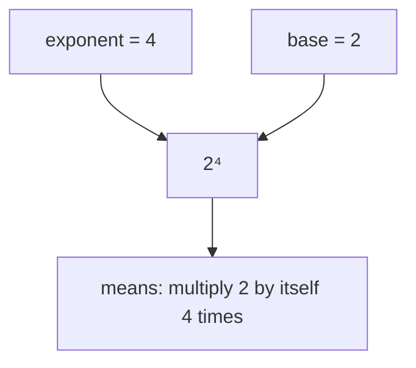
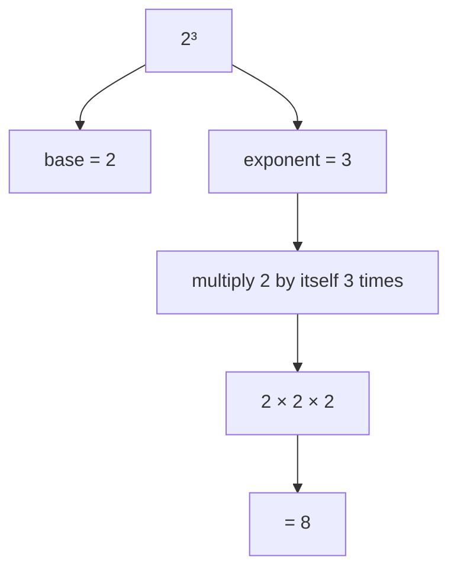
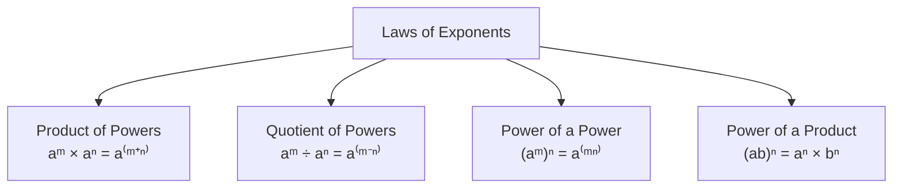
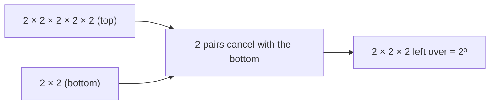
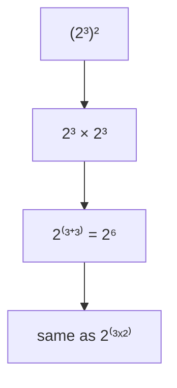
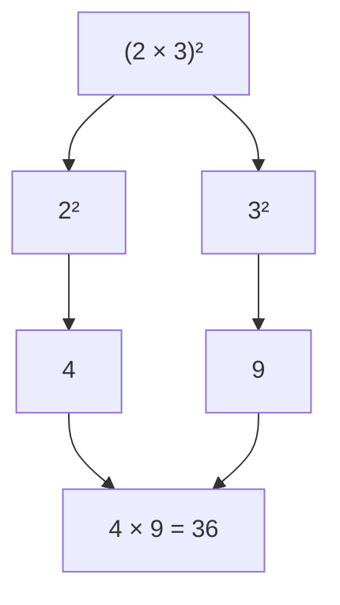
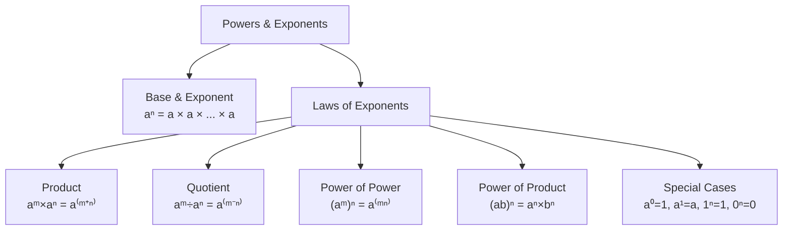

# Exponents & Powers
### *Mathematics for AI — Study Notes by Mehrunnisa*

Okay, so this is literally the very first topic in my math notes. I'm starting from zero here — like, actual zero. If you've forgotten everything about exponents, don't worry, so had I. Let's rebuild it together from scratch.

---

## Table of Contents

- [1. What Are Exponents and Powers?](#1-what-are-exponents-and-powers)
- [2. Base and Exponent](#2-base-and-exponent)
- [3. Understanding Powers](#3-understanding-powers)
- [4. Laws of Exponents](#4-laws-of-exponents)
- [5. Product of Powers](#5-product-of-powers)
- [6. Quotient of Powers](#6-quotient-of-powers)
- [7. Power of a Power](#7-power-of-a-power)
- [8. Power of a Product](#8-power-of-a-product)
- [9. Common Mistakes](#9-common-mistakes)
- [10. Quick Revision](#10-quick-revision)
- [11. Mini Quiz](#11-mini-quiz)
- [12. End Concept Map](#12-end-concept-map)

---

## 1. What Are Exponents and Powers?

First, I need to understand why this even exists.

Imagine I have to write this out:

```
2 × 2 × 2 × 2 × 2 × 2 × 2 × 2 × 2 × 2
```

That's ten 2's multiplied together. Writing that every time is annoying and takes up space. So mathematicians made a shortcut for "multiply this number by itself a bunch of times."

That shortcut is a **power**.

So instead of writing `2 × 2 × 2 × 2 × 2 × 2 × 2 × 2 × 2 × 2`, I can just write:

```
2^10
```

This basically means "multiply 2 by itself 10 times." That's it. That's the whole idea. A power is just a compressed way of writing repeated multiplication.

> **The important thing here is:** a power is not a new operation like addition or multiplication. It's just a *notation* — a shorter way of writing something we already know how to do (multiplying).

---

## 2. Base and Exponent

Now let's look at the pieces of a power. Take `2^4`.



- **Base** → the number being multiplied (here, 2)
- **Exponent** → how many times the base is multiplied by itself (here, 4)

So `2^4` is read as **"2 raised to the power 4"** or just **"2 to the 4th."**

Let's actually work it out:

```
2^4 = 2 × 2 × 2 × 2 = 16
```

Base = 2
Exponent = 4
Value = 16

The easiest way to think about this is: the exponent tells the base "copy yourself this many times, then multiply all the copies together."

### A few more examples to get comfortable

```
5^3 = 5 × 5 × 5 = 125
3^2 = 3 × 3 = 9
10^5 = 10 × 10 × 10 × 10 × 10 = 100000
```

### Powers of 1

Here's a nice pattern. What is `1^100`?

```
1^100 = 1 × 1 × 1 × ... × 1 (100 times) = 1
```

No matter how many times I multiply 1 by itself, I still get 1. So **1 raised to any power is always 1**. Makes sense — multiplying by 1 never changes anything.

### Powers of 0 (with a positive exponent)

```
0^5 = 0 × 0 × 0 × 0 × 0 = 0
```

Same logic — if the base is 0, the answer is always 0 (as long as the exponent is a positive number).

### What about an exponent of 0?

This one feels weird at first: **any non-zero number raised to the power 0 equals 1.**

```
5^0 = 1
100^0 = 1
```

I won't fully prove this now (we'll actually see *why* this is true naturally once we hit the Quotient Law in Section 6 — it falls right out of the pattern). For now, just remember it as a rule: **anything^0 = 1** (except 0 itself, which is a special case usually left undefined at this level).

### A tiny peek at negative exponents

I'm only mentioning this because it'll help the laws make sense later. A negative exponent just means "flip it into a fraction":

```
2^-1 = 1/2
2^-3 = 1/2^3 = 1/8
```

This basically means a negative exponent doesn't make the number negative — it makes it a **reciprocal**. We won't go deep into this here; just recognize it when it shows up.

---

## 3. Understanding Powers Visually

Let's really lock this in with pictures, because seeing it helps more than just reading it.



Another way to see it — like "unpacking" the power:


Now I can see why powers are so useful — `2^4` is just a compact box, and expanding it gives me back the full multiplication.

### One more visual: comparing bases and exponents

| BASE changes, exponent stays 3 | | EXPONENT changes, base stays 2 |
|---|---|---|
| 2³ = 8 | | 2¹ = 2 |
| 3³ = 27 | | 2² = 4 |
| 4³ = 64 | | 2³ = 8 |
| | | 2⁴ = 16 |

*Bigger base → bigger jump. Bigger exponent → each step **doubles** the last one.*

This helps me notice something important: increasing the **exponent** grows the number *way* faster than increasing the **base**. That's the whole idea behind "exponential growth."

---

## 4. Laws of Exponents

Okay, now for the actual reason we're here. There are 4 basic laws that let us simplify powers without expanding everything out every single time. I'm not going to just hand you the formulas — I want to *build* each one from scratch so it actually makes sense.



---

## 5. Product of Powers

**a^m × a^n = a^(m+n)**

Let's not memorize this yet — let's *see* it happen.

```
2^3 × 2^2
```

I'll expand both powers fully:

```
2^3 × 2^2
= (2 × 2 × 2) × (2 × 2)
```

Now if I remove the brackets, I just have one long multiplication:

```
= 2 × 2 × 2 × 2 × 2
```

Now count how many 2's there are — one, two, three, four, five:

```
= 2^5
```

So:

```
2^3 × 2^2 = 2^(3+2) = 2^5 = 32
```

**Now I can see why** the exponents get added — because multiplying powers of the same base is just *piling up* more copies of that base. 3 copies plus 2 more copies = 5 copies total.

### The shortcut

```
2^3 × 2^2 = 2^(3+2) = 2^5
```

No need to expand every time — just add the exponents, as long as the **base is the same**.

### More examples

```
5^2 × 5^4 = 5^(2+4) = 5^6
x^3 × x^5 = x^(3+5) = x^8
a^1 × a^4 = a^(1+4) = a^5
```

> **A common mistake I can make here** is multiplying the bases together too, like writing `2^3 × 2^2 = 4^5`. That's wrong! The base stays exactly the same — only the exponents add.

---

## 6. Quotient of Powers

**a^m / a^n = a^(m-n)**  (where a ≠ 0)

Same idea, but for division. Let's build it from scratch again.

```
2^5 / 2^2
```

Expand fully:

```
2^5 / 2^2 = (2 × 2 × 2 × 2 × 2) / (2 × 2)
```

Now here's the key step — common factors on top and bottom **cancel out**:



So:

```
2^5 / 2^2 = 2^(5-2) = 2^3 = 8
```

This basically means: when I divide powers with the same base, the bottom copies cancel out the top copies, leaving only the "extra" ones on top. That's why we **subtract** the exponents instead of adding them.

### The shortcut

```
2^5 / 2^2 = 2^(5-2) = 2^3
```

### More examples

```
7^6 / 7^4 = 7^(6-4) = 7^2
x^9 / x^3 = x^(9-3) = x^6
```

### Quick restriction to remember

The denominator (bottom base) **cannot be zero**, since we can't divide by 0. So this law only works when `a ≠ 0`.

### Why does anything^0 = 1? (the mystery from Section 2, solved)

Watch what happens when the top and bottom exponents are equal:

```
2^3 / 2^3 = 2^(3-3) = 2^0
```

But I also know that any number divided by itself is 1:

```
2^3 / 2^3 = 8/8 = 1
```

So `2^0` must equal `1`. Now I can see exactly why the "anything to the power 0 is 1" rule is true — it's not random, it just falls naturally out of the subtraction rule.

---

## 7. Power of a Power

**(a^m)^n = a^(mn)**

This one is about what happens when a power itself gets raised to another power — like a power wrapped inside another power.

```
(2^3)^2
```

The outer exponent (2) tells me to multiply `2^3` by itself 2 times:

```
(2^3)^2 = 2^3 × 2^3
```

And now I already know this part — it's the Product Law from Section 5! I just add the exponents:

```
= 2^(3+3) = 2^6
```

So:

```
(2^3)^2 = 2^(3×2) = 2^6 = 64
```

**Now I can see why** the exponents get *multiplied* here — because "squaring `2^3`" literally means adding `3 + 3`, which is the same as `3 × 2`. If it were `(2^3)^4`, I'd be adding four 3's together, which is `3 × 4`.



### More examples

```
(5^2)^3 = 5^(2×3) = 5^6
(x^4)^2 = x^(4×2) = x^8
```

> **A common mistake I can make here** is confusing this with the Product Law and adding instead of multiplying. Remember: powers *multiplying* each other (like `a^m × a^n`) → **add** exponents. A power *raised to* another power (like `(a^m)^n`) → **multiply** exponents.

---

## 8. Power of a Product

**(ab)^n = a^n × b^n**

Last law! This is about what happens when there are two numbers multiplied *inside* the brackets, and the whole thing is raised to a power.

```
(2 × 3)^2
```

Let's just calculate it directly first — the normal way:

```
(2 × 3)^2 = 6^2 = 36
```

Now let's try applying the exponent to *each* factor separately and see if we get the same answer:

```
2^2 × 3^2 = 4 × 9 = 36
```

Same answer! So:

```
(2 × 3)^2 = 2^2 × 3^2 = 36
```

This basically means when a **product** (two things multiplied) is inside the brackets, the exponent outside applies to *both* factors individually — not just one of them.



### More examples

```
(3 × 5)^2 = 3^2 × 5^2 = 9 × 25 = 225
(x × y)^3 = x^3 × y^3
```

> **A common mistake I can make here** is forgetting to apply the exponent to *both* factors — like writing `(2×3)^2 = 2^2 × 3` instead of `2^2 × 3^2`. Every factor inside the brackets gets the exponent.

---

## 9. Common Mistakes

Quick round-up of the slip-ups I need to watch out for:

- ❌ `2^3 × 2^2 = 4^5` → ✅ base stays the same, only add exponents: `2^5`
- ❌ `(2^3)^2 = 2^5` (adding instead of multiplying) → ✅ `2^6`
- ❌ `(2×3)^2 = 2^2 × 3` → ✅ apply exponent to **both** factors: `2^2 × 3^2`
- ❌ Adding exponents when the **bases are different** (e.g., `2^3 × 3^2` cannot be simplified this way — the laws only work for the *same base*)
- ❌ Thinking `a^0 = 0` → ✅ it's actually `1` (for a ≠ 0)

---

## 10. Quick Revision

| Law | Rule |
|---|---|
| Product of Powers | aᵐ × aⁿ = a⁽ᵐ⁺ⁿ⁾ |
| Quotient of Powers | aᵐ ÷ aⁿ = a⁽ᵐ⁻ⁿ⁾ |
| Power of a Power | (aᵐ)ⁿ = a⁽ᵐⁿ⁾ |
| Power of a Product | (ab)ⁿ = aⁿ × bⁿ |

| Special Case | Value |
|---|---|
| a⁰ | 1 &nbsp;(a ≠ 0) |
| a¹ | a |
| 1ⁿ | 1 |
| 0ⁿ &nbsp;(n > 0) | 0 |

**Memory trick:**
- Multiplying same-base powers → **ADD**
- Dividing same-base powers → **SUBTRACT**
- Power on a power → **MULTIPLY**
- Product inside brackets → **DISTRIBUTE** the exponent to each factor

---

## 11. Mini Quiz

Try these before checking the answers below — no peeking!

1. `3^2 × 3^4 = ?`
2. `5^7 / 5^3 = ?`
3. `(2^2)^3 = ?`
4. `(4 × 2)^2 = ?` (solve two ways and check they match)
5. `9^0 = ?`
6. `1^250 = ?`
7. What's wrong with this step: `2^3 × 2^2 = 4^5`?

<details>
<summary>Click to check answers</summary>

1. `3^(2+4) = 3^6 = 729`
2. `5^(7-3) = 5^4 = 625`
3. `2^(2×3) = 2^6 = 64`
4. `(4×2)^2 = 8^2 = 64` and `4^2 × 2^2 = 16 × 4 = 64` ✅ matches
5. `9^0 = 1`
6. `1^250 = 1`
7. The base should stay as `2`, not become `4`. Correct answer: `2^5 = 32`

</details>

---

## 12. End Concept Map



That's the full picture — start with what a power even *is*, then build every law from first principles instead of memorizing it blind. Next up: putting these laws into more mixed practice problems.

---

<div align="center">

⋆˚꩜｡

### Follow Me

If you enjoyed these notes, you'll probably enjoy the rest too.

| Platform | Link |
|---|---|
| Instagram | @mehrunnisa.ai |
| SubStack | The Epoch |
| YouTube | @mehrunnisa.ai |

**Usage Terms**
These notes are free to use for personal learning, revision, and study. Please do not:
- Sell or redistribute for profit.
- Claim them as your own work.
- Modify and republish without permission.
- Use for any unethical or unauthorized purpose.

Thank you for respecting the effort behind these notes. Happy learning. ♡

</div>
