# Roots
### *Mathematics for AI — Study Notes by Mehrunnisa*

Okay so exponents taught me how to go "up" — multiply a number by itself a bunch of times. Roots are basically the reverse question: **if I already know the answer, what number was multiplied to get there?** Let's build this up from scratch.

---

## Table of Contents

- [1. Square Root](#1-square-root)
  - [1.1 Meaning of Square Root](#11-meaning-of-square-root)
  - [1.2 Perfect Squares](#12-perfect-squares)
  - [1.3 Principal Square Root](#13-principal-square-root)
  - [1.4 Positive and Negative Square Roots](#14-positive-and-negative-square-roots)
  - [1.5 Square Root of Fractions](#15-square-root-of-fractions)
  - [1.6 Square Root of Decimals](#16-square-root-of-decimals)
  - [1.7 Simplifying Square Roots](#17-simplifying-square-roots)
  - [1.8 Properties of Square Roots](#18-properties-of-square-roots)
  - [1.9 Square Root of Variables](#19-square-root-of-variables)
- [2. Cube Root](#2-cube-root)
  - [2.1 Meaning of Cube Root](#21-meaning-of-cube-root)
  - [2.2 Perfect Cubes](#22-perfect-cubes)
  - [2.3 Cube Root of Positive Numbers](#23-cube-root-of-positive-numbers)
  - [2.4 Cube Root of Negative Numbers](#24-cube-root-of-negative-numbers)
  - [2.5 Cube Root of Fractions](#25-cube-root-of-fractions)
  - [2.6 Cube Root of Decimals](#26-cube-root-of-decimals)
  - [2.7 Simplifying Cube Roots](#27-simplifying-cube-roots)
  - [2.8 Properties of Cube Roots](#28-properties-of-cube-roots)
  - [2.9 Cube Root of Variables](#29-cube-root-of-variables)
- [3. nth Root](#3-nth-root)
  - [3.1 Meaning of nth Root](#31-meaning-of-nth-root)
  - [3.2 Even and Odd Roots](#32-even-and-odd-roots)
  - [3.3 nth Root of Numbers](#33-nth-root-of-numbers)
  - [3.4 nth Root of Fractions](#34-nth-root-of-fractions)
  - [3.5 nth Root of Variables](#35-nth-root-of-variables)
  - [3.6 Simplifying nth Roots](#36-simplifying-nth-roots)
  - [3.7 Properties of nth Roots](#37-properties-of-nth-roots)
- [4. Roots and Exponents](#4-roots-and-exponents)
  - [4.1 Roots as Fractional Exponents](#41-roots-as-fractional-exponents)
  - [4.2 Converting Roots to Exponents](#42-converting-roots-to-exponents)
  - [4.3 Converting Exponents to Roots](#43-converting-exponents-to-roots)
  - [4.4 Power of a Root](#44-power-of-a-root)
  - [4.5 Root of a Power](#45-root-of-a-power)
  - [4.6 Fractional Exponents with Variables](#46-fractional-exponents-with-variables)
- [5. Radical Properties](#5-radical-properties)
  - [5.1 Product Property](#51-product-property)
  - [5.2 Quotient Property](#52-quotient-property)
  - [5.3 Simplifying Radicals](#53-simplifying-radicals)
  - [5.4 Adding Like Radicals](#54-adding-like-radicals)
  - [5.5 Subtracting Like Radicals](#55-subtracting-like-radicals)
  - [5.6 Nested Radicals](#56-nested-radicals)
  - [5.7 Rationalizing Denominators](#57-rationalizing-denominators)
- [6. AI/ML Applications](#6-aiml-applications)
  - [6.1 Euclidean Distance](#61-euclidean-distance)
  - [6.2 Vector Magnitude](#62-vector-magnitude)
  - [6.3 Standard Deviation](#63-standard-deviation)
  - [6.4 Root Mean Square (RMS)](#64-root-mean-square-rms)
- [7. Common Mistakes](#7-common-mistakes)
- [8. Quick Revision](#8-quick-revision)
- [9. Mini Quiz](#9-mini-quiz)
- [10. End Concept Map](#10-end-concept-map)

---

## 1. Square Root

### 1.1 Meaning of Square Root

First, I need to understand what "square root" is even asking.

I already know that squaring a number means multiplying it by itself: `4^2 = 4 × 4 = 16`.

A square root asks the exact **opposite question**: "What number, multiplied by itself, gives me 16?" The answer is 4, because `4 × 4 = 16`.

We write this using the radical symbol `√`:

```
√16 = 4
```

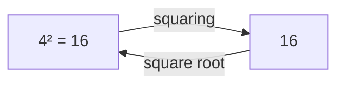

This basically means squaring and square-rooting **undo each other** — they're inverse operations, just like addition and subtraction undo each other.

### 1.2 Perfect Squares

A **perfect square** is any number that comes from squaring a whole number. These are the ones where the square root comes out clean, with no decimals.

```
1² = 1      2² = 4      3² = 9      4² = 16
5² = 25     6² = 36     7² = 49     8² = 64
9² = 81     10² = 100
```

The easiest way to think about this is: perfect squares are the "nice" numbers where `√` gives a whole number answer. Memorizing the first 10-12 of these makes square roots way faster to spot later.

### 1.3 Principal Square Root

Here's something I need to be careful about. Both `4 × 4 = 16` AND `(-4) × (-4) = 16`. So technically, both 4 and -4 are square roots of 16.

But when I write `√16`, math has a rule: the `√` symbol *always* means the **positive** root, unless a `−` sign is placed in front of it. This positive one is called the **principal square root**.

```
√16 = 4          (principal root — this is what √ means by default)
-√16 = -4        (the negative root, written explicitly)
```

> **The important thing here is:** `√16` by itself is always just `4`. If I want the negative one, I have to write the minus sign myself.

### 1.4 Positive and Negative Square Roots

So every positive number actually has **two** square roots — a positive one and a negative one — because a negative times a negative is positive.

```
√25 = 5   and   -√25 = -5      (since 5×5=25 and (-5)×(-5)=25)
```

If a question asks for "all square roots of 25," the answer is `±5` (read as "plus or minus 5"). But if it just asks for `√25` (no extra wording), the answer is just `5` — the principal root.

> **A common mistake I can make here** is writing `√25 = ±5`. That's only correct if the question specifically asks for "all square roots." The `√` symbol alone always means the positive one.

### 1.5 Square Root of Fractions

Now let's apply this to fractions. The easiest way to think about this is: just take the square root of the top and the bottom **separately**.

```
√(4/9) = √4 / √9 = 2/3
```

Check: `(2/3) × (2/3) = 4/9` ✅ — that confirms it.

```
√(25/16) = √25 / √16 = 5/4
```

### 1.6 Square Root of Decimals

For decimals, the easiest way to think about this is to first convert the decimal into a fraction (or just recognize the pattern).

```
√0.25 = √(25/100) = 5/10 = 0.5
```

Check: `0.5 × 0.5 = 0.25` ✅

```
√0.04 = √(4/100) = 2/10 = 0.2
```

A quick pattern I noticed: if the number of decimal digits is even, I can often "split" it cleanly like this. For messier decimals, we usually just estimate or use a calculator — no need to do this by hand every time.

### 1.7 Simplifying Square Roots

Not every number under a `√` is a perfect square. Like `√50` — there's no whole number that squares to 50. But I can still simplify it by pulling out any perfect-square *factors*.

```
√50 = √(25 × 2) = √25 × √2 = 5√2
```

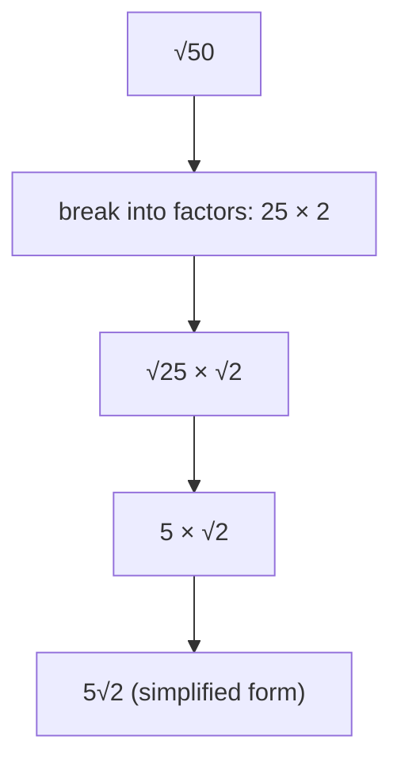

**Now I can see why** this works — I'm just looking for the *biggest perfect square* hiding inside the number, pulling it out as a whole number, and leaving the rest under the root.

More examples:

```
√72 = √(36 × 2) = 6√2
√18 = √(9 × 2) = 3√2
```

### 1.8 Properties of Square Roots

Quick list of rules that make square roots easier to work with (we'll prove some of these properly in Section 5):

```
√a × √b = √(ab)          (product property)
√a / √b = √(a/b)          (quotient property, b ≠ 0)
(√a)² = a                 (squaring undoes the root)
√(a²) = |a|                (root of a square gives the absolute value)
```

That last one is subtle — I'll come back to it, but the short version is: `√((-3)²) = √9 = 3`, **not** -3. The root always gives a non-negative answer.

### 1.9 Square Root of Variables

Same idea applies to variables, but I need to be a little careful.

```
√(x²) = |x|        (in general, since x could be negative)
√(x⁴) = x²          (x² is always non-negative, so no need for | |)
√(9x²) = 3|x|
```

If I'm told `x` is positive (which is common in algebra problems), I can drop the absolute value bars and just write `√(x²) = x`.

---

## 2. Cube Root

### 2.1 Meaning of Cube Root

Same logic as square roots, but now I'm undoing a *cube* (power of 3) instead of a square.

I know `3^3 = 3 × 3 × 3 = 27`. The cube root asks: "What number, multiplied by itself 3 times, gives 27?" Answer: 3.

We write this with a small `3` in the radical:

```
³√27 = 3
```

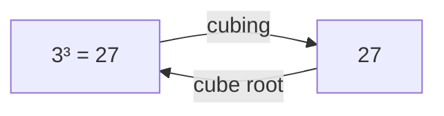

### 2.2 Perfect Cubes

Just like perfect squares, these are numbers that come from cubing a whole number:

```
1³ = 1      2³ = 8      3³ = 27     4³ = 64
5³ = 125    6³ = 216    7³ = 343    8³ = 512
```

Worth memorizing at least the first 5-6 for quick recognition.

### 2.3 Cube Root of Positive Numbers

```
³√8 = 2       (since 2×2×2=8)
³√125 = 5     (since 5×5×5=125)
```

Nothing tricky here — every positive number has exactly one real cube root, and it's positive.

### 2.4 Cube Root of Negative Numbers

Here's where cube roots are actually *simpler* than square roots. Since a negative number times itself an odd number of times stays negative:

```
(-2) × (-2) × (-2) = -8
```

That means:

```
³√(-8) = -2
```

**Now I can see why** this works, unlike square roots — negative numbers *do* have real cube roots, because multiplying three negatives gives a negative. So I don't need the "principal root only" workaround here; the cube root of a negative number is just... negative.

> **The important thing here is:** unlike `√(-16)` (which has no real answer), `³√(-8)` is perfectly fine and equals `-2`.

### 2.5 Cube Root of Fractions

Same split-it-up idea as before:

```
³√(8/27) = ³√8 / ³√27 = 2/3
```

### 2.6 Cube Root of Decimals

```
³√0.008 = ³√(8/1000) = 2/10 = 0.2
```

Check: `0.2 × 0.2 × 0.2 = 0.008` ✅

### 2.7 Simplifying Cube Roots

Same trick as square roots — pull out the biggest **perfect cube** factor hiding inside.

```
³√54 = ³√(27 × 2) = ³√27 × ³√2 = 3³√2
```

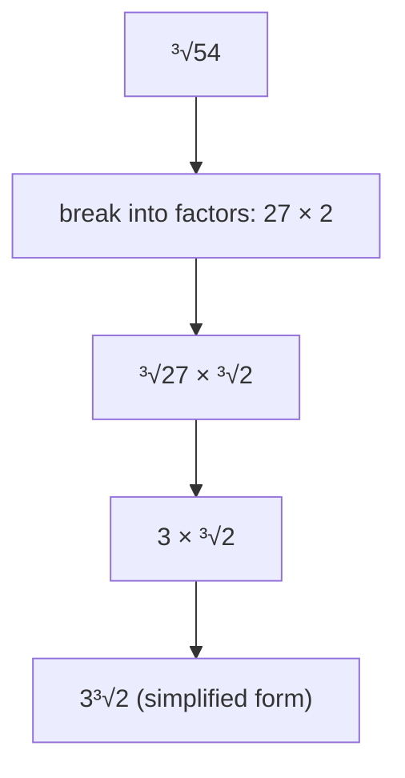

### 2.8 Properties of Cube Roots

```
³√a × ³√b = ³√(ab)
³√a / ³√b = ³√(a/b)
(³√a)³ = a
³√(a³) = a          (no absolute value needed — cube roots keep the sign!)
```

That last property is the nice part: unlike square roots, cube roots don't need the `| |` absolute value fix, because the sign carries through naturally.

### 2.9 Cube Root of Variables

```
³√(x³) = x
³√(8x³) = 2x
³√(x⁶) = x²
```

---

## 3. nth Root

### 3.1 Meaning of nth Root

Now let's generalize everything above into one idea. Instead of always asking about squares (power 2) or cubes (power 3), I can ask about *any* power `n`.

The **n-th root** of a number asks: "What number, raised to the power `n`, gives me this value?"

```
ⁿ√a = b     means     b^n = a
```

Written with a small `n` above the radical. When `n = 2` (square root), we usually don't even bother writing the 2 — that's why `√` alone means square root.

### 3.2 Even and Odd Roots

This distinction actually matters a lot, and it's the same pattern we already saw with squares vs. cubes:

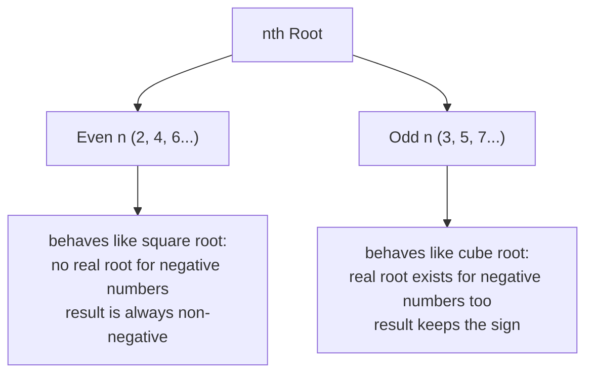

```
⁴√16 = 2         (even root, positive input, fine)
⁴√(-16) = ✗       (no real answer — even roots of negatives don't exist in real numbers)

⁵√32 = 2          (odd root, positive input, fine)
⁵√(-32) = -2      (odd root of a negative number is fine — stays negative)
```

This basically means: the rule I learned for square roots (even) and cube roots (odd) isn't a coincidence — it's a pattern that continues for *every* even or odd root.

### 3.3 nth Root of Numbers

```
⁴√81 = 3        (since 3⁴ = 81)
⁵√243 = 3        (since 3⁵ = 243)
⁶√64 = 2         (since 2⁶ = 64)
```

### 3.4 nth Root of Fractions

Same splitting rule as before, generalized:

```
³√(8/125) = ³√8 / ³√125 = 2/5
⁴√(16/81) = ⁴√16 / ⁴√81 = 2/3
```

### 3.5 nth Root of Variables

```
ⁿ√(xⁿ) = x     (if n is odd, or if x is known to be positive)
ⁿ√(xⁿ) = |x|    (if n is even and x could be negative)
```

Example:

```
⁴√(x⁴) = |x|
⁵√(x⁵) = x
```

### 3.6 Simplifying nth Roots

Same "pull out the biggest matching group" idea, just generalized to any `n`.

```
⁴√48 = ⁴√(16 × 3) = ⁴√16 × ⁴√3 = 2⁴√3
```

I'm looking for a factor that's a **perfect n-th power** — for a 4th root, I want factors that are perfect 4th powers (like 16 = 2⁴).

### 3.7 Properties of nth Roots

```
ⁿ√a × ⁿ√b = ⁿ√(ab)
ⁿ√a / ⁿ√b = ⁿ√(a/b)
(ⁿ√a)^n = a
```

These are the exact same properties I saw for square roots and cube roots — because those were really just specific cases (n=2 and n=3) of this general nth-root idea all along.

---

## 4. Roots and Exponents

### 4.1 Roots as Fractional Exponents

This is honestly the most useful thing in this whole topic — roots and fractional exponents are **the same thing**, just written differently.

```
√a   =   a^(1/2)
³√a   =   a^(1/3)
ⁿ√a   =   a^(1/n)
```

I actually proved why this is true back in my Exponents & Powers notes: squaring `a^(1/2)` gives `a^1 = a` (using the Power of a Power law), which is exactly what squaring `√a` does too. Since they behave identically, they must be the same value.

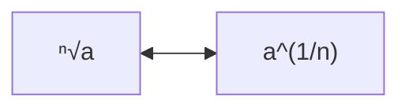

### 4.2 Converting Roots to Exponents

The denominator of the fraction is the "which root," and it goes on the outside as the root index.

```
√5 = 5^(1/2)
³√7 = 7^(1/3)
⁵√x = x^(1/5)
```

### 4.3 Converting Exponents to Roots

Same conversion works backwards:

```
9^(1/2) = √9 = 3
8^(1/3) = ³√8 = 2
16^(1/4) = ⁴√16 = 2
```

### 4.4 Power of a Root

What if there's a power *inside* the fractional exponent, like `a^(m/n)`? The easiest way to think about this is: the denominator `n` is the root, and the numerator `m` is a regular power — apply them in either order.

```
8^(2/3) = (³√8)²  =  2²  =  4
```

or equivalently:

```
8^(2/3) = ³√(8²) = ³√64 = 4
```

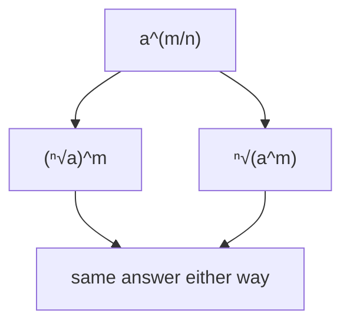

Both routes give the same answer, but taking the root **first** (then the power) usually involves smaller numbers, so it's often the easier path by hand.

### 4.5 Root of a Power

This is really just the same idea from the other direction — `ⁿ√(a^m)` is just `a^(m/n)` written as a root instead of a fractional exponent.

```
³√(2⁴) = 2^(4/3)
```

I can't simplify `2^(4/3)` to a whole number, so I'd usually rewrite it by pulling out whole cubes:

```
³√(2⁴) = ³√(2³ × 2) = 2 × ³√2
```

### 4.6 Fractional Exponents with Variables

Same rules apply directly to variables:

```
x^(1/2) = √x
x^(2/3) = ³√(x²) = (³√x)²
(x²)^(1/2) = x^(2×1/2) = x^1 = x        (using Power of a Power)
```

---

## 5. Radical Properties

### 5.1 Product Property

**√a × √b = √(ab)**

Let's check this is actually true rather than just trusting it:

```
√4 × √9 = 2 × 3 = 6
√(4×9) = √36 = 6
```

Both give 6 ✅. This basically means I can merge two roots being multiplied into one root of the product — which is exactly the trick I used back in Sections 1.7 and 2.7 to simplify radicals.

### 5.2 Quotient Property

**√a / √b = √(a/b)**  (b ≠ 0)

```
√100 / √25 = 10/5 = 2
√(100/25) = √4 = 2
```

Both give 2 ✅. Same idea as the product property, just for division.

### 5.3 Simplifying Radicals

Recap of the method from Sections 1.7/2.7, now formalized: to simplify `ⁿ√x`, I factor `x` looking for the biggest perfect n-th-power factor, then pull it out.

```
√48 = √(16 × 3) = 4√3
```

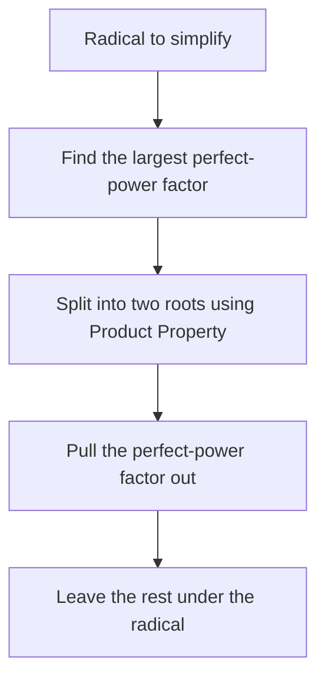

### 5.4 Adding Like Radicals

I can only add radicals directly if they have the **same number under the root** (called "like radicals") — just like I can only add `3x + 2x` because they share the same variable.

```
3√2 + 5√2 = 8√2
```

> **A common mistake I can make here** is trying to add `√2 + √3`. These are NOT like radicals (different numbers inside), so they can't be combined — the answer just stays as `√2 + √3`.

Sometimes radicals look different but aren't, once simplified:

```
√8 + √18
= 2√2 + 3√2     (after simplifying each one first)
= 5√2
```

### 5.5 Subtracting Like Radicals

Exact same rule as addition, just subtracting instead:

```
7√5 - 2√5 = 5√5
```

```
√50 - √8
= 5√2 - 2√2       (simplify first)
= 3√2
```

### 5.6 Nested Radicals

Sometimes a root sits *inside* another root, like `√(√16)`. The easiest way to think about this: work from the inside out.

```
√(√16) = √4 = 2
```

Or, using the exponent connection from Section 4, this is the same as:

```
√(√16) = 16^(1/2 × 1/2) = 16^(1/4) = ⁴√16 = 2
```

**Now I can see why**: nesting roots multiplies their fractional exponents together, exactly like the Power of a Power rule.

### 5.7 Rationalizing Denominators

Here's a math "manners" rule: we don't like leaving a radical in the denominator of a fraction. If I have `1/√2`, I "rationalize" it by multiplying top and bottom by `√2` — which turns the bottom into a whole number, since `√2 × √2 = 2`.

```
1/√2  =  (1×√2) / (√2×√2)  =  √2 / 2
```

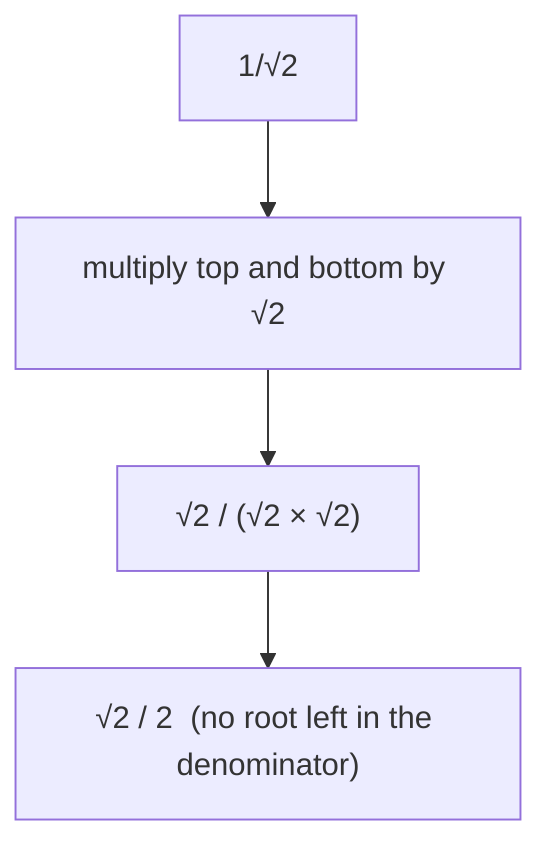

Another example:

```
3/√5 = (3×√5)/(√5×√5) = 3√5/5
```

This basically means the *value* doesn't change (I multiplied by `√2/√2`, which is just 1), only how it's *written* changes.

---

## 6. AI/ML Applications

This is where roots stop being "just algebra" and start showing up everywhere in machine learning. I'll only cover what's needed to recognize these formulas when I see them.

### 6.1 Euclidean Distance

This measures the straight-line distance between two points — used constantly in ML for things like k-nearest-neighbors and clustering.

For two points `(x1, y1)` and `(x2, y2)`:

```
distance = √( (x2-x1)² + (y2-y1)² )
```

This is literally the same formula as the Pythagorean theorem, just rearranged — it's asking "what's the length of the straight line between these two points?"

Example: distance between `(0,0)` and `(3,4)`:

```
√(3² + 4²) = √(9+16) = √25 = 5
```

In higher dimensions (which is what actually happens in ML, with many features per data point), it just extends the same pattern:

```
distance = √( (x2-x1)² + (y2-y1)² + (z2-z1)² + ... )
```

### 6.2 Vector Magnitude

A vector's magnitude (its "length") uses the exact same square-root-of-sum-of-squares idea, just for one vector instead of the distance between two points.

For a vector `v = [v1, v2, v3]`:

```
|v| = √(v1² + v2² + v3²)
```

Example: `v = [3, 4, 0]`

```
|v| = √(9 + 16 + 0) = √25 = 5
```

This shows up everywhere — normalizing vectors (making their length equal to 1), measuring embedding similarity, and more.

### 6.3 Standard Deviation

Standard deviation measures how "spread out" a set of numbers is from the average. The formula involves a square root at the very last step:

```
standard deviation = √( average of (each value − mean)² )
```

Why the square root at the end? Because before that step, we're working with **squared** differences (to avoid negatives cancelling out positives). Taking the square root at the end brings the units back to the original scale, so the spread is measured in the same units as the data.

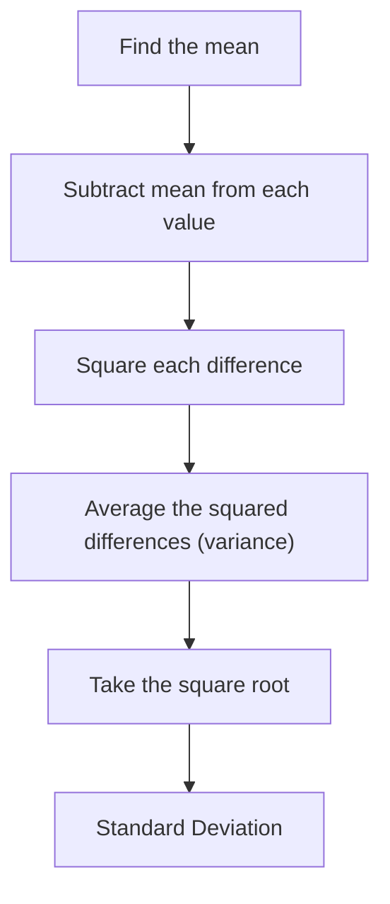

### 6.4 Root Mean Square (RMS)

RMS is a way to measure the "typical size" of a set of numbers, especially useful when values can be positive or negative (like errors in a model's predictions).

```
RMS = √( average of (each value)² )
```

This is the core idea behind **RMSE (Root Mean Square Error)**, one of the most common ways to measure how wrong a machine learning model's predictions are:

```
RMSE = √( average of (prediction − actual)² )
```

Same reasoning as standard deviation: squaring first stops errors from cancelling each other out (a `+5` error and a `-5` error would otherwise average to 0, hiding the mistake), and the final square root brings the error back to a sensible, real-world scale.

---

## 7. Common Mistakes

- ❌ `√25 = ±5` → ✅ `√25 = 5` only (the `√` symbol always means the *principal*, positive root)
- ❌ `√(-16)` has a real answer → ✅ even roots of negative numbers have **no real answer**
- ❌ `³√(-8)` is undefined → ✅ odd roots of negatives ARE defined: `³√(-8) = -2`
- ❌ `√2 + √3 = √5` → ✅ unlike radicals can't be combined by adding what's under the root
- ❌ `16^(1/2) = 8` → ✅ it's `√16 = 4` (fractional exponent = root, not division)
- ❌ Leaving `1/√2` as a final answer → ✅ rationalize it to `√2/2`
- ❌ `√(x²) = x` for all x → ✅ technically `√(x²) = |x|`, since x could be negative

---

## 8. Quick Revision

| Concept | Rule |
|---|---|
| Square root | √a = a^(1/2) |
| Cube root | ³√a = a^(1/3) |
| nth root | ⁿ√a = a^(1/n) |
| Product Property | √a × √b = √(ab) |
| Quotient Property | √a ÷ √b = √(a/b) |
| Power of a root | a^(m/n) = (ⁿ√a)^m = ⁿ√(a^m) |
| Rationalizing | 1/√a = √a / a |

| Root Type | Negative input? |
|---|---|
| Even root (√, ⁴√, ⁶√...) | ❌ no real answer |
| Odd root (³√, ⁵√, ⁷√...) | ✅ real answer, keeps the sign |

**Memory trick:**
- Root ↔ fractional exponent — they're the same idea, two different notations
- Even root of a negative → doesn't exist (in real numbers)
- Odd root of a negative → exists, and stays negative
- Only **like radicals** (same number under the root) can be added/subtracted
- Never leave a radical in the denominator — rationalize it

---

## 9. Mini Quiz

Try these before checking the answers below — no peeking!

1. `√81 = ?`
2. `³√(-27) = ?`
3. Simplify `√72`
4. `√(9/16) = ?`
5. Convert `x^(2/3)` into radical form
6. `√8 + √2 = ?`
7. Rationalize `5/√3`
8. Is `√(-25)` a real number? Why or why not?
9. `8^(1/3) = ?`
10. What's the Euclidean distance between `(0,0)` and `(6,8)`?

<details>
<summary>Click to check answers</summary>

1. `√81 = 9`
2. `³√(-27) = -3`
3. `√72 = √(36×2) = 6√2`
4. `√(9/16) = 3/4`
5. `x^(2/3) = (³√x)² = ³√(x²)`
6. `√8 + √2 = 2√2 + √2 = 3√2`
7. `5/√3 = (5×√3)/(√3×√3) = 5√3/3`
8. No — `√(-25)` is not a real number, because even roots of negative numbers have no real solution.
9. `8^(1/3) = ³√8 = 2`
10. `√(6²+8²) = √(36+64) = √100 = 10`

</details>

---

## 10. End Concept Map

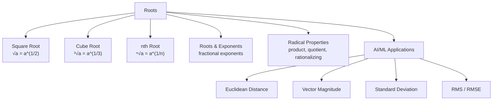

That's the full picture of roots — from "what does √ even mean" all the way to how it quietly powers distance metrics and error calculations in machine learning. Next up: putting exponents and roots together in mixed practice problems.

---

<div align="center">

⋆˚꩜｡

### Follow Me

If you enjoyed these notes, you'll probably enjoy the rest too.

| Platform | Link |
|---|---|
| Instagram | @mehrunnisa.ai |
| SubStack | The Epoch |
| YouTube | @mehrunnisa.ai |

**Usage Terms**
These notes are free to use for personal learning, revision, and study. Please do not:
- Sell or redistribute for profit.
- Claim them as your own work.
- Modify and republish without permission.
- Use for any unethical or unauthorized purpose.

Thank you for respecting the effort behind these notes. Happy learning. ♡

</div>
