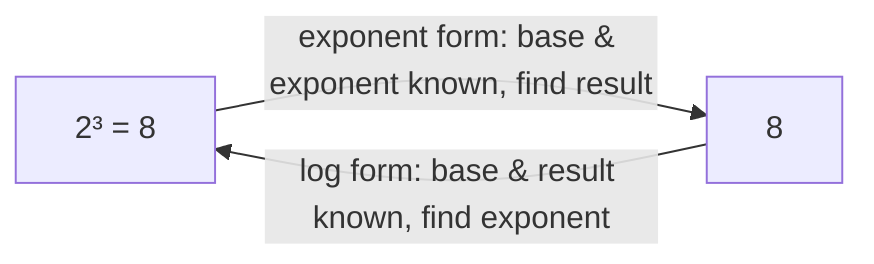
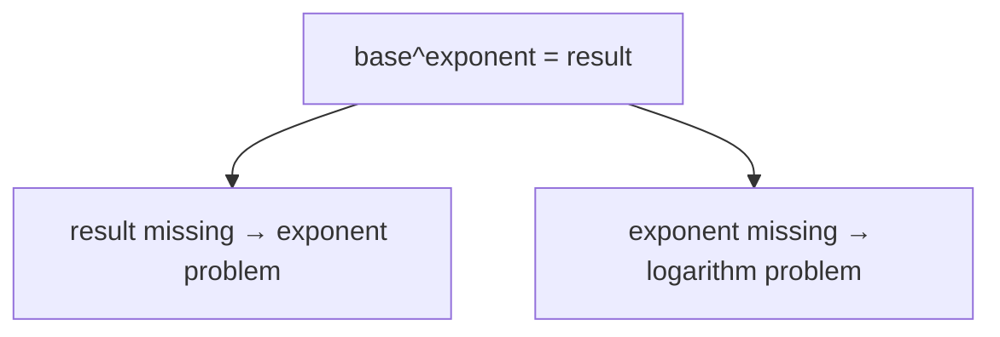
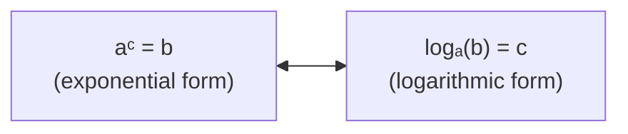
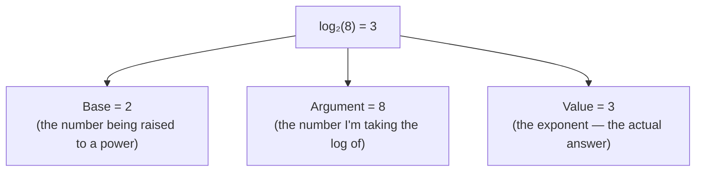
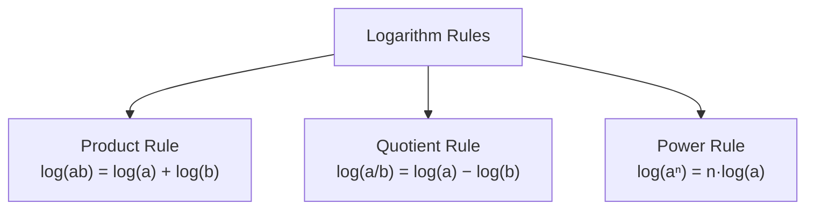
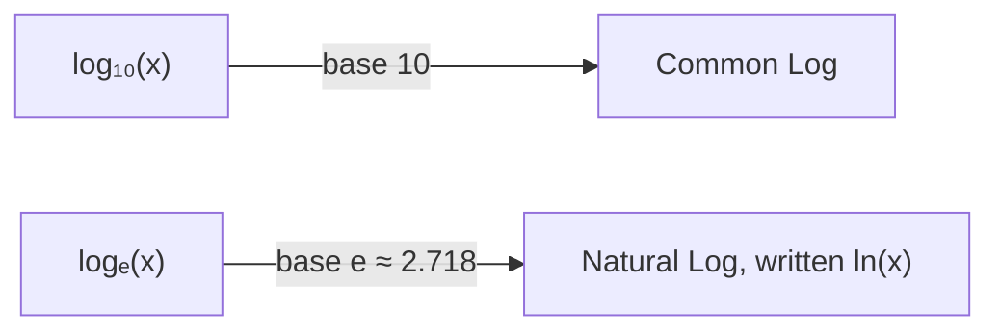
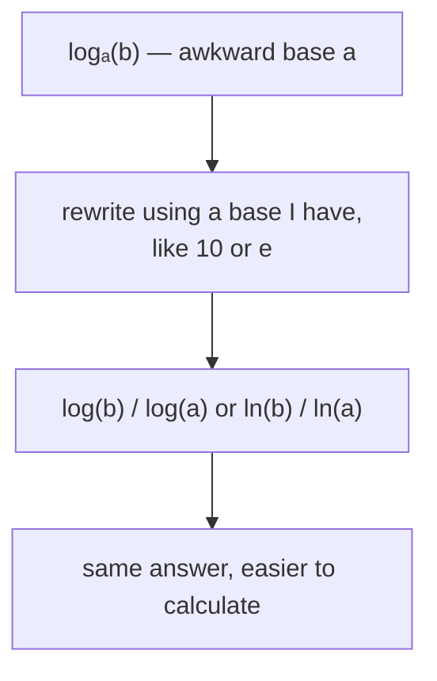
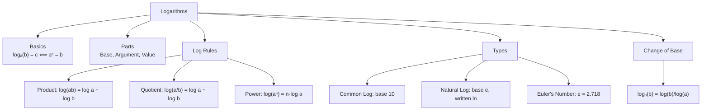

# Logarithms
### *Mathematics for AI — Study Notes by Mehrunnisa*

Okay so I've done exponents (going "up") and roots (undoing exponents to find the base). Logarithms are the *other* way to undo an exponent — instead of asking "what's the base?", they ask **"what's the exponent?"**. Let's build this up from scratch.

---

## Table of Contents

- [1. Basics](#1-basics)
  - [1.1 What Is a Logarithm?](#11-what-is-a-logarithm)
  - [1.2 Relationship Between Exponents and Logarithms](#12-relationship-between-exponents-and-logarithms)
  - [1.3 Meaning of logₐ(b)](#13-meaning-of-logab)
  - [1.4 Converting Between Exponential and Logarithmic Form](#14-converting-between-exponential-and-logarithmic-form)
- [2. Parts of a Logarithm](#2-parts-of-a-logarithm)
  - [2.1 Base](#21-base)
  - [2.2 Argument](#22-argument)
  - [2.3 Value (Result)](#23-value-result)
- [3. Logarithm Rules](#3-logarithm-rules)
  - [3.1 Product Rule](#31-product-rule)
  - [3.2 Quotient Rule](#32-quotient-rule)
  - [3.3 Power Rule](#33-power-rule)
- [4. Types of Logarithms](#4-types-of-logarithms)
  - [4.1 Common Log](#41-common-log)
  - [4.2 Natural Log](#42-natural-log)
  - [4.3 Euler's Number (e)](#43-eulers-number-e)
- [5. Change of Base Formula](#5-change-of-base-formula)
  - [5.1 Converting Logs From One Base to Another](#51-converting-logs-from-one-base-to-another)
- [6. Common Mistakes](#6-common-mistakes)
- [7. Quick Revision](#7-quick-revision)
- [8. Mini Quiz](#8-mini-quiz)
- [9. End Concept Map](#9-end-concept-map)

---

## 1. Basics

### 1.1 What Is a Logarithm?

First, I need to understand what question a logarithm is actually asking.

I already know exponents answer this question: "2 raised to the power 3 gives what?" → `2^3 = 8`.

A logarithm flips this around and asks: **"2 raised to what power gives 8?"** → the answer is 3.

We write that question like this:

```
log₂(8) = 3
```

Read it out loud as "log base 2 of 8 equals 3." This basically means: a logarithm is just a way of asking "what's the missing exponent?"



### 1.2 Relationship Between Exponents and Logarithms

The easiest way to think about this is: exponents and logarithms are just **two different ways of writing the same relationship**, depending on which piece is missing.

There are three pieces in a statement like `2^3 = 8`: the base (2), the exponent (3), and the result (8).

- If the **result** is missing → it's an exponent question → `2^3 = ?`
- If the **exponent** is missing → it's a logarithm question → `log₂(8) = ?`



**Now I can see why** logs feel confusing at first — they're not a brand new operation, they're just exponents rearranged to solve for a different unknown.

### 1.3 Meaning of logₐ(b)

Generalizing what I just did with `log₂(8)`:

```
logₐ(b) = c        means the exact same thing as        a^c = b
```

- `a` = the base (same base as in the exponential form)
- `b` = the number I'm taking the log of
- `c` = the answer — the exponent that makes it work

So `logₐ(b)` is literally asking: **"a to the power of what gives me b?"**

Example:

```
log₃(9) = 2     because     3^2 = 9
log₅(125) = 3   because     5^3 = 125
```

### 1.4 Converting Between Exponential and Logarithmic Form

Since these are just two ways of writing the same thing, I should be able to flip between them freely.



**Exponential → Logarithmic:**

```
4^2 = 16    →    log₄(16) = 2
10^3 = 1000 →    log₁₀(1000) = 3
```

**Logarithmic → Exponential:**

```
log₂(32) = 5    →    2^5 = 32
log₆(1) = 0     →    6^0 = 1
```

> **A common mistake I can make here** is mixing up which number goes where. Memory trick: in `logₐ(b) = c`, the base `a` stays the base when I flip it — it becomes `a^c = b`. The base never moves.

---

## 2. Parts of a Logarithm

Let's label the pieces clearly using `log₂(8) = 3` as the example.



### 2.1 Base

The **base** is the small subscript number written after "log" — it's the same base I'd use in the matching exponential form. If no base is written at all (just "log"), it's usually assumed to be base 10 (more on this in Section 4.1).

```
log₂(8)   → base is 2
log₅(25)  → base is 5
```

### 2.2 Argument

The **argument** is the number inside the brackets — the number I'm asking "what power gives me this?" about. It must always be a **positive number** (I'll explain why in Section 4).

```
log₂(8)   → argument is 8
log₃(81)  → argument is 81
```

### 2.3 Value (Result)

The **value** (or result) is the actual answer to the logarithm — the exponent it evaluates to.

```
log₂(8) = 3     → value is 3
log₁₀(100) = 2   → value is 2
```

> **The important thing here is:** the "value" of a logarithm is always an *exponent*, even though it doesn't look like one anymore once it's isolated on its own.

---

## 3. Logarithm Rules

These three rules exist for one reason: **logarithms convert multiplication into addition, division into subtraction, and powers into multiplication.** That's what makes them so useful — they turn hard operations into easier ones.



### 3.1 Product Rule

**log(ab) = log(a) + log(b)**

Let's not just memorize this — let's see *why* it's true, using the exponent connection from Section 1.

Say `log(a) = m` and `log(b) = n`. By the definition of a log (Section 1.3), that means:

```
a = 10^m     and     b = 10^n
```

Now multiply `a` and `b` together:

```
ab = 10^m × 10^n
```

I already know from the Product of Powers law (same base, multiply → add exponents) that:

```
ab = 10^(m+n)
```

Converting this back into log form (Section 1.4):

```
log(ab) = m + n = log(a) + log(b)
```

So:

```
log(ab) = log(a) + log(b)
```

**Now I can see why** this rule works — multiplying two numbers just *adds* their exponents, and a logarithm literally IS an exponent, so of course the logs add.

Numerical check:

```
log₂(4 × 8) = log₂(32) = 5
log₂(4) + log₂(8) = 2 + 3 = 5     ✅ matches
```

### 3.2 Quotient Rule

**log(a/b) = log(a) − log(b)**

Same proof idea, but using the Quotient of Powers law instead (same base, divide → subtract exponents):

```
a/b = 10^m / 10^n = 10^(m-n)
```

Converting back to log form:

```
log(a/b) = m - n = log(a) - log(b)
```

Numerical check:

```
log₂(32/4) = log₂(8) = 3
log₂(32) - log₂(4) = 5 - 2 = 3     ✅ matches
```

### 3.3 Power Rule

**log(aⁿ) = n · log(a)**

Same idea again, using the Power of a Power law. If `log(a) = m`, then `a = 10^m`, so:

```
aⁿ = (10^m)ⁿ = 10^(mn)
```

Converting back:

```
log(aⁿ) = mn = n · log(a)
```

Numerical check:

```
log₂(4³) = log₂(64) = 6
3 × log₂(4) = 3 × 2 = 6     ✅ matches
```

> **A common mistake I can make here** is thinking `log(a) × log(b) = log(ab)`. That's wrong — it's `log(a) + log(b) = log(ab)`. Logs turn multiplication into *addition*, not the other way around.

---

## 4. Types of Logarithms

### 4.1 Common Log

The **common log** is just a logarithm with **base 10**. It's used so often that we don't even bother writing the base — `log(x)` with no subscript automatically means base 10.

```
log(x)  means  log₁₀(x)
```

```
log(100) = 2     because     10^2 = 100
log(1000) = 3    because     10^3 = 1000
```

This is especially handy for anything related to powers of 10 — like the Richter scale (earthquakes) or decibels (sound), which are both built on common logs.

### 4.2 Natural Log

The **natural log** is a logarithm with a special base called `e` (covered in 4.3). It's written as `ln(x)` instead of `logₑ(x)`.

```
ln(x)  means  logₑ(x)
```

```
ln(e) = 1        because     e^1 = e
ln(1) = 0        because     e^0 = 1
```

This basically means `ln` is just a nickname for "log base e" — mathematicians gave it its own symbol because it shows up constantly in calculus, growth/decay problems, and — very relevantly for me — machine learning (loss functions like cross-entropy loss use `ln`).

### 4.3 Euler's Number (e)

`e` is a special mathematical constant, a bit like `π`. It's an irrational number (never-ending decimal) that shows up naturally when studying continuous growth and change:

```
e ≈ 2.71828...
```

I don't need to know *where* `e` comes from in depth right now — just that it's a fixed, famous number (like π), and that it's the default base used in natural logs because it makes calculus-based math behave in especially clean ways.



---

## 5. Change of Base Formula

### 5.1 Converting Logs From One Base to Another

Here's a practical problem: what if I need `log₃(20)`, but my calculator only has buttons for `log` (base 10) or `ln` (base e)? I need a way to convert between bases.

```
logₐ(b) = log(b) / log(a)
```

(This works with `ln` instead of `log` too — as long as I use the *same* new base on both the top and bottom.)

Example: find `log₃(20)` using base 10:

```
log₃(20) = log(20) / log(3) ≈ 1.301 / 0.477 ≈ 2.727
```

Check it makes sense: `3^2 = 9` and `3^3 = 27`, so `log₃(20)` should land somewhere between 2 and 3 — and `2.727` does. ✅



**Now I can see why** this works: it's really just the Power Rule (Section 3.3) in disguise, applied to the definition of a log — but I don't need to re-derive it every time, just remember: *new-base log of the argument, divided by new-base log of the original base.*

> **A common mistake I can make here** is flipping the fraction — writing `log(a)/log(b)` instead of `log(b)/log(a)`. The **argument** always goes on top.

---

## 6. Common Mistakes

- ❌ Thinking `log(ab) = log(a) × log(b)` → ✅ it's `log(a) + log(b)` — logs turn multiplication into addition
- ❌ Thinking `log(a-b) = log(a)/log(b)` → ✅ subtraction and division rules don't mix like that; only `log(a/b) = log(a) - log(b)`
- ❌ Taking the log of a negative number or zero → ✅ the argument of a log must always be **positive** (there's no real power of a positive base that gives 0 or a negative number)
- ❌ Confusing `log(x)` (base 10) with `ln(x)` (base e) — they're different unless explicitly told otherwise
- ❌ In the change of base formula, writing `log(a)/log(b)` instead of `log(b)/log(a)` → ✅ the argument goes on top
- ❌ Forgetting that `logₐ(b) = c` and `a^c = b` describe the exact same relationship, just written differently

---

## 7. Quick Revision

| Concept | Rule |
|---|---|
| Definition | logₐ(b) = c  ⟺  a^c = b |
| Product Rule | log(ab) = log(a) + log(b) |
| Quotient Rule | log(a/b) = log(a) − log(b) |
| Power Rule | log(aⁿ) = n·log(a) |
| Common Log | log(x) = log₁₀(x) |
| Natural Log | ln(x) = logₑ(x) |
| Change of Base | logₐ(b) = log(b)/log(a) |

**Memory trick:**
- A logarithm is just an exponent in disguise — it's answering "what power?"
- Multiply inside the log → add the logs
- Divide inside the log → subtract the logs
- Power inside the log → multiply out front
- The argument of a log must always be positive
- `e ≈ 2.718`, and `ln` is just log base `e`

---

## 8. Mini Quiz

Try these before checking the answers below — no peeking!

1. Convert `5^3 = 125` into logarithmic form.
2. Convert `log₄(64) = 3` into exponential form.
3. `log₂(16) = ?`
4. Simplify `log(6) + log(4)` into a single log, then evaluate it.
5. Simplify `log(100) - log(10)` into a single log, then evaluate it.
6. `log₅(5³) = ?` (use the Power Rule)
7. What is `ln(1)`?
8. Why is `log(-5)` undefined?
9. Use the change of base formula to write `log₄(10)` using base 10.
10. What's wrong with this step: `log(3×5) = log(3) × log(5)`?

<details>
<summary>Click to check answers</summary>

1. `log₅(125) = 3`
2. `4^3 = 64`
3. `log₂(16) = 4` (since 2⁴ = 16)
4. `log(6) + log(4) = log(24) = log(24)` — evaluates to ≈1.380 (log₁₀ 24)
5. `log(100) - log(10) = log(10) = 1`
6. `log₅(5³) = 3 · log₅(5) = 3 × 1 = 3`
7. `ln(1) = 0` (since e⁰ = 1)
8. Because there's no real power that a positive base can be raised to that gives a negative result.
9. `log₄(10) = log(10) / log(4)`
10. It should be addition, not multiplication: `log(3×5) = log(3) + log(5)`

</details>

---

## 9. End Concept Map



That's the full picture of logarithms — starting from "what power gives me this?" all the way to converting between bases. The pattern to remember throughout: **a logarithm is just an exponent, asked about differently.** Next up: putting exponents, roots, and logs together in mixed practice problems.

---

<div align="center">

⋆˚꩜｡

### Follow Me

If you enjoyed these notes, you'll probably enjoy the rest too.

| Platform | Link |
|---|---|
| Instagram | @mehrunnisa.ai |
| SubStack | The Epoch |
| YouTube | @mehrunnisa.ai |


**Usage Terms**
These notes are free to use for personal learning, revision, and study. Please do not:
- Sell or redistribute for profit.
- Claim them as your own work.
- Modify and republish without permission.
- Use for any unethical or unauthorized purpose.

Thank you for respecting the effort behind these notes. Happy learning. ♡

</div>
