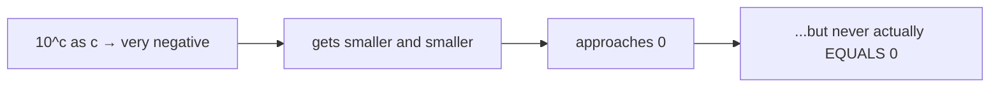
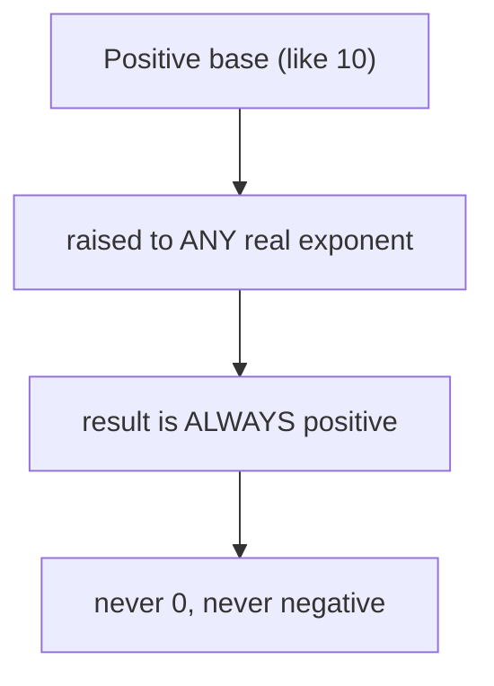
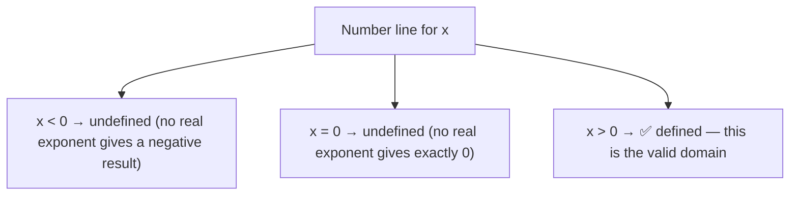
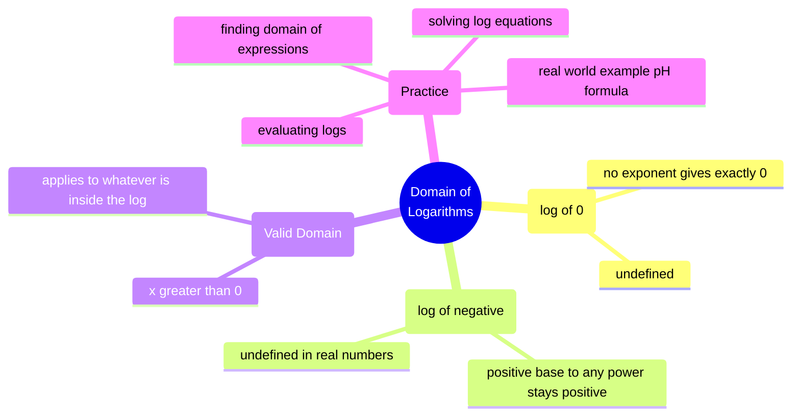

# Domain of Logarithms
### *Mathematics for AI — Study Notes by Mehrunnisa*

Okay, this is a follow-up to my Logarithms notes. There's one rule I kept using without fully explaining: **the thing inside a log (the argument) has to be positive.** Let's actually understand *why*, instead of just accepting it as a random restriction.

---

## Table of Contents

- [1. Domain of Logarithms](#1-domain-of-logarithms)
  - [1.1 Why log(0) Is Undefined](#11-why-log0-is-undefined)
  - [1.2 Why log of a Negative Number Is Not Defined (in Real Numbers)](#12-why-log-of-a-negative-number-is-not-defined-in-real-numbers)
  - [1.3 Valid Domain: x > 0](#13-valid-domain-x--0)
- [2. Quick Revision](#2-quick-revision)
- [3. 20 Practice Questions (With Full Solutions)](#3-20-practice-questions-with-full-solutions)
- [4. End Concept Map](#4-end-concept-map)
- [5. Where I Studied This](#5-where-i-studied-this)

---

## 1. Domain of Logarithms

### 1.1 Why log(0) Is Undefined

First, I need to go back to the actual definition of a logarithm, since that's where the answer is hiding.

```
logₐ(b) = c     means the same thing as     a^c = b
```

So `log₁₀(0)` is really asking: **"10 raised to what power gives 0?"**

Let's test this out. I'll try plugging in bigger and bigger negative exponents and see what happens:

```
10^1  = 10
10^0  = 1
10^-1 = 0.1
10^-2 = 0.01
10^-3 = 0.001
10^-100 = 0.0000...0001  (99 zeros)
```

Now I can see the pattern: as the exponent gets more and more negative, `10^c` gets **closer and closer to 0** — but it never actually *touches* 0. No matter how negative I make the exponent, I always end up with some tiny positive decimal, never exactly zero.



This basically means there is **no exponent, anywhere, that makes a positive base equal exactly 0.** Since a logarithm is just asking "what's the missing exponent," and no exponent gives 0, the question `log(0)` simply has no answer. Not "a weird answer" — no answer at all.

> **The important thing here is:** this isn't a rule someone made up arbitrarily. It falls directly out of how exponents behave — a positive base raised to any real power is always strictly positive, never zero.

### 1.2 Why log of a Negative Number Is Not Defined (in Real Numbers)

Same approach — let's go back to the definition and actually test it.

`log₁₀(-5)` is asking: **"10 raised to what power gives -5?"**

Let's check what `10^c` gives us across the board:

```
10^3  = 1000        (positive)
10^1  = 10           (positive)
10^0  = 1            (positive)
10^-1 = 0.1          (positive)
10^-5 = 0.00001      (positive)
```

Every single one of these is positive. That's not a coincidence — **a positive base raised to ANY real exponent always produces a positive result.** It doesn't matter if the exponent is huge, tiny, positive, negative, or a fraction — the output never crosses into negative territory.



So if I'm asking "what exponent gives me -5," the honest answer is: **there isn't one** — at least not among real numbers. This basically means `log(-5)` has no real solution, for the exact same underlying reason `log(0)` doesn't: there's simply no exponent that produces that output.

> A quick side note (not going deep into this, just flagging it): this is actually where **complex numbers** eventually come in — with imaginary numbers, logs of negative numbers technically CAN be defined. But that's a whole different topic for a whole different day. For everything we're doing here, we're staying strictly in the real number world.

### 1.3 Valid Domain: x > 0

Putting Sections 1.1 and 1.2 together, I can now state the full rule properly.

For `logₐ(x)` to have a real, defined answer:

```
x > 0
```

That's it. Not "x ≥ 0" (0 is excluded), not "x can be anything" — strictly **greater than zero**.



This is called the **domain** of the logarithmic function — the full set of input values (`x`) for which the function actually produces a real, meaningful output. For `logₐ(x)`, that domain is always `(0, ∞)` — every positive real number, no exceptions.

> **A common mistake I can make here** is only worrying about this rule when the argument is a plain variable, like `log(x)`. But it applies just as much when the argument is an *expression*, like `log(x-3)`. In that case, I need `x - 3 > 0`, which means `x > 3` — not just "x > 0." Always check what's actually inside the brackets.

---

## 2. Quick Revision

| Case | Defined? | Why |
|---|---|---|
| log(positive number) | ✅ Yes | some real exponent produces it |
| log(0) | ❌ No | no real exponent makes base^c exactly 0 |
| log(negative number) | ❌ No (in reals) | a positive base to any real power is always positive |
| Domain of logₐ(x) | x > 0 | combines both rules above |

**Memory trick:**
- A positive base raised to any real power → always lands strictly positive
- It can get infinitely *close* to 0, but never touches it
- So the log function can only ever "ask about" positive numbers
- Domain check on expressions: set whatever is *inside* the log > 0, then solve

---

## 3. 20 Practice Questions (With Full Solutions)

Try to solve each one yourself first — then check the solution underneath.

---

**Q1. Evaluate `log₂(32)`.**

<details>
<summary>Solution</summary>

Ask: "2 raised to what power gives 32?"
`2^5 = 32`
**Answer: 5**
</details>

---

**Q2. Evaluate `log₅(1)`.**

<details>
<summary>Solution</summary>

Ask: "5 raised to what power gives 1?"
Any base to the power 0 equals 1: `5^0 = 1`
**Answer: 0**
</details>

---

**Q3. Is `log(0)` defined? Explain using the domain rule.**

<details>
<summary>Solution</summary>

No. A positive base raised to any real exponent gets arbitrarily close to 0 but never equals exactly 0 — there's no exponent that produces 0. Since 0 is not greater than 0, it fails the domain condition `x > 0`.
**Answer: Undefined**
</details>

---

**Q4. Find the domain of `log(x - 3)`.**

<details>
<summary>Solution</summary>

The argument must be positive:
`x - 3 > 0`
`x > 3`
**Answer: x > 3**
</details>

---

**Q5. Find the domain of `log(5 - x)`.**

<details>
<summary>Solution</summary>

The argument must be positive:
`5 - x > 0`
`-x > -5`
Flip the inequality when dividing/multiplying by a negative:
`x < 5`
**Answer: x < 5**
</details>

---

**Q6. Solve for x: `log₃(x) = 4`.**

<details>
<summary>Solution</summary>

Convert to exponential form: `3^4 = x`
`3^4 = 81`
**Answer: x = 81**
</details>

---

**Q7. Evaluate `log₁₀(0.001)`.**

<details>
<summary>Solution</summary>

Ask: "10 raised to what power gives 0.001?"
`0.001 = 1/1000 = 10^-3`
**Answer: -3**
</details>

---

**Q8. Simplify `log(8) + log(2)` into a single log, then evaluate.**

<details>
<summary>Solution</summary>

Product Rule: `log(a) + log(b) = log(ab)`
`log(8) + log(2) = log(16)`
`log₁₀(16)` doesn't simplify to a whole number, but if we instead read this as base 2 (a common textbook convention for this kind of question): `log₂(16) = 4`
If it's genuinely base 10: **Answer: log(16) ≈ 1.204**
If base 2 was intended: **Answer: 4**
</details>

---

**Q9. Simplify `log(100) - log(10)` into a single log, then evaluate.**

<details>
<summary>Solution</summary>

Quotient Rule: `log(a) - log(b) = log(a/b)`
`log(100) - log(10) = log(10)`
`log₁₀(10) = 1`
**Answer: 1**
</details>

---

**Q10. Evaluate `log₂(1/8)`.**

<details>
<summary>Solution</summary>

Ask: "2 raised to what power gives 1/8?"
`1/8 = 2^-3`
**Answer: -3**
</details>

---

**Q11. Find the domain of `log(x + 2)`.**

<details>
<summary>Solution</summary>

Argument must be positive:
`x + 2 > 0`
`x > -2`
**Answer: x > -2**
</details>

---

**Q12. Solve for x: `log₄(64) = x`.**

<details>
<summary>Solution</summary>

Ask: "4 raised to what power gives 64?"
`4^1 = 4`, `4^2 = 16`, `4^3 = 64`
**Answer: x = 3**
</details>

---

**Q13. Is `log(-9)` defined? Explain.**

<details>
<summary>Solution</summary>

No. A positive base raised to any real exponent is always positive — it can never produce a negative result like -9. Since -9 is not greater than 0, it fails the domain condition.
**Answer: Undefined (in real numbers)**
</details>

---

**Q14. Solve for the base x: `logₓ(49) = 2`.**

<details>
<summary>Solution</summary>

Convert to exponential form: `x^2 = 49`
`x = √49 = 7` (bases must be positive, so we discard -7)
**Answer: x = 7**
</details>

---

**Q15. Evaluate `ln(e³)`.**

<details>
<summary>Solution</summary>

`ln(x) = logₑ(x)`, and `ln(eᵏ) = k` (since the log and the exponent directly undo each other when the base matches)
**Answer: 3**
</details>

---

**Q16. Find the domain of `log₂(x - 1)`.**

<details>
<summary>Solution</summary>

Argument must be positive:
`x - 1 > 0`
`x > 1`
**Answer: x > 1**
</details>

---

**Q17. Simplify `2log(3) + log(5)` into a single log, then evaluate (base 10).**

<details>
<summary>Solution</summary>

Apply Power Rule first: `2log(3) = log(3²) = log(9)`
Now apply Product Rule: `log(9) + log(5) = log(45)`
`log₁₀(45) ≈ 1.653`
**Answer: log(45) ≈ 1.653**
</details>

---

**Q18. Solve for x: `log(x) = 3` (base 10).**

<details>
<summary>Solution</summary>

Convert to exponential form: `10^3 = x`
**Answer: x = 1000**
</details>

---

**Q19. Find the domain of `log(7 - 2x)`.**

<details>
<summary>Solution</summary>

Argument must be positive:
`7 - 2x > 0`
`-2x > -7`
Divide by -2, flip the inequality:
`x < 3.5`
**Answer: x < 3.5**
</details>

---

**Q20. The pH formula in chemistry is `pH = -log[H⁺]`, where `[H⁺]` is hydrogen ion concentration. Explain, using the domain rule, why `[H⁺]` must always be a positive value for this formula to make sense.**

<details>
<summary>Solution</summary>

Since `[H⁺]` sits directly inside a logarithm, the domain rule `x > 0` applies to it exactly like any other log argument. If `[H⁺]` were zero or negative, `log[H⁺]` would be undefined, and the pH formula would break down — there'd be no real number to output. This lines up with actual chemistry too: concentration is a physical quantity and can never be zero or negative in the first place, so the math and the real-world meaning agree with each other.
**Answer: [H⁺] > 0 is required, both mathematically (domain of log) and physically (concentration can't be negative or zero)**
</details>

---

## 4. End Concept Map



---

## 5. Where I Studied This

I built these notes while working through Khan Academy's Logarithms unit — genuinely one of the best free resources for this, especially the videos on the definition of logs and their domain/graphs.

🔗 **Khan Academy — Logarithms:** https://www.khanacademy.org/math/algebra2/x2ec2f6f830c9fb89:logs

---

<div align="center">

⋆˚꩜｡

### Follow Me

If you enjoyed these notes, you'll probably enjoy the rest too.

| Platform | Link |
|---|---|
| Instagram | @mehrunnisa.ai |
| SubStack | The Epoch |
| YouTube | @mehrunnisa.ai |

> 📥 **Download: maths note — for offline reading.**

**Usage Terms**
These notes are free to use for personal learning, revision, and study. Please do not:
- Sell or redistribute for profit.
- Claim them as your own work.
- Modify and republish without permission.
- Use for any unethical or unauthorized purpose.

Thank you for respecting the effort behind these notes. Happy learning. ♡

</div>
