# Algebra: Expressions
### *Mathematics for AI — Study Notes by Mehrunnisa*

Okay, new chapter — **Algebra**, and we're starting with **Expressions**. This is basically the alphabet of algebra: variables, terms, combining stuff, simplifying stuff. Once this clicks, literally everything else in algebra (equations, functions, all of it) gets built right on top of it. Let's go from zero.

---

## Table of Contents

- [1. Variables and Constants](#1-variables-and-constants)
- [2. Terms, Coefficients, and Factors](#2-terms-coefficients-and-factors)
- [3. Like and Unlike Terms](#3-like-and-unlike-terms)
- [4. Combining Like Terms](#4-combining-like-terms)
- [5. Simplifying Algebraic Expressions](#5-simplifying-algebraic-expressions)
- [6. Addition and Subtraction of Expressions](#6-addition-and-subtraction-of-expressions)
- [7. Multiplication of Algebraic Expressions](#7-multiplication-of-algebraic-expressions)
- [8. Division of Algebraic Expressions](#8-division-of-algebraic-expressions)
- [9. Distributive Property](#9-distributive-property)
- [10. Expanding Brackets](#10-expanding-brackets)
- [11. Simplifying Expressions With Multiple Brackets](#11-simplifying-expressions-with-multiple-brackets)
- [12. Common Mistakes](#12-common-mistakes)
- [13. Quick Revision](#13-quick-revision)
- [14. Mini Quiz](#14-mini-quiz)
- [15. End Concept Map](#15-end-concept-map)
- [16. Where I Studied This](#16-where-i-studied-this)

---

## 1. Variables and Constants

First, I need to understand the two basic building blocks of any algebraic expression.

A **constant** is a fixed number — it never changes. `5`, `-3`, `100` — these always mean exactly what they say.

A **variable** is a symbol (usually a letter like `x`, `y`, or `a`) that *stands in* for a number we don't know yet, or a number that can change depending on the situation.

```
5x + 3
```

Here, `5` and `3` are constants — fixed values. `x` is the variable — it could represent literally any number, and the value of the whole expression depends on whatever `x` ends up being.

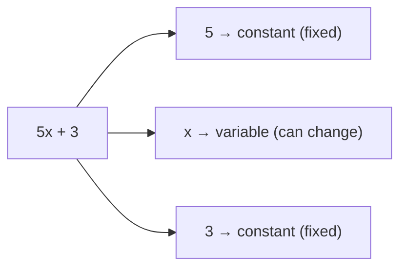

The easiest way to think about this: a variable is basically a labeled box. It's empty until you decide to put a number inside it — and whatever you put in there changes the final answer.

---

## 2. Terms, Coefficients, and Factors

Now let's zoom into the pieces that make up an expression like `5x + 3`.

A **term** is a single piece of an expression, separated by `+` or `-` signs.

```
5x + 3
```

This expression has **two terms**: `5x` and `3`.

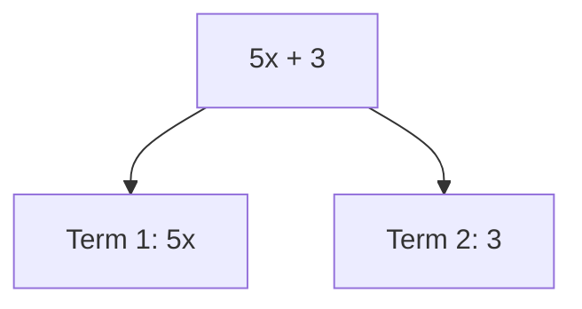

A **coefficient** is the number multiplying a variable inside a term. In `5x`, the coefficient is `5`.

A **factor** is anything being multiplied together to form a term. In `5x`, the factors are `5` and `x` — because `5 × x` is literally what `5x` means (algebra just drops the multiplication sign for convenience).

```
Term:        5x
             │  │
             ▼  ▼
      Coefficient  Variable
          5           x
      (both are "factors" of the term)
```

More examples:

```
7xy    → coefficient = 7, factors = 7, x, y
-4a²   → coefficient = -4, factors = -4, a, a
```

> **The important thing here is:** a constant term (like the `3` in `5x + 3`) doesn't have a coefficient in the usual sense — it's just a number standing alone, not attached to any variable.

---

## 3. Like and Unlike Terms

Here's a distinction I need before I can combine anything. **Like terms** have the *exact same* variable part (same letters, raised to the same powers) — only their coefficients can differ.

```
3x  and  7x        → LIKE terms (both just "x")
2x² and  9x²       → LIKE terms (both "x²")
5xy and  -2xy      → LIKE terms (both "xy")
```

**Unlike terms** have different variable parts — different letters, or the same letter but different powers.

```
3x  and  3y        → UNLIKE (different variables)
2x  and  2x²       → UNLIKE (different powers — x is not the same as x²)
```

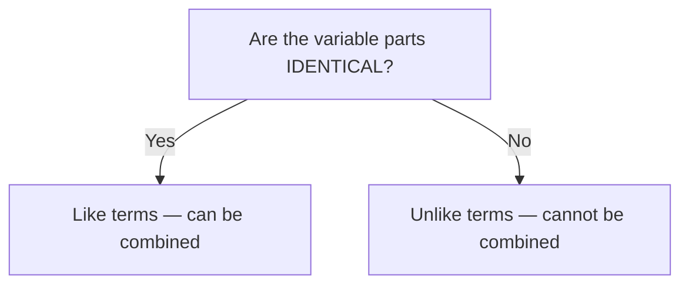

This basically means: I can only compare/combine terms that are "speaking the same language" variable-wise. `x` and `x²` might look similar, but they behave completely differently (think of `x` as a length and `x²` as an area — very different things, even with the same letter).

---

## 4. Combining Like Terms

Now for the actual payoff of Section 3. If terms are "like," I can combine them by just adding or subtracting their **coefficients**, keeping the variable part exactly the same.

```
3x + 7x
```

Both terms are "x" terms, so I just add the coefficients:

```
3x + 7x = (3+7)x = 10x
```

**Now I can see why** this works — `3x` literally means "3 copies of x," and `7x` means "7 copies of x." Put them together and I've got 10 copies of x total. It's the exact same logic as `3 apples + 7 apples = 10 apples` — you're not allowed to combine apples with oranges (that's the "unlike terms" rule again).

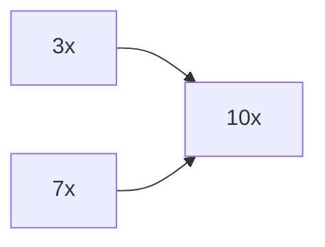

More examples:

```
8y - 3y = 5y
4a² + 6a² = 10a²
2x + 5y - x + 3y = (2x - x) + (5y + 3y) = x + 8y
```

> **A common mistake I can make here** is combining unlike terms, like writing `3x + 4y = 7xy`. That's wrong — `x` and `y` are different variables, they simply cannot merge into one term.

---

## 5. Simplifying Algebraic Expressions

"Simplifying" just means rewriting an expression in its shortest, cleanest possible form — usually by combining every set of like terms until nothing more can be merged.

### Example: Simplify `4x + 3y - 2x + 7y - 5`

Group the like terms together first (mentally or by rewriting):

```
(4x - 2x) + (3y + 7y) - 5
```

Combine each group:

```
= 2x + 10y - 5
```

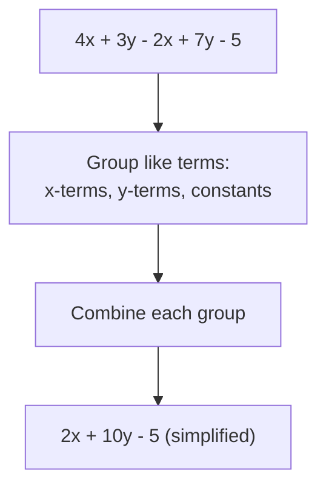

This is the "final answer" form — no more like terms left to combine. This basically means simplifying is just Section 4's rule (combining like terms), applied to an entire expression at once instead of just two terms.

---

## 6. Addition and Subtraction of Expressions

Adding or subtracting two whole expressions is really just combining like terms across both of them — same rule, bigger scale.

### Addition example

```
(3x + 2y) + (5x - y)
```

Drop the brackets (addition doesn't flip any signs) and combine like terms:

```
= 3x + 2y + 5x - y
= (3x+5x) + (2y-y)
= 8x + y
```

### Subtraction example

```
(3x + 2y) - (5x - y)
```

**Here's the important part:** subtracting a bracket means I flip the sign of *every* term inside that bracket before combining.

```
= 3x + 2y - 5x + y
= (3x-5x) + (2y+y)
= -2x + 3y
```

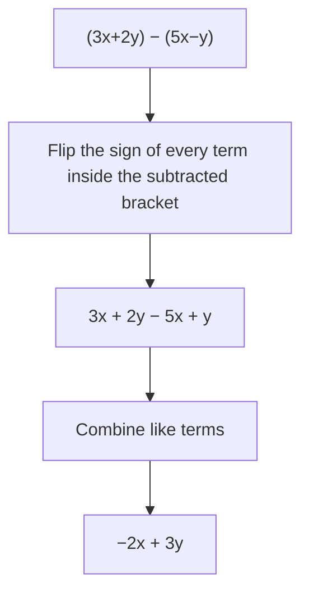

> **A common mistake I can make here** is only flipping the sign of the *first* term inside the bracket, writing `3x + 2y - 5x - y` instead of `3x + 2y - 5x + y`. The minus sign in front of a bracket applies to **every single term** inside it.

---

## 7. Multiplication of Algebraic Expressions

### Term × Term

Multiply the coefficients together, and multiply the variable parts together (adding exponents if the same variable repeats — remember the Product of Powers law from my Exponents notes!).

```
(3x) × (4x) = (3×4) × (x×x) = 12x²
(2x) × (5y) = 10xy
```

### Term × Expression (multi-term)

Multiply the single term by **every** term inside the expression, one at a time.

```
3x × (2x + 5)
= (3x × 2x) + (3x × 5)
= 6x² + 15x
```

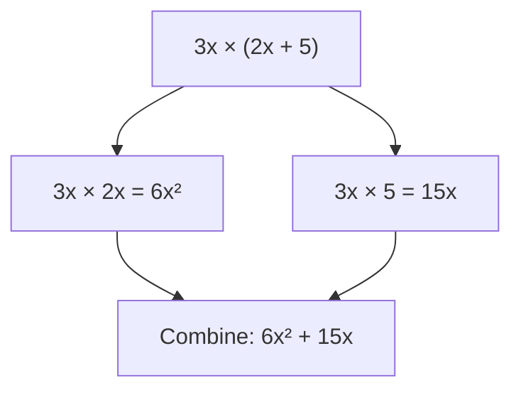

This is actually a sneak peek at the **Distributive Property**, which we'll formally name in Section 9 — I'm using it here already without calling it that.

---

## 8. Division of Algebraic Expressions

Dividing algebraic terms works a lot like simplifying a fraction — divide the coefficients, and cancel matching variable factors (subtracting exponents, same as the Quotient of Powers law).

```
12x³ / 4x
= (12/4) × (x³/x)
= 3 × x²
= 3x²
```

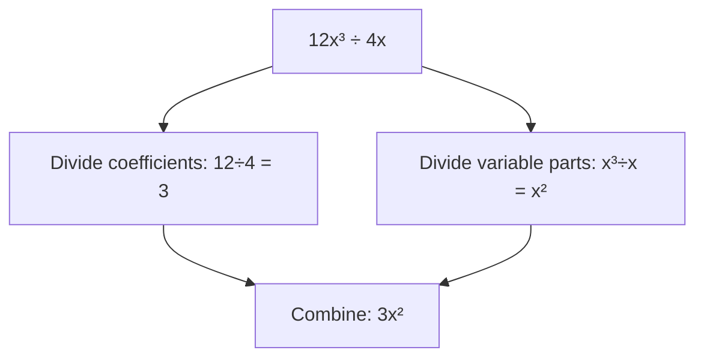

Dividing a multi-term expression by a single term means dividing **each term** separately.

```
(10x² + 5x) / 5
= (10x²/5) + (5x/5)
= 2x² + x
```

---

## 9. Distributive Property

**a(b + c) = ab + ac**

This is the official name for the "multiply into the bracket" trick I already used in Section 7. It's called "distributive" because the term outside gets *distributed* to each term inside.

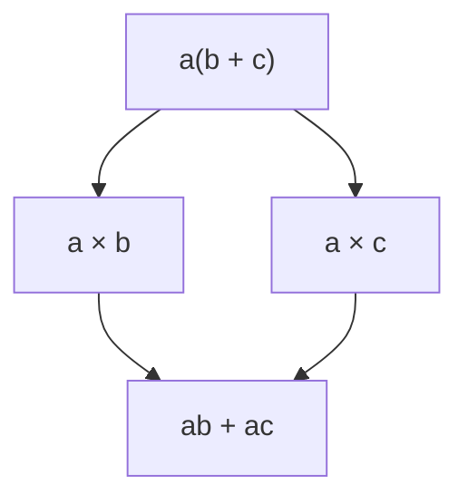

### Why does this actually work?

Let's check with real numbers first: `3 × (4 + 5)`

```
3 × (4+5) = 3 × 9 = 27
```

versus distributing first:

```
(3×4) + (3×5) = 12 + 15 = 27
```

Same answer either way ✅. **Now I can see why** this rule is trustworthy — multiplying a sum is the same as multiplying each part separately and then adding. This works identically whether the terms are plain numbers or algebraic expressions.

```
5(2x + 3) = (5×2x) + (5×3) = 10x + 15
```

---

## 10. Expanding Brackets

"Expanding" just means applying the distributive property to get rid of brackets entirely.

### Single bracket example

```
4(3x - 2)
= (4×3x) - (4×2)
= 12x - 8
```

### Negative sign in front of a bracket

```
-2(x - 5)
= (-2×x) - (-2×5)
= -2x + 10
```

> **A common mistake I can make here** is forgetting that a negative sign outside the bracket flips **every** sign inside when distributed — this is the exact same trap from Section 6, just with multiplication instead of plain subtraction.

### Two brackets multiplied together

This is where things get slightly bigger, but it's the same rule — every term in the first bracket must multiply every term in the second bracket.

```
(x + 2)(x + 3)
```

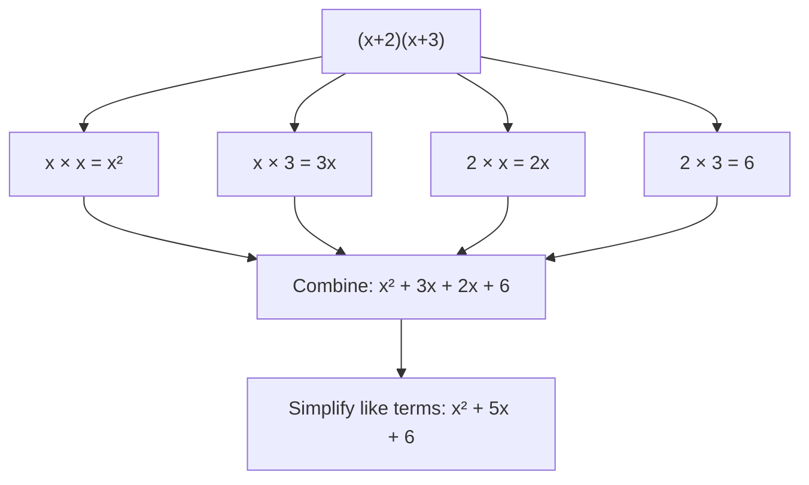

```
(x+2)(x+3) = x² + 3x + 2x + 6 = x² + 5x + 6
```

Each term in the first bracket had to "shake hands" with each term in the second bracket — that's genuinely the whole method, just done systematically so nothing gets missed.

---

## 11. Simplifying Expressions With Multiple Brackets

When an expression has several brackets, the process is: expand every bracket first (Sections 9-10), then combine all the resulting like terms (Sections 4-5).

### Example: Simplify `3(x + 2) + 2(x - 1)`

**Step 1 — expand both brackets:**

```
3(x+2) = 3x + 6
2(x-1) = 2x - 2
```

**Step 2 — combine everything:**

```
3x + 6 + 2x - 2
= (3x+2x) + (6-2)
= 5x + 4
```

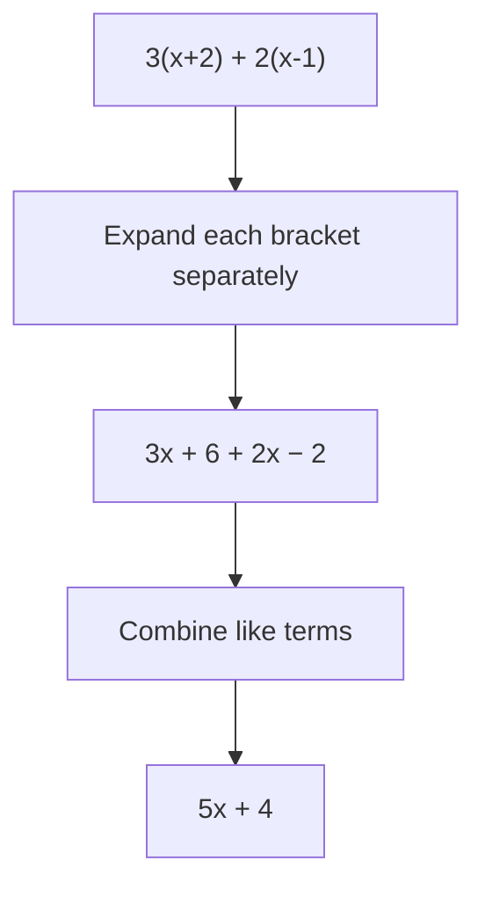

### A trickier one: `4(2x - 3) - 2(x - 5)`

**Step 1 — expand both brackets (careful with the minus sign before the second bracket!):**

```
4(2x-3) = 8x - 12
-2(x-5) = -2x + 10
```

**Step 2 — combine:**

```
8x - 12 - 2x + 10
= (8x-2x) + (-12+10)
= 6x - 2
```

This basically means multiple brackets aren't actually a new skill — they're just Sections 9, 10, 4, and 6 all being used back-to-back on the same problem. Expand everything first, worry about combining second, and take it one bracket at a time.

---

## 12. Common Mistakes

- ❌ Combining unlike terms, like `3x + 4y = 7xy` → ✅ different variables can never merge
- ❌ Forgetting to flip every sign when subtracting a bracket → ✅ the minus sign applies to ALL terms inside
- ❌ Only multiplying the first term when distributing, like `4(3x-2) = 12x - 2` → ✅ every term inside gets multiplied: `12x - 8`
- ❌ Adding exponents incorrectly when multiplying terms, like `3x × 4x = 7x²` → ✅ multiply coefficients (3×4=12) and add exponents (x¹×x¹=x²): `12x²`
- ❌ Forgetting to expand BOTH brackets before combining like terms in multi-bracket expressions
- ❌ Treating `x` and `x²` as like terms → ✅ different powers = different terms, can't be combined

---

## 13. Quick Revision

| Concept | Meaning |
|---|---|
| Variable | A symbol representing an unknown/changeable value |
| Constant | A fixed, unchanging number |
| Term | A piece of an expression, separated by + or − |
| Coefficient | The number multiplying a variable in a term |
| Factor | Anything being multiplied to form a term |
| Like terms | Same variable part — can be combined |
| Unlike terms | Different variable part — cannot be combined |
| Distributive Property | a(b+c) = ab + ac |

**Memory trick:**
- Combine like terms → add/subtract coefficients ONLY, variable part stays the same
- Subtracting a bracket → flip every sign inside it
- Distributing → the outside term "shakes hands" with every term inside
- Two brackets multiplied → every term in bracket 1 multiplies every term in bracket 2
- Multiple brackets → expand everything first, THEN combine like terms

---

## 14. Mini Quiz

Try these before checking the answers below — no peeking!

1. Identify the coefficient and variable in the term `-6ab`.
2. Are `4x²` and `4x` like terms or unlike terms?
3. Simplify: `5x + 3x - 2x`
4. Simplify: `(4x + 3) - (2x - 1)`
5. Multiply: `3x × 5x`
6. Divide: `18x⁴ ÷ 6x²`
7. Expand: `5(2x - 4)`
8. Expand: `(x + 4)(x + 2)`
9. Simplify: `2(x + 3) + 4(x - 1)`
10. What's wrong with this step: `2x + 3y = 5xy`?

<details>
<summary>Click to check answers</summary>

1. Coefficient = -6, variable = ab (factors: -6, a, b)
2. Unlike terms (different powers of x)
3. `5x + 3x - 2x = 6x`
4. `(4x+3) - (2x-1) = 4x+3-2x+1 = 2x+4`
5. `3x × 5x = 15x²`
6. `18x⁴ ÷ 6x² = 3x²`
7. `5(2x-4) = 10x - 20`
8. `(x+4)(x+2) = x² + 2x + 4x + 8 = x² + 6x + 8`
9. `2(x+3) + 4(x-1) = 2x+6+4x-4 = 6x+2`
10. `2x` and `3y` are unlike terms (different variables) — they cannot be combined into `5xy`. The expression simply stays as `2x + 3y`.

</details>

---

## 15. End Concept Map

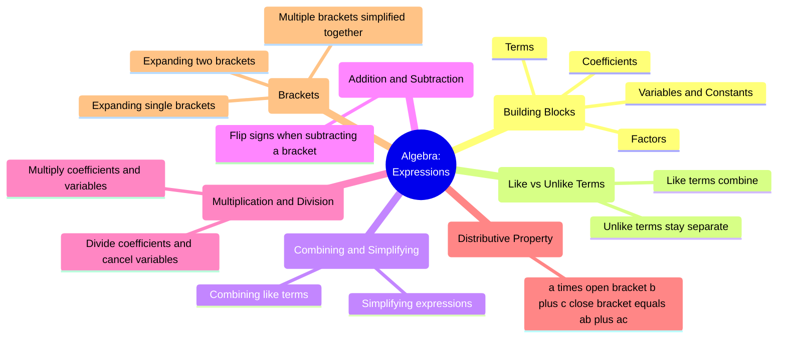

That's the full picture of algebraic expressions — from the smallest building block (a single variable) all the way up to expanding and simplifying expressions with multiple brackets. Every single rule here traces back to one core idea: **only combine what's actually alike, and always distribute fully before combining anything.** Next up: Algebra Equations.

---

## 16. Where I Studied This

I built these notes while working through Khan Academy's Algebra Basics unit — their videos on terms, coefficients, combining like terms, and the distributive property were especially useful for actually seeing the "why" behind each rule.

🔗 **Khan Academy — Algebraic Expressions:** [https://www.khanacademy.org/math/algebra-basics/alg-basics-algebraic-expressions](https://www.khanacademy.org/math/algebra/x2f8bb11595b61c86:foundation-algebra)

---

<div align="center">

⋆˚꩜｡

### Follow Me

If you enjoyed these notes, you'll probably enjoy the rest too.

| Platform | Link |
|---|---|
| Instagram | @mehrunnisa.ai |
| SubStack | The Epoch |
| YouTube | @mehrunnisa.ai |

> 📥 **Download: maths note — for offline reading.**

**Usage Terms**
These notes are free to use for personal learning, revision, and study. Please do not:
- Sell or redistribute for profit.
- Claim them as your own work.
- Modify and republish without permission.
- Use for any unethical or unauthorized purpose.

Thank you for respecting the effort behind these notes. Happy learning. ♡

</div>
